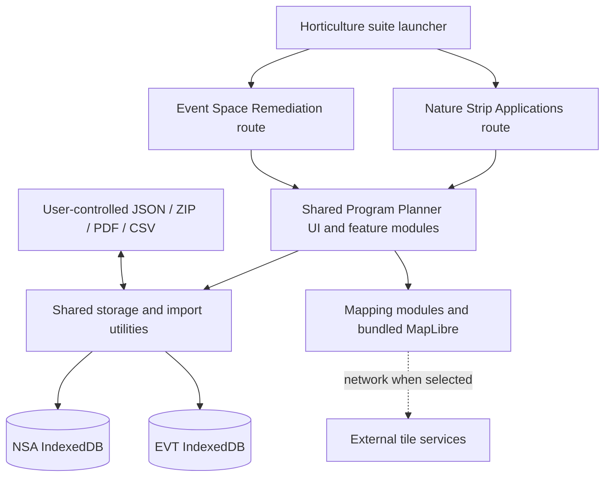

# Authoritative review boundary — Stage 0

**User correction:** The Overtime and Workforce Planner is entirely out of scope. Exclude its complete archive subtree, code, tests, governance material, historical review conclusions and release status at every stage. No issues are carried over from that subsystem. Shared application code is in scope only where **actually loaded by** one of the two in-scope Program Planner workspaces; no source dependency from the excluded subtree was observed in either Program Planner HTML entry point.

## In-scope business applications

1. **Nature Strip Applications (NSA):** `src/program-planner/nsa.html`, iframe of `index.html?workspace=NSA`; `appId=uos.horticulture.nsa`, IndexedDB `uos-horticulture-nsa-v16`.
2. **Event Space Remediation (EVT):** `src/program-planner/events.html`, iframe of `index.html?workspace=EVT`; `appId=uos.horticulture.events`, IndexedDB `uos-horticulture-events-v16`.

These are two **application configurations / workspace boundaries over one shared Program Planner implementation**, not two independent codebases. The suite launcher (`src/index.html`), shared UI/persistence/import modules (`src/shared`), map integration (`src/remediation-planner`) and all first-party Program Planner modules are in scope. `src/remediation-planner` is a mapping dependency, **not** an additional separately runnable application in the inspected launcher. The data boundaries are defined in source; their runtime independence remains to be proven.

**Diagram convention:** solid lines represent source-observed wiring/capabilities; dotted lines represent external/environment-dependent behaviour. Shared code does not imply shared operational records.

## Ancillary material

`src/governance` contains constitutional, contracts and assurance documentation, with a supporting HTML viewer; root and `Offline/` Markdown files include historical notes and checkpoints. `tests/`, `scripts/`, `playwright.config.cjs` and package metadata support the supplied test regime. A sample PDF and past UI screenshots are fixtures/reference artifacts, not seeded operational workspaces. The unreferenced nested GeoForge ZIP and standalone `md-mermaid-viewer.html` are ancillary and not separately assessed as business applications. No claim about the safety or content of the nested archive is made.

**Archive inventory:** 351 ZIP files total; **154 excluded by explicit subsystem boundary**; 197 retained in the non-excluded source manifest (some of which are explicitly marked ancillary). See `SOURCE_MANIFEST.csv` for each retained file's hash, status, observed coverage and planned stage.
