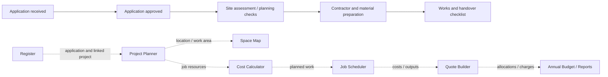
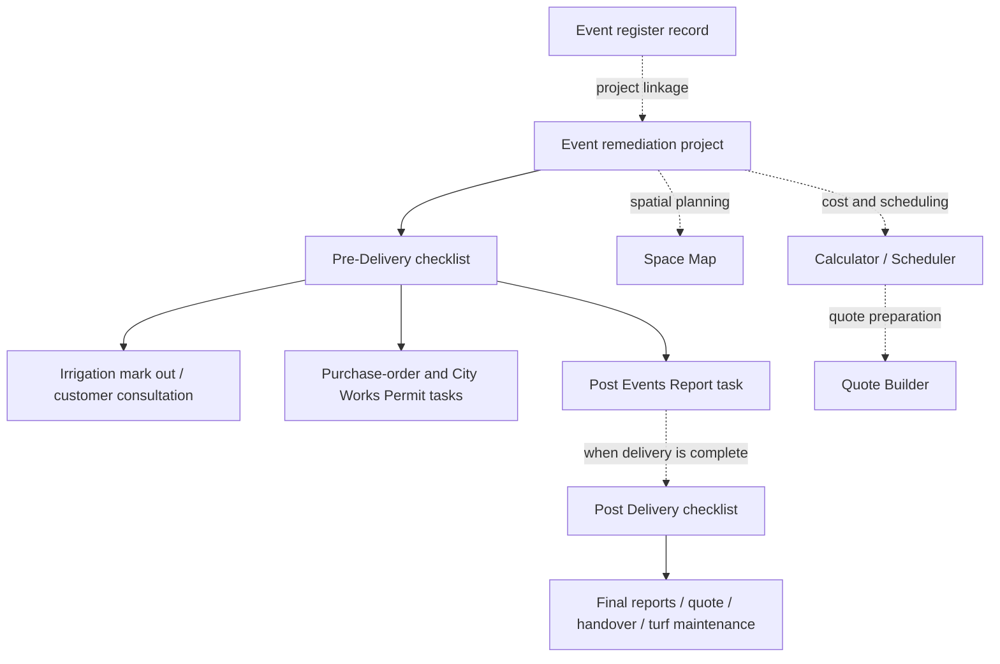
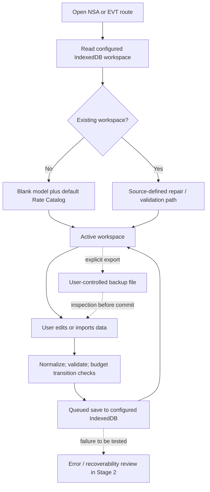

# Stage 0 — Source-derived workflow maps

These diagrams are **reconnaissance maps**, not proof that the application enforces every transition. Solid arrows indicate directly observed source/UI structure; dotted arrows indicate relationships scheduled for Stage 4 verification. The workspaces share feature modules while exposing owner-specific record types and checklist templates.

## Nature Strip Applications — checklist context and feature touchpoints

`src/program-planner/js/model.js:84–110` supplies Nature Strip checklist labels and `src/program-planner/index.html:48–83` exposes the feature navigation. Mandatory order, approval gates and save timing remain **unverified**.

## Event Space Remediation — source-defined checklist context

`src/program-planner/js/model.js:111–125` provides Event Space Remediation's separate Pre-Delivery/Post Delivery checklist labels. The diagram is a **logical grouping** of those source-defined tasks, not a tested business-process gate.

## First-use, editing and recovery — observed control structure

`src/program-planner/js/app.js:635–677,851–865`, `src/program-planner/js/model.js:229–232,322–355`, `src/program-planner/js/storage.js:236–280`, `src/program-planner/js/data-workspace.js:398–411,619–752`.

**Required follow-up:** independently validate persistence success/failure; app separation and origin/session storage; source-defined lifecycle/status transitions; cross-module transactional integrity; distinction between operational data and default reference catalog; import-preview accuracy and recovery after interrupted saves.
