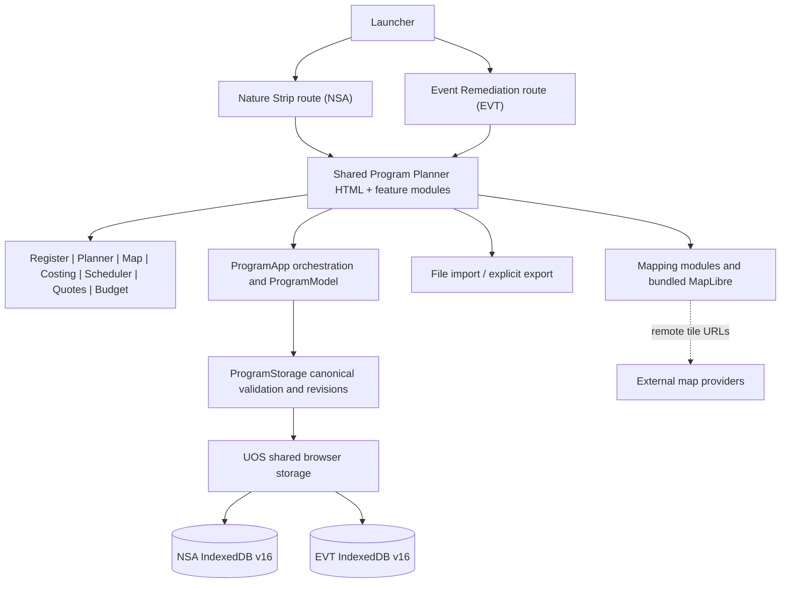

# Stage 0 — Independent intake and source reconnaissance

**Assessment:** Horticulture Program Planner, Nature Strip Applications + Event Space Remediation **only**  
**Stage status:** Stage 0 completed at reconnaissance depth; detailed assurance remains open.  
**Archive:** `horticulture-operations-detached-branch(1).zip`  
**SHA-256:** `3bc65a0ece717d2ca920fb4c885fa1f3e1c32d34da77415fb11cdbd4d12dfcc7`  
**Stage boundary:** Stop after Stage 0. Stage 1 requires explicit `CONTINUE` authorization.

## 1. Corrected boundary and intake

The user explicitly excluded the entire Overtime and Workforce Planner subsystem. No such files, tests, governance, findings or release claims form part of this assessment. Of 351 regular files in the received ZIP, 154 belong to the excluded subtree. The retained manifest records **197 other files**, including explicitly classified supporting material; this is an inventory count, not a claim that 197 files were read or audited.

The only launched business routes observed are `src/program-planner/nsa.html` and `src/program-planner/events.html`, linked by `src/index.html:20–30`. Both load a common iframe implementation. Route-specific application IDs, workspace owners and IndexedDB names are set in `src/program-planner/app-config.js:11–23`. The mapping files under `src/remediation-planner` are loaded by this common implementation (`index.html:1115–1116,1161–1163`) and therefore **remain within** the Program Planner review; their directory name does not define an independent application.

Safety inspection of the ZIP's metadata preceded extraction. All regular entries passed path traversal, symlink, encryption, duplicate, per-entry size and cumulative expansion checks applied by the intake script. Source files were copied into a disposable workspace; **no supplied application code, tests, install scripts or nested archives were executed or expanded**. Only source snippets and filenames were inspected. The manifest retains SHA-256 for each non-excluded file.

## 2. Observed application architecture

The interface declares Register, Project Planner, Space Map, Cost Calculator, Job Scheduler, Quote Builder, Annual Budget, Data & Settings, and hidden Dashboard and Reports navigation nodes (`src/program-planner/index.html:48–83`). The JavaScript model represents both owner-specific registers and shared project, job, costing, quote, payment, mapping, status and budget entities (`js/model.js:70–80`). The runtime is browser-centric: local IndexedDB for workspaces, `localStorage` for certain interface preferences and `sessionStorage` for operator/UI session fields. The package bundles MapLibre and PDF.js under `src/shared/vendor`; map-provider configurations refer to external tile URLs, so full offline-map operation is **not yet established**.

### Stage 0 provenance

Directly inspected in full: launcher and both route wrappers, `app-config.js`, root `package.json`. Targeted/partial source inspection: shared Program Planner HTML, model blank state and checklist templates, app initialization/mutation, canonical/shared storage, import/export entry functions, default rate catalog, session operator keys, and map-provider configuration. All other retained files were **inventoried by path/hash only**, including test contents, governance provisions and full third-party library source. The source-first observations were recorded before reading claims in project governance or past test-result files. See `SOURCE_FIRST_NOTE.md` and per-file coverage in `SOURCE_MANIFEST.csv`.

## 3. Business flows and trust boundaries

The owner-specific checklist templates differ: NSA includes application approval, site assessment, planning checks, contractor preparation and handover; EVT includes pre-delivery consultation, irrigation mark-out, purchase-order/permit tasks and post-delivery reports/maintenance (`js/model.js:84–125`). The feature UI provides common mapping, estimation, scheduling, quotes and budget surfaces, but **cross-module enforcement and state transitions have not been traced or executed**. `BUSINESS_WORKFLOW_MAPS.md` contains three embedded Mermaid diagrams: NSA, EVT and startup/edit/recovery.

Source-observed startup (`js/app.js:851–865`) attempts an existing canonical workspace and otherwise activates `ProgramModel.blank()`. The blank factory first creates empty entity arrays then populates default **Rate Catalog reference entries** (`js/model.js:229–232,322–345`; `js/default-rate-catalog.js:33–95`). There is no basis yet to equate the reference catalog with pre-existing operational records; Stage 2 must define and test the empty-start acceptance criterion on a fresh isolated browser profile. Existing workspace repair and legacy-source staging remain review targets. The actual first-run browser state was **not** tested.

Queued application mutations (`js/app.js:635–677`) normalize data, invoke budget transition checks, and call canonical save. Shared storage selects a route-specific IndexedDB name (`src/shared/js/storage.js:4–15,29–44`); ProgramStorage implements validation and last-verified recovery. User-controlled JSON/ZIP export and corresponding import entry points exist (`js/data-workspace.js:398–411,619–752`). Presence in code is not evidence that backup, recovery, browser-quota and interrupted-write scenarios work correctly.

## 4. Provisional risk/verification ledger

No runtime-demonstrated defects or passed tests are claimed. Stage 0 created four **source-grounded verification items**, not findings of operational failure. Their stable IDs, provisional priorities, hashes, owner scope and closure criteria are in `FINDINGS_LEDGER.csv`.

| ID | Provisional concern | Evidence | Next verification |
|---|---|---|---|
| HPA-0001 | Browser-shipped map configuration embeds an API token; restrictions, permission scope and treatment as a public key are unknown. | `src/remediation-planner/config/metromaps-provider.js:5` | Stage 3: establish credential classification, service restrictions and rotation requirements without reproducing token. |
| HPA-0002 | Blank workspaces load a default rate catalog. The zero-operational-data requirement needs an explicit distinction between reference rates and user records. | `src/program-planner/js/model.js:229–232,322–345` | Stage 2: clean-profile runtime test and exact per-collection baseline assertion. |
| HPA-0003 | The status operator uses an unqualified sessionStorage key common to the shared implementation; whether this is intended across NSA/EVT is undetermined. | `src/program-planner/js/status-app.js:6`, `status-ui.js:8–9` | Stages 2/4: cross-route same-tab/operator audit. |
| HPA-0004 | Map tile provider URLs point outside the static application; offline operation and permitted external disclosures require evidence. | `src/remediation-planner/config/map-providers.js:19,27,35` | Stages 3/6: test airplane/offline mode and check Council deployment rules. |

These are **review priorities**, not confirmed defects. No readiness grade or release verdict is appropriate at this stage.

## 5. Coverage map for later stages

| Stage | In-scope code / evidence emphasis |
|---|---|
| 1: Constitution / architecture | `src/governance/*.md`, root governance docs, `src/program-planner/js/*.js`, `src/shared/js/*.js`, module ownership and reference-catalog contracts. |
| 2: Persistence / recoverability | `js/model.js`, `js/storage.js`, `js/data-workspace.js`, `js/data-settings.js`, `js/migration.js`, `src/shared/js/storage.js`, clean profiles and safe backup failures. |
| 3: Security | All importers and renderers; `src/remediation-planner/config/*`; vendored MapLibre/PDF.js and source/distribution integrity; CSP/deployment context. |
| 4: Operational correctness | Each NSA/EVT flow through Register, Planner, Space Map, Costing, Scheduler, Quotes, Budget, status and reports; shared mapping dependencies. |
| 5: Test evidence | `tests/` (41 retained entries including test helper), `scripts/`, `package.json`, `playwright.config.cjs`; independently run only after script safety audit. |
| 6: UI / accessibility | HTML/CSS, interaction JS, screenshots and browser-dependent map / offline behaviour; keyboard and visual/manual checks. |
| 7: Cross-cutting | Revisit interactions across previously evidenced critical flows. |
| 8: Consolidation | Cumulative audit ledger, unresolved dependencies, required verification and Council acceptance boundaries. |

`SOURCE_MANIFEST.csv` assigns a primary and secondary planned stage to each of the 197 retained items so subsequent sessions can identify material that has **not** been inspected. Historical `Offline/` notes and prior review documents are only supporting context, never test evidence. The standalone viewer and nested GeoForge archive are ancillary, not separate business applications.

## 6. Next boundary and evidence needed

**Completed:** safe intake, source-first entry-point and persistence reconnaissance, corrected scope, SHA-256 inventory, initial feature/workflow diagrams, and a stable provisional ledger. **Unverified:** constitutional conformity; exact data-baseline semantics; active workflow transitions; actual runtime storage, security, browser compatibility and test assertions. **Next authorized stage:** Stage 1 constitutional and architecture compliance after `CONTINUE` and confirmation the same source ZIP/hash is retained. The next session should open `SESSION_HANDOFF.md` before anything else, verify the archive checksum and examine the supplied governance documents against actual code without adopting earlier conclusions.
