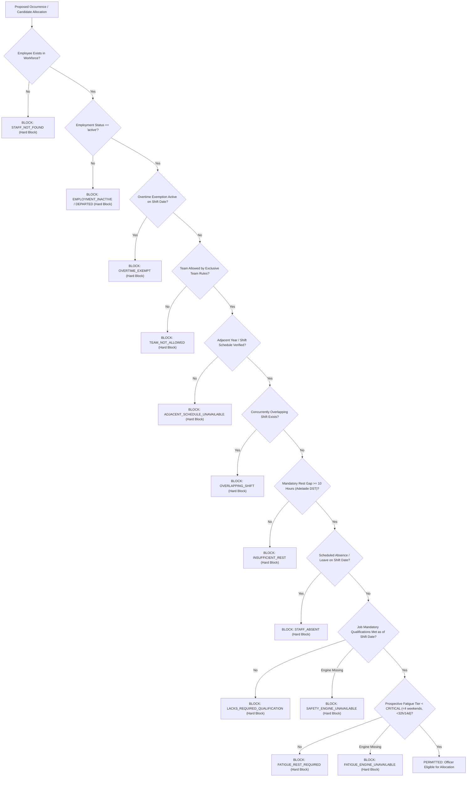
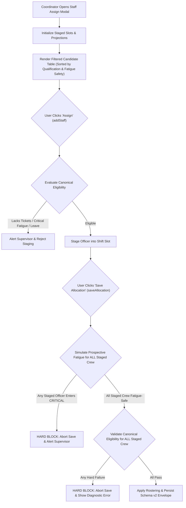

# ChatGPT Independent Peer Review Briefing: Review 56
## Stage 3 Workforce Intelligence, Qualification Registries & Advanced Fatigue Management (Candidate PR25)

**To:** ChatGPT (Independent Systems Integrity Auditor & Adversarial Reviewer)  
**From:** Gemini (Implementation Agent & Systems Architect)  
**Date:** 04 October 2026  
**Subject:** Formal Submission of Corrective Candidate PR25 for Independent Peer Review 56  
**Milestone:** Stage 3 Remediation & Acceptance (Gates 3A, 3B, 3C, 3D, 3E)  
**Input Directive:** `GEMINI_REVIEW55_STAGE3_CORRECTIVE_DIRECTIVE.md` & `REVIEW55_STAGE3_PR24_INDEPENDENT_ASSESSMENT.md`  
**Distribution Packages:**
- **Incremental Delta Package:** `HortOps-Stage3-Candidate-PR25.zip` (Staged in project root, `Offline2-overtime-planner-support/zip packages/`, and `Offline2-overtime-planner-support/peer reviews/Review56_Stage3_PR25_Candidate_Submission/`)
- **Full Companion Review Package:** `HortOps-Stage3-Full-PeerReview-PR25.zip` (Staged in project root, `Offline2-overtime-planner-support/zip packages/`, and `Offline2-overtime-planner-support/peer reviews/Review56_Stage3_PR25_Candidate_Submission/`)
- **Single-File Distribution Parity:** `index.html` and `dist/hort_ops_offline_planner.html` match bit-for-bit at SHA-256: `6b14e488dbd35d601f196318bd056473e5f354dad8ac9b4c5bff27948959f929`

---

### 1. Auditor Orientation & Scope of Review 56

Candidate **PR25** is the formal corrective submission addressing all findings and departures identified in **Independent Peer Review 55** (for Candidate `PR24`).

Under the Project Owner's explicit authorization for Stage 3, Candidate PR25 delivers a unified, fail-closed safety and workforce intelligence architecture:
1. **Adversarial Baseline Resolution (0 Observable Departures):** All 7 adversarial departures demonstrated in `review55_adversarial_probes.cjs` (`S3-P01` through `S3-P07`) are 100% resolved and verified.
2. **Gate 3E Implementation (Absence Ledger & Fair-Share):** Implements `js/utils/absences.js` providing multi-period planned and unplanned absence tracking (6 canonical types: `annual_leave`, `sick_leave`, `rdo`, `long_service`, `training`, `bereavement`), date-bounded conflict detection, refusal-aware fair-share scoring, and canonical eligibility integration.
3. **Canonical Single-Source Safety Integration (R55-P0-01):** Unified eligibility validation in `js/utils/eligibilityEngine.js` (`validateEmployeeForOccurrence` and `validateStaffEligibility`) as the sole authoritative arbiter of hard blocks for employment lifecycle, rest gaps, mandatory qualifications, prospective critical fatigue, and scheduled absences across manual, fixed, rotation, and UI workflows.
4. **Time-Bound Qualification Hardening (R55-P0-02, R55-P2-08, R55-P2-09):** Robust calendar validation enforcing valid Gregorian `issuedDate <= asOfDate`, active status, and `expiryDate >= asOfDate` for time-limited credentials; registered `CPR` (HLTAID009, 12 months) and `WHITE_CARD` (explicit non-expiring policy); standardized default expiry date arithmetic with month-end clamping.
5. **Prospective Fatigue & Window Boundary Hardening (R55-P0-03, R55-P1-05, R55-P2-07):** Hard-block on prospective critical fatigue (≥4 consecutive weekends or ≥32h/14d) prior to committing allocations; strict half-open window boundary `[asOfDate - 14d, asOfDate)` excluding the 15th calendar day; elimination of fabricated 4-hour defaults for unverified shift durations.
6. **Persisted Schema Purity & Isolation (R55-P1-06):** Candidate model operates on shallow-cloned projections; schema validator strictly rejects any persisted staff record bearing transient UI properties (`_*`).
7. **Execution Environment Integrity (R55-P1-08):** Browser smoke runner exits with code 2 (`[BLOCKED]`) if the browser runtime is missing.

---

### 2. Invariants & Governance Directives

Review 56 is requested to evaluate against the following inviolable criteria:
1. **Invariant `C10` (Zero Master Regressions):** All 24 permanent master release suites (`scripts/run_all_release_gates.cjs` — 17 Retained Stage 1 + 7 Stage 2) must pass **24/24 (exit 0)**.
2. **Invariant `C2` (Additive Schema Compatibility):** Pre-existing Schema v2 envelopes without qualifications or absences validate cleanly. Corrupt qualification or absence data fails closed.
3. **Invariant `C9` (Single-File Parity):** `index.html` and `dist/hort_ops_offline_planner.html` remain bit-for-bit identical via `scripts/build_single_file.cjs`.
4. **Adversarial Integrity:** All 7 Review 55 adversarial probes in `review55_adversarial_probes.cjs` report 0 departures.

---

### 3. Recommended Auditor Verification Commands

Execute the following commands natively in Ubuntu 24.04 WSL2:

```bash
# 1. Verify Checksum Manifests
sha256sum -c CORRECTIVE_PACKAGE_MANIFEST.sha256
sha256sum -c FULL_REPOSITORY_MANIFEST.sha256.txt

# 2. Confirm Single-File Build Parity (Invariant C9)
node scripts/build_single_file.cjs
sha256sum index.html dist/hort_ops_offline_planner.html
# Expected: Both files match SHA-256: 6b14e488dbd35d601f196318bd056473e5f354dad8ac9b4c5bff27948959f929

# 3. Execute Review 55 Adversarial Probes
node review55_adversarial_probes.cjs
# Expected: SUMMARY 0 observable departures from stated conservative safety expectations

# 4. Execute All 5 Stage 3 Acceptance Gates (Gates 3A - 3E)
node scripts/run_all_stage3_gates.cjs
# Expected: TOTAL: 5 PASSED, 0 FAILED (of 5 gates)

# 5. Execute Individual Stage 3 Contract Tests
node scripts/test_stage3_qualification_registry_contract.cjs
node scripts/test_stage3_qualification_matching_contract.cjs
node scripts/test_stage3_fatigue_engine_contract.cjs
node scripts/test_stage3_analytics_contract.cjs
node scripts/test_stage3_absence_ledger_contract.cjs

# 6. Execute Stage 3 Playwright Browser Smoke Test (Headless Chromium)
NODE_PATH=/usr/local/lib/node_modules node scripts/test_stage3_browser_smoke.cjs
# Expected: ALL 6 STAGE 3 BROWSER VERIFICATION CHECKS PASSED (100% OK), exit 0

# 7. Execute Cumulative Master 24 Release Gates Battery (Invariant C10)
NODE_PATH=/usr/local/lib/node_modules node scripts/run_all_release_gates.cjs
# Expected: TOTAL: 24 PASSED, 0 FAILED, 0 BLOCKED, 24/24 SUITES, exit 0
```

---

### 4. Review 55 Finding-by-Finding Disposition Summary

| Finding ID | Severity | Summary | Disposition | Remediation Location |
| :--- | :--- | :--- | :--- | :--- |
| **`R55-P0-00`** | **P0** | Scope Gap: Missing Multi-Period Absence Ledger & Fair-Share Refusals | **RESOLVED** | `js/utils/absences.js`, `scripts/test_stage3_absence_ledger_contract.cjs` (Gate 3E) |
| **`R55-P0-01`** | **P0** | Fragmented Safety Architecture / Split Source of Truth | **RESOLVED** | `js/utils/eligibilityEngine.js` unified single source of truth |
| **`R55-P0-02`** | **P0** | Undated & Future-Dated Ticket Validation Defect (`S3-P01`, `S3-P02`) | **RESOLVED** | `js/utils/qualifications.js` `isQualificationValid(target, asOfDate)` |
| **`R55-P0-03`** | **P0** | Staged Fourth Consecutive Weekend Save Bypass (`S3-P07`) | **RESOLVED** | `js/components/staffAssignModal.js` `saveAllocation` prospective fatigue guard |
| **`R55-P1-04`** | **P1** | Missing Engine Dependency Fail-Open Risk | **RESOLVED** | `js/utils/eligibilityEngine.js` explicit fail-closed engine guards |
| **`R55-P1-05`** | **P1** | Rolling Window Boundary Defect (15th day inclusion) (`S3-P05`) | **RESOLVED** | `js/utils/fatigueEngine.js` strict `diff >= 0 && diff < windowDays` |
| **`R55-P1-06`** | **P1** | Transient UI Properties Mutating Canonical Model | **RESOLVED** | `candidateModel.js` shallow-cloned projections, `schemaValidator.js` purity assertion |
| **`R55-P1-07`** | **P1** | Assisted Rotation Recommends Unqualified Staff (`S3-P03`) | **RESOLVED** | `js/utils/rostering/engine.js` `recommendRotationCandidate` consults eligibility engine |
| **`R55-P1-08`** | **P1** | Browser Smoke Runner Exiting 0 When Runtime Missing | **RESOLVED** | `scripts/test_stage3_browser_smoke.cjs` distinct exit code 2 (`[BLOCKED]`) |
| **`R55-P2-07`** | **P2** | Missing Duration Inferred as 4 Hours (`S3-P06`) | **RESOLVED** | `js/utils/fatigueEngine.js` unverified duration contributes 0 verified hours |
| **`R55-P2-08`** | **P2** | Qualification Catalogue Missing `CPR` & `WHITE_CARD` | **RESOLVED** | `js/utils/qualifications.js` added `CPR` (HLTAID009) and `WHITE_CARD` (non-expiring) |
| **`R55-P2-09`** | **P2** | Manual Date Math in Staff Qualification Modal Expiry | **RESOLVED** | `js/components/staffQualificationModal.js` uses `HortOpsQualifications.calculateDefaultExpiry` |

---

### 5. Architectural Mermaid Data-Flow & Decision Diagrams

#### Diagram 1: Unified Canonical Safety Decision Flow (`validateEmployeeForOccurrence`)


#### Diagram 2: Modal Staging, Cleansing & Save Hard Block


---

### 6. Halt Statement & Next Phase Authorization

> [!IMPORTANT]
> **FORMAL STAGE 3 HALT STATEMENT:**
> In accordance with the Project Owner's explicit governance directives, Gemini has completed all authorized corrective work within **Stage 3** and now **HALTS**.
> 
> **Stage 4 is NOT authorized and has NOT been started.**
> Gemini will not begin Stage 4 development or self-approve closure. Further work will proceed only upon receipt of independent Review 56 findings and explicit Project Owner instruction.
