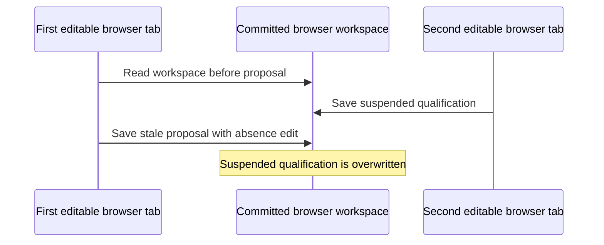
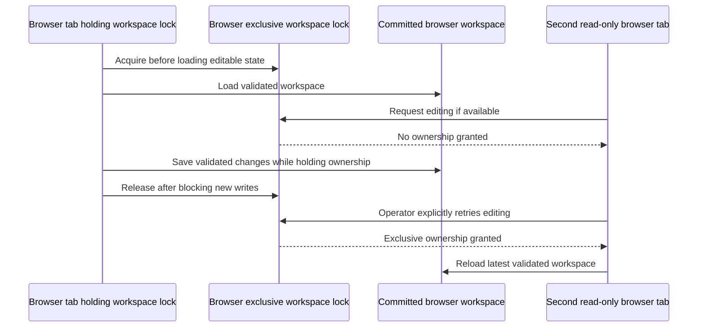

# Review 64 single-writer design decision

Date: 5 October 2026. Phase: migration Phase 4, corresponding to Review 64
Gate A. This is design and isolated browser evidence, not production
integration or release closure. Rostering product Stage 4 is not authorised.

## Decision and remaining owner choice

Use a browser-managed exclusive Web Lock for the entire editable lifetime
of a workspace. No lock means read-only. A second tab may request editing
explicitly after the owner releases it or closes. There is no timeout-based
takeover, forced stealing, localStorage lease or silent write fallback.

**Owner clarification: clean client start.** The client has no existing or
saved workspace. Use a fresh physical storage namespace, empty Workforce and
Job registries and current Schema v2 only. Populate Workforce from the client's
User Table and let the client create Jobs. No legacy import or migration step
is required. The client runtime must not adopt old keys, Schema 1, sample
workforce, sample jobs or historical operational data. No namespace or
application code has changed in Phase 4; enforce this in Phase 5.

The existing physical key is `hort_ops_workspace_v2`. A proposed new canonical
key is `hort_ops_workspace_v2_single_writer_v1`; Schema v2 and all business
identities remain unchanged. All auxiliary recovery, quarantine, staging and
probe keys must belong to the same new namespace, not just the main envelope.
The exact namespace mapping must be reviewed in Phase 5 before changing keys.

## Why this is needed

Review 64 demonstrates a read–validate–write race: another writer changes
committed data after verification, then a stale proposal overwrites it.
Qualification suspension, absence notes and budget updates can be lost.
An additional read, timestamp or storage event cannot make this sequence atomic.



The Web Locks specification defines cooperative coordination within a storage
bucket; the exclusive lock is held while its callback promise is pending.
It does not prevent a client that ignores locks from writing directly.
See the [Web Locks specification](https://w3c.github.io/web-locks/).

## Alternatives assessed

| Approach | Decision |
| --- | --- |
| Final read, timestamp or domain baseline | Retain existing conflict checks, but insufficient to prevent TOCTOU |
| Storage lease with heartbeat and expiry | Reject: concurrent acquisition and suspended-owner takeover can overlap |
| BroadcastChannel or storage events | Notifications only; not exclusive write authority |
| Per-save lock on a stale editable snapshot | Insufficient alone; needs reread/reconciliation and still permits competing editors |
| Lifetime exclusive Web Lock | Selected for cooperative upgraded clients, subject to fail-closed runtime checks |
| IndexedDB replacement | Defer: broad persistence and recovery rewrite outside this correction |
| New runtime server | Not introduced; offline standalone obligation remains |
| New physical storage namespace | Selected for clean client start; no legacy adoption |

## Ownership contract

1. Begin with persistence and editing blocked. Feature-detect secure-context
   Web Locks and request the stable workspace lock with `exclusive` and
   `ifAvailable`. Use a name derived from the physical workspace key, never
   the filename, tab identity, revision or imported customer data.
2. Acquire before `loadWorkspace()` or any mutating health/migration probe.
   Reading editable baselines before ownership is forbidden. A read-only view
   must use a genuinely non-mutating read/validation path.
3. Keep the request callback pending throughout editing. Enable mutations
   only when the private ownership capability and current lifecycle generation
   are valid. A late grant after cancellation cannot enable editing.
4. Keep existing canonical validation, domain conflict checks, recovery
   protection, historical snapshots and verified persistence. A lock grants
   permission to attempt a valid write; it never turns failed storage into success.
5. Recheck ownership at every mutation boundary, including lower-level storage
   methods. Guard before changing live state or staging recovery evidence.
   UI disabling alone is insufficient. Ordinary synchronous localStorage
   commits finish under ownership; any asynchronous transaction must remain
   tracked under the lock through verification and compensation.
6. On explicit release or page lifecycle departure, block new mutations and
   invalidate pending operation tokens first. Drain tracked transactions before
   releasing. On a destroyed renderer, the browser releases its lock. Never
   infer death from a missing heartbeat or a frozen/background tab.
7. On `pageshow`, including back/forward cache restoration, remain blocked
   until a fresh acquisition and fresh validated load complete. Discard stale
   edit buffers on takeover; do not auto-save an earlier preview.
8. A second tab reports read-only and offers explicit retry. It must not queue
   itself into an unexpected editable takeover, cancel the owner or delete data.



## Runtime matrix and evidence limits

The child-local Chromium 149.0.7827.55 / Playwright 1.61.1 experiment used
fresh browser contexts and synthetic keys. Four simultaneous pages represented
the main file, distribution file, another copy and a second opening.

| Runtime | Actual result | Production disposition |
| --- | --- | --- |
| Linux headless Chromium, `file://` across tested paths | Shared storage, one exclusive writer; handoff and tab closure preserved bytes | Coordination demonstrated for this tested runtime only; legacy-copy isolation still required |
| Dedicated temporary loopback origin | Shared storage, one writer; same handoff checks | Verification fixture only; no runtime server shipped or deployment authorised |
| Chromium renderer crash | Surviving tab acquired and read latest bytes | Prototype evidence; application recovery integration still required |
| Frozen Chromium tab | Owner retained lock; another tab could not steal or save | No heartbeat/TTL takeover permitted |
| Missing, throwing or rejected LockManager | No editable read or write | Read-only |
| Storage read/write failure | No successful write claim | Preserve source; application recovery behaviour must be tested |
| Windows Edge, interactive Chrome, Firefox and Safari | Not executed | Not certified for editing by this proof; require equivalent shared-storage tests before advertising support |
| Old unguarded application on shared storage | Direct old-key write bypassed cooperative lock | Existing namespace unsafe for mixed-version editing |
| Proposed new key versus old-key writer | Old write did not affect new bytes; upgraded second writer blocked | Migration design candidate, not implemented |

API presence alone is not compatibility certification. Browser profiles and
private sessions have separate storage/coordination domains; no cross-device
or cross-profile synchronisation is promised. Third-party embedding, denied
storage, insecure HTTP and unusual file-origin behaviour remain unsupported
until tested; they must not enable an uncoordinated writer. The isolated proof
uses fixtures, not the production startup, dialogs or recovery transactions.

## Clean client startup and legacy isolation

The test confirmed that an older copy can write through the old key even while
an upgraded tab owns a lock. Keeping a warning alone does not close this risk.
A dedicated origin prevents old applications on other origins from accessing
the workspace. That does not supply isolation for all existing `file://`
copies sharing a browser storage domain.

The recommended new namespace isolates the actual historical writer code,
which targets the old keys. This is compatibility isolation, not a security
barrier against arbitrary scripts or developer tools on the same origin.
HTML injection is separately unresolved by this design (R64-P1-02).

The client starts from scratch. Do not scan, adopt, copy, synchronise or migrate
old canonical/legacy keys or historical recovery artifacts. Do not show a legacy
import step. Existing old keys, if present in a development browser, stay outside
the new app's namespace and are not deleted. Reset and compaction must target
only the new namespace.

Initialize empty jobs, workforce, assignments, permits, absences, refusal
history, rostering instructions/provenance and historical snapshots. Use valid
current Schema v2 structures and necessary non-personal configuration, such as
holiday/calendar rules. No sample people, jobs, saved rosters or contact details
may become client data. Workforce comes from the client's User Table; Jobs are
created by the client. Current-schema backup/restore remains available for
data they create. Invalid or unsupported saved data in the new namespace must
still trigger recovery without overwrite; clean startup is not permission to
discard a client's future saved workspace.

Keep historical source, fixtures, schema compatibility tests and signed review
documents as inactive development provenance where required. They are not
client operational data. Legacy-loading/migration code must not remain an
active client startup or import path. Phase 5 must review the compiled source
graph and prove the client artifact cannot activate these paths or sample data.

## Phase 5 integration crosswalk

| Current boundary | Required integration and proof |
| --- | --- |
| `js/app.js` DOM-ready bootstrap and `init` | Acquire before editable loading; pure read-only startup; fresh takeover baselines |
| `js/app.js` canonical proposal and mutation entry points | Ownership check before live-state mutation; no side effects on denial |
| `js/utils/storage.js` facade, save, import and load | Guard all writes, migrations and cleanup; preserve existing validation contracts |
| `js/utils/storage/storageDriver.js` set/remove, health and compaction | Guard raw mutators and mutating probes; ensure namespace-specific cleanup |
| Driver reset, restore, rollback and emergency staging | Own the full transaction through compensation; preserve evidence and fail-closed recovery |
| Recovery inspection/export/acknowledgement and retirement | Pure export remains available; evidence writes/removals require ownership |
| Modal callbacks, timers, UI-state saves and lifecycle callbacks | No stale callback may mutate after release; blocked UI with low-level protection |
| Standalone compiler and distribution | Add child-only module in ordered source; rebuild exact index/dist parity |
| Retained test harnesses | Explicit isolated test capabilities; no runtime bypass flags or fake ownership from imported state |

Phase 5 must enumerate every write call and prove no uncovered bypass. Add
production two-tab tests for qualification, absence/refusal, budget, jobs,
roster, permits, assignments, lineage, UI state, import, restore, reset,
recovery staging/compensation and source preservation. Include empty, valid,
legacy, corrupt and future-schema startup; release during transaction;
crash/reload; back/forward-cache restoration; denied persistence; old/new
namespace isolation and preservation of old keys. Node mocks supplement real
browser proofs; they do not replace the runtime coordination test.

## Reproduction and disposition

```sh
rtk proxy node scripts/test_single_writer_design.cjs
```

The proof imports only child-local Playwright and writes synthetic fixtures,
results and logs under ignored `test_reports/phase4-writer-design/`.
`scripts/design-proof/single-writer-prototype.js` is deliberately absent from
the application source graph and compiler. All 18 checks passed, including an
intentional demonstration of the old-copy bypass. Original Review 64 probes
remain unchanged; the application still reproduces its open findings.

**R64-P0-01 disposition: design proof complete, application remediation pending.**
Phase 5 requires owner resumption and must implement the clarified clean start. No claim of
Review 65 acceptance, safe production editing or release closure is made.

## Phase 5 implementation update

The clean-start namespace and cooperative writer design are now implemented;
see `MIGRATION_PHASE5_CHECKPOINT.md`. The client excludes legacy loading and
sample-data modules, while compatibility tests retain their original sources.
Logical recovery key identities map to isolated physical storage; all auxiliary
stores and reset/compensation paths remain inside that boundary.

All 18 production writer checks, 24 retained suites and seven Stage 3 browser
checks passed. The historical design/prototype results above remain evidence
of Phase 4, not a claim that its prototype is the production source. Raw Review
64 reproductions and the colour-injection finding remain tracked; supported
client concurrency protection does not establish a security barrier against
arbitrary scripts or grant release acceptance. Stop before Phase 6 until resumed.
