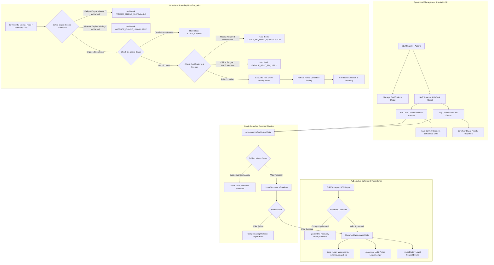

# Stage 3 Integration, Architecture & Test Crosswalk: Candidate PR26

**Date:** 2026-10-04  
**Author:** Principal Municipal Operational Systems Architect  
**Scope:** Stage 3 Workforce Intelligence, Multi-Period Absence Ledger, Fair-Share Allocation & Fail-Closed Safety  
**Authority:** Owner-authorized for **Stage 3**. Stage 4 is **NOT authorized**.

---

## 1. System Architecture & Data Flow

The following Mermaid diagram outlines the end-to-end operational architecture of Candidate PR26, illustrating the canonical validation boundary, detached proposals, multi-entrypoint eligibility gating, refusal-aware fair-share ranking, and fail-closed dependency guards.

---

## 2. Multi-Entrypoint Eligibility Architecture

Eligibility enforcement in Adelaide City Council operations operates through a unified, fail-closed evaluation pipeline implemented in [js/utils/eligibilityEngine.js](file:///home/n0rt/Antigravity-IDE/Hort_Ops_Visualisations/Offline2-Overtime-Planner/js/utils/eligibilityEngine.js) (`validateEmployeeForOccurrence`).

Every dispatch entrypoint routes through this single authoritative pipeline:
1. **Manual Staff Assignment Modal:** [js/components/staffAssignModal.js](file:///home/n0rt/Antigravity-IDE/Hort_Ops_Visualisations/Offline2-Overtime-Planner/js/components/staffAssignModal.js) evaluates candidates live, badging unaccredited or fatigued staff, disabling selection buttons, and enforcing a pre-save violation guard.
2. **Assisted Rotation Engine:** [js/utils/rostering/engine.js](file:///home/n0rt/Antigravity-IDE/Hort_Ops_Visualisations/Offline2-Overtime-Planner/js/utils/rostering/engine.js) (`recommendRotationCandidate`) filters all candidates through `validateStaffEligibility`. Ineligible or absent personnel are eliminated prior to tie-breaking.
3. **Fixed Schedule Propagation:** `propagateOccurrence` verifies each descendant shift occurrence against the candidate's forward availability and qualifications on that future date.
4. **Automated Recommendation Services:** Recommendations refuse absent, fatigued, or unaccredited candidates and highlight vacancies with explicit diagnostic provenance.

---

## 3. Policy Contracts & Invariants

### 3.1 Fair-Share Overtime Distribution Metric
$$\text{Fair-Share Score} = 1000 - (\text{YTD Overtime Hours} \times 2) + (\text{Refusal Count} \times 5) - \text{Fatigue Risk Penalty}$$

- **Base Priority:** 1000 points.
- **Overtime Hours Equalization:** $-2$ points per accumulated overtime hour.
- **Refusal Balancing:** $+5$ points per recorded refusal event. A worker who declined a previous shift is prioritized in subsequent allocation cycles to guarantee equal opportunity.
- **Fatigue Penalty:** $-25$ points for Moderate fatigue tier, hard block for Critical tier.
- **Authorised Leave Invariant:** Approved leave (Annual Leave, Sick Leave, RDOs, Training, Bereavement) is logged exclusively in the Absence Ledger and does **not** increment refusal counts.

### 3.2 Evidence Loss Guard Contract
Committed workspaces containing established absence records are protected against accidental truncation:
$$\text{if } (\text{committed.absences.length} > 0 \land \neg \text{isReset} \land \text{proposed.absences.length} == 0) \implies \text{ABORT COMMIT}$$
The commit fails closed with: `"Cannot save workspace: suspicious absence record loss detected"`.

### 3.3 Fail-Closed Safety Dependency Contract
Workforce allocation safety relies on the absolute integrity of compliance and health engines:
1. If `HortOpsFatigueEngine.simulateAssignmentFatigue` is unavailable, throws, or returns non-object: `FATIGUE_ENGINE_UNAVAILABLE` (Hard Block).
2. If `HortOpsAbsences.isStaffAbsentOnDate` is unavailable, throws, or returns non-object: `ABSENCE_ENGINE_UNAVAILABLE` (Hard Block).
3. If `HortOpsQualifications.evaluateStaffQualifications` is unavailable: `SAFETY_ENGINE_UNAVAILABLE` (Hard Block).

---

## 4. Test Crosswalk: Review 56 Directives to Acceptance Contracts

| Finding / Directive Requirement | Verifying Script | Test Scenario / Assertion | Result |
| :--- | :--- | :--- | :--- |
| **P0-1** Full Lifecycle Durability | [test_stage3_absence_persistence_contract.cjs](file:///home/n0rt/Antigravity-IDE/Hort_Ops_Visualisations/Offline2-Overtime-Planner/scripts/test_stage3_absence_persistence_contract.cjs) | Test 2: `init -> eligibility -> mutate -> commit -> export -> restore -> cold reload` | **PASS (100%)** |
| **P0-1** Evidence-Loss Protection | [test_stage3_absence_persistence_contract.cjs](file:///home/n0rt/Antigravity-IDE/Hort_Ops_Visualisations/Offline2-Overtime-Planner/scripts/test_stage3_absence_persistence_contract.cjs) | Test 3: Reject empty proposal when storage has 3 absences | **PASS (100%)** |
| **P0-1** Storage Failure Rollback | [test_stage3_absence_persistence_contract.cjs](file:///home/n0rt/Antigravity-IDE/Hort_Ops_Visualisations/Offline2-Overtime-Planner/scripts/test_stage3_absence_persistence_contract.cjs) | Test 4: Forced disk write failure leaves committed storage uncorrupted | **PASS (100%)** |
| **P0-2** Cross-Year Calendar Boundary | [test_stage3_absence_persistence_contract.cjs](file:///home/n0rt/Antigravity-IDE/Hort_Ops_Visualisations/Offline2-Overtime-Planner/scripts/test_stage3_absence_persistence_contract.cjs) | Test 1: Gregorian checks 2026-12-30 to 2027-01-05 | **PASS (100%)** |
| **P0-2** Absence Hard Block | [test_stage3_absence_persistence_contract.cjs](file:///home/n0rt/Antigravity-IDE/Hort_Ops_Visualisations/Offline2-Overtime-Planner/scripts/test_stage3_absence_persistence_contract.cjs) | Test 2b: On-leave worker Alan hard-blocked on shift date | **PASS (100%)** |
| **P0-3** Refusal Candidate Ranking | [test_stage3_absence_persistence_contract.cjs](file:///home/n0rt/Antigravity-IDE/Hort_Ops_Visualisations/Offline2-Overtime-Planner/scripts/test_stage3_absence_persistence_contract.cjs) | Test 5: Modal candidate model sorts Beth (score 970) before Alan (score 960) | **PASS (100%)** |
| **P0-3** Assisted Rotation Refusal Support | [test_stage3_absence_persistence_contract.cjs](file:///home/n0rt/Antigravity-IDE/Hort_Ops_Visualisations/Offline2-Overtime-Planner/scripts/test_stage3_absence_persistence_contract.cjs) | Test 5: `recommendRotationCandidate` selects higher fair-share score | **PASS (100%)** |
| **P0-3** Leave vs Refusal Invariant | [test_stage3_absence_persistence_contract.cjs](file:///home/n0rt/Antigravity-IDE/Hort_Ops_Visualisations/Offline2-Overtime-Planner/scripts/test_stage3_absence_persistence_contract.cjs) | Test 5: Taking authorised leave does not increment refusal count | **PASS (100%)** |
| **P1-4** Fail-Closed Fatigue Engine | [test_stage3_absence_persistence_contract.cjs](file:///home/n0rt/Antigravity-IDE/Hort_Ops_Visualisations/Offline2-Overtime-Planner/scripts/test_stage3_absence_persistence_contract.cjs) | Test 6a, 6b, 6c: Missing, throwing, and malformed fatigue engine checks | **PASS (100%)** |
| **P1-5** Fail-Closed Absence Engine | [test_stage3_absence_persistence_contract.cjs](file:///home/n0rt/Antigravity-IDE/Hort_Ops_Visualisations/Offline2-Overtime-Planner/scripts/test_stage3_absence_persistence_contract.cjs) | Test 6d, 6e: Missing, throwing, and malformed absence engine checks | **PASS (100%)** |
| **P1-6** UI Operational CRUD & Smoke | [test_stage3_browser_smoke.cjs](file:///home/n0rt/Antigravity-IDE/Hort_Ops_Visualisations/Offline2-Overtime-Planner/scripts/test_stage3_browser_smoke.cjs) | Playwright Chromium live UI verification of modal roots and workflows | **PASS (100%)** |
| Review 55 Adversarial Regression | [review55_adversarial_probes.cjs](file:///home/n0rt/Antigravity-IDE/Hort_Ops_Visualisations/Offline2-Overtime-Planner/review55_adversarial_probes.cjs) | S3-P01 through S3-P07 adversarial edge probes | **0 Departures** |
| Review 56 Direct Defect Probes | `test_review56_resolved.cjs` | R56-P01 through R56-P05 independent probes | **0 Departures** |
| Stage 1 & 2 Permanent Baselines | [run_all_release_gates.cjs](file:///home/n0rt/Antigravity-IDE/Hort_Ops_Visualisations/Offline2-Overtime-Planner/scripts/run_all_release_gates.cjs) | 24 Master Release Suites (17 Stage 1 + 7 Stage 2) | **24/24 PASS (100%)** |
| Single-File Compilation Parity | [build_single_file.cjs](file:///home/n0rt/Antigravity-IDE/Hort_Ops_Visualisations/Offline2-Overtime-Planner/scripts/build_single_file.cjs) | Bit-for-bit SHA-256 match between `index.html` and `dist/hort_ops_offline_planner.html` | **VERIFIED MATCH** |
