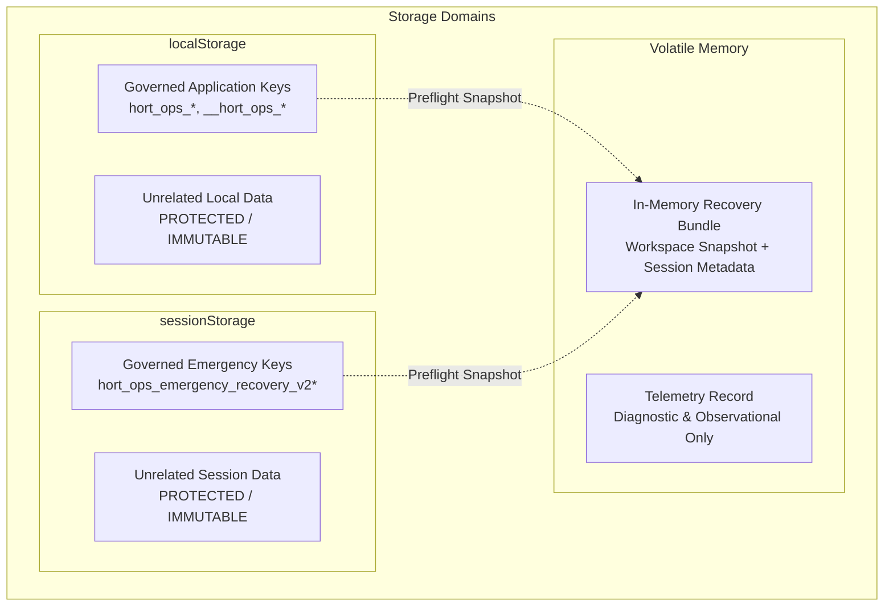
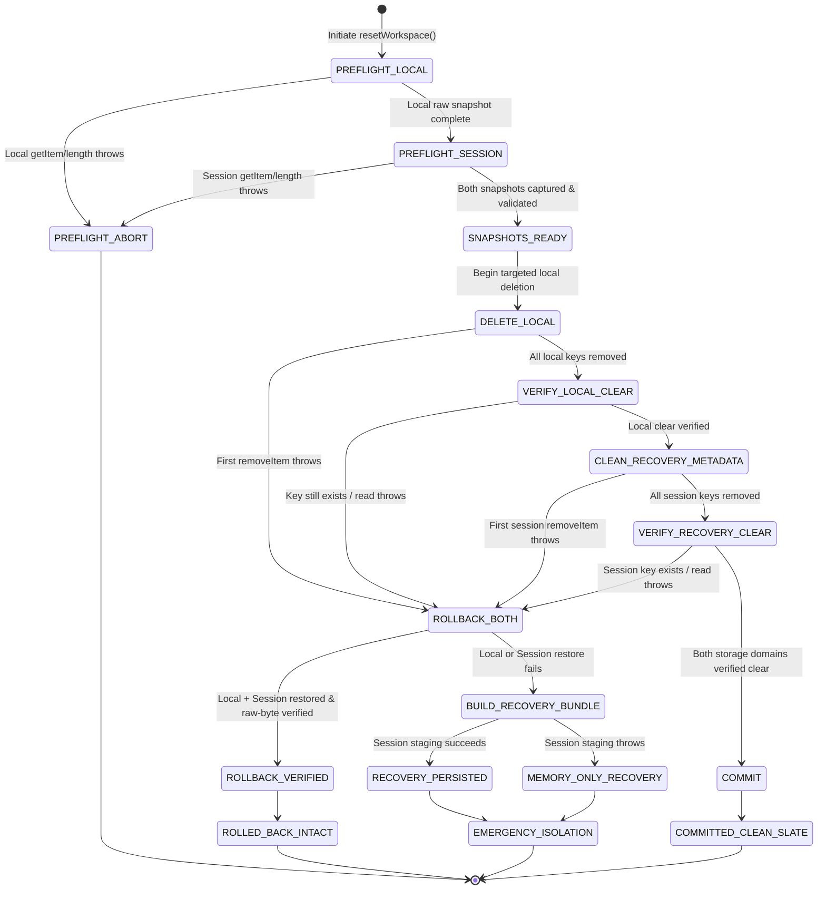

# Stage 2 Transaction-Model Closure Design Submission (PR23_07)

**Document ID:** `STAGE2_TRANSACTION_MODEL_DESIGN_SUBMISSION_01.md`  
**Candidate Target:** `PR23_07 — Stage 2 Transaction-Model Closure Candidate`  
**Role:** Principal Transaction Integrity Engineer and Release Closure Architect  
**Authority:** Supersedes Review 43 implementation instructions per `01_SUPERSESSION_AND_AUTHORITY.md` and `Stage2_Transaction_Model_Closure_Addendum.md`.  
**Governance Status:** Design Gate Submission (Halt Rule Active — Zero Production Code Changes Prior to Independent Review Approval).

---

## Executive Summary & Architectural Paradigm

In accordance with the Stage 2 Transaction Model Closure Readiness Package and its Addendum, this design submission establishes the formal transaction state machine, invariant mappings, failure-injection mappings, and component specifications for the **Clean Slate Reset** and **Emergency Recovery Restore** workflows.

Classical browser storage lacks atomic primitives, distributed transaction coordinators, write-ahead logging (WAL), and prepare/commit phases. Therefore, this architecture is strictly defined as:

> **Multi-store transaction orchestration with verified compensating rollback and SAGA-style emergency recovery.**

Atomicity and durability are emulated through:
$$\\text{Dual-Domain Snapshot} \\longrightarrow \\text{Controlled Mutation} \\longrightarrow \\text{Byte-for-Byte Compensation} \\longrightarrow \\text{Emergency Isolation}$$

Zero production code has been modified in preparation of this document. Production implementation will only commence upon receiving formal `DESIGN GATE: PASS` approval.

---

## Section A: Transaction Architecture

### A.1 Governed Storage Domains & Ownership Boundaries
The browser environment manages three distinct storage domains under strict scoped ownership rules (Invariant `TM-I02`):

1. **Application-Owned `localStorage`:**
   - **Governed Keys:** Canonical keys matching `hort_ops_*` and internal probe keys `__hort_ops_*`:
     - `hort_ops_workspace_v2` (Canonical workspace state)
     - `hort_ops_workspace_v1` (Legacy v1 workspace)
     - `hort_ops_jobs_offline`, `hort_ops_staff_offline`, `hort_ops_assignments_offline`, `hort_ops_permits_offline`, `hort_ops_budget_offline`
     - `__hort_ops_persistence_probe__`
   - **Isolation Boundary:** Any key in `localStorage` not matching `hort_ops_*` or `__hort_ops_*` (e.g., `unrelated-local`, third-party tokens) is strictly untouched and immutable across all phases.

2. **Emergency-Recovery `sessionStorage`:**
   - **Governed Keys:** Keys matching `hort_ops_emergency_recovery_v2*`.
   - **Isolation Boundary:** Any session key not matching this prefix (e.g., `unrelated-session`, auth tokens) is strictly untouched.

3. **In-Memory Volatile State:**
   - Active store state (`HortOpsStorageDriver.memory`).
   - Transaction Telemetry Record (`HortOpsStorageDriver.lastResetResult.telemetry`).
   - Emergency Transaction Recovery Bundle (in-memory JSON object containing current workspace snapshot + pre-reset session metadata).



### A.2 State Diagram: Transaction A (Clean Slate Reset)

The Clean Slate Reset transaction executes across explicit non-overlapping phases. Every phase boundary is guarded by strict error capture and stop-on-failure discipline (`TM-I05`).



### A.3 Commit Point Definition
The transaction reaches the **Commit Point** if and only if:
1. All application-owned keys in `localStorage` have been deleted and verified absent (`getItem(k) === null`).
2. All emergency-recovery keys in `sessionStorage` have been removed and verified absent.
3. Verification is performed via raw storage inspection without catching or masking discrepancies.
4. Once verified, memory is purged (`this.memory = {}`) and the transaction transitions to `COMMITTED_CLEAN_SLATE` (`success: true, rolledBack: false`).

### A.4 Compensation Point (Rollback Boundary)
If a failure occurs during:
- Local key deletion (`DELETE_LOCAL`),
- Local clear verification (`VERIFY_LOCAL_CLEAR`),
- Emergency metadata cleanup (`CLEAN_RECOVERY_METADATA`), or
- Session clear verification (`VERIFY_RECOVERY_CLEAR`),

The orchestrator halts further mutations immediately (`TM-I05`) and triggers dual-store compensating rollback (`ROLLBACK_BOTH`):
1. **Compensate `localStorage`:** Re-write every preflight key/value pair that was deleted or targeted; remove any spurious keys created.
2. **Verify `localStorage`:** Inspect every preflight key and assert `window.localStorage.getItem(k) === snapshot[k]` byte-for-byte (`TM-I14`).
3. **Compensate `sessionStorage`:** Re-write every preflight emergency recovery artifact; remove any keys not present in the preflight session snapshot.
4. **Verify `sessionStorage`:** Assert `window.sessionStorage.getItem(k) === sessionSnapshot[k]` byte-for-byte (`TM-I14`).

If and only if **both** compensations succeed and are byte-verified:
- Terminal state is `ROLLED_BACK_INTACT` (`success: false, rolledBack: true`).

### A.5 Emergency Isolation Model (Second-Order Failure)
If compensating rollback fails in either domain (e.g., `localStorage.setItem` throws `QuotaExceededError`, or `sessionStorage` fails to re-stage the metadata):
1. The orchestrator immediately enters `BUILD_RECOVERY_BUNDLE` (`TM-I07`).
2. It synthesizes an in-memory **Transaction Recovery Bundle**:
   ```json
   {
     "bundleType": "hort_ops_reset_transaction_recovery",
     "schemaVersion": 2,
     "createdAt": "2026-10-01T12:00:00.000Z",
     "terminalState": "EMERGENCY_ISOLATION",
     "currentWorkspaceRecoveryArtifact": {
       "artifactType": "hort_ops_reset_recovery",
       "artifactVersion": 1,
       "storageSnapshot": { ...localPreflightSnapshot... },
       "failedKey": "...",
       "error": "..."
     },
     "previousEmergencyRecoveryMetadata": { ...sessionPreflightSnapshot... },
     "compensationOutcome": {
       "localRestored": false,
       "localVerified": false,
       "recoveryMetadataRestored": true,
       "recoveryMetadataVerified": true
     }
   }
   ```
3. **Persistence-Independent Export (`TM-I08`):** Staging this bundle to `sessionStorage` is attempted as best-effort. If `sessionStorage.setItem` throws (or is quota-locked), the bundle **remains fully preserved in volatile memory**.
4. The API returns `success: false, rolledBack: false, recoveryBundle: bundle, recoveryBundleJson: JSON.stringify(bundle)`.
5. The UI modal catches this state, prevents page reload, blocks autosave (`TM-I10`), and exposes a prominent **"Download Emergency Recovery Bundle"** action so the operator can safely export all data to disk before closing the browser.

### A.6 Diagnostic Telemetry Envelope (Addendum §3)
In strict compliance with Addendum §3:
> *"The telemetry record observes the state machine. It must never drive the state machine."*

The telemetry record is maintained as an observational ledger attached to `lastResetResult.telemetry`. It records:
- `transactionId`: UUID / timestamp identifier.
- `transactionType`: `"clean_slate_reset"`.
- `startedAt` & `completedAt`: ISO 8601 timestamps.
- `initialLocalKeyCount` & `initialRecoveryKeyCount`.
- `transitionHistory`: Array of strings recording each phase entered in real-time.
- `compensationOutcome`: Exact booleans for local and session restoration and verification.
- `terminalState`: One of `COMMITTED_CLEAN_SLATE`, `ROLLED_BACK_INTACT`, `EMERGENCY_ISOLATION`, or `PREFLIGHT_ABORT`.
- `recoveryBundleAvailable`: Boolean indicating whether an in-memory bundle was formed.
- `errors`: List of sanitized diagnostic error messages.
- `Object.freeze(...)`: The telemetry record is permanently frozen upon entering the terminal state.

---

## Section B: State Table

| State Name | Entry Condition | Allowed Mutations | Next States | Operator Behaviour | Autosave Behaviour | Reload Behaviour | Recovery Availability |
|---|---|---|---|---|---|---|---|
| **`PREFLIGHT_LOCAL`** | `resetWorkspace()` called | None (read-only enumeration of `localStorage`) | `PREFLIGHT_SESSION`, `PREFLIGHT_ABORT` | Modal shows progress spinner ("Validating workspace...") | Isolated / paused during execution | Normal startup if interrupted | N/A |
| **`PREFLIGHT_SESSION`** | Local preflight snapshot successful | None (read-only enumeration of `sessionStorage`) | `SNAPSHOTS_READY`, `PREFLIGHT_ABORT` | Modal shows progress spinner ("Validating recovery store...") | Isolated / paused | Normal startup if interrupted | N/A |
| **`PREFLIGHT_ABORT`** | Exception thrown during local or session preflight read | None (stores remain untouched) | Terminal State | Modal displays error banner: "Reset aborted before mutation. Storage read failure." | Remains enabled (existing workspace untouched) | Workspace loads normally; uncorrupted | None required |
| **`SNAPSHOTS_READY`** | Both local and session snapshots verified in memory | In-memory transaction telemetry initialization | `DELETE_LOCAL` | Modal shows progress ("Purging workspace data...") | Isolated / paused | If crash here, stores untouched | Snapshots held in memory |
| **`DELETE_LOCAL`** | Snapshots ready | `localStorage.removeItem(k)` for application-owned keys | `VERIFY_LOCAL_CLEAR`, `ROLLBACK_BOTH` | Modal shows progress bar | Strictly BLOCKED | If crash, detected as corrupt workspace on reload | Held in memory snapshot |
| **`VERIFY_LOCAL_CLEAR`**| All targeted local keys passed `removeItem` | Read-only scan of `localStorage` | `CLEAN_RECOVERY_METADATA`, `ROLLBACK_BOTH` | Modal shows progress | Strictly BLOCKED | Detected as empty/partial on reload | Held in memory snapshot |
| **`CLEAN_RECOVERY_METADATA`**| Local clear verified | `sessionStorage.removeItem(k)` for emergency recovery artifacts | `VERIFY_RECOVERY_CLEAR`, `ROLLBACK_BOTH` | Modal shows progress ("Cleaning recovery metadata...") | Strictly BLOCKED | Local clear, session partial | Held in memory snapshot |
| **`VERIFY_RECOVERY_CLEAR`**| Session removals attempted | Read-only scan of `sessionStorage` | `COMMIT`, `ROLLBACK_BOTH` | Modal shows progress | Strictly BLOCKED | Local clear, session verified/partial | Held in memory snapshot |
| **`COMMIT`** | Both local and session storage verified clear | Purge in-memory cache (`this.memory = {}`) | `COMMITTED_CLEAN_SLATE` | Modal transitions to clean slate screen | Re-enabled for new empty workspace | Opens fresh default workspace | Staged recovery cleared; fresh slate |
| **`COMMITTED_CLEAN_SLATE`** | Commit completed | None | Terminal State | Operator sees confirmation banner; clean slate ready | Enabled | Fresh clean workspace | None required (data intentionally cleared) |
| **`ROLLBACK_BOTH`** | Mutation or verification failure in local or session phase | `localStorage.setItem`, `sessionStorage.setItem` to restore snapshots | `ROLLBACK_VERIFIED`, `BUILD_RECOVERY_BUNDLE` | Modal displays "Restoring workspace after failure..." | Strictly BLOCKED | Restoring in progress | Preflight snapshots being applied |
| **`ROLLBACK_VERIFIED`** | Both stores restored and verified byte-identical to preflight | In-memory status update (`rolledBack: true`) | `ROLLED_BACK_INTACT` | Modal displays amber alert: "Reset failed. Workspace was restored intact." | Blocked until user dismisses or edits workspace | Workspace loads intact; identical to pre-reset | Workspace data intact in `localStorage` |
| **`ROLLED_BACK_INTACT`** | Dual-store rollback verified | None | Terminal State | Operator continues working with existing workspace; no data lost | Autosave re-engaged upon user edit | Safe to reload | Live data fully restored |
| **`BUILD_RECOVERY_BUNDLE`**| Local or session rollback failed verification | In-memory bundle synthesis | `RECOVERY_PERSISTED`, `MEMORY_ONLY_RECOVERY` | Modal displays critical alert: "Storage failure during restoration." | Strictly BLOCKED | Reload blocked by modal alert | In-memory bundle assembled |
| **`RECOVERY_PERSISTED`** | SessionStorage staging of bundle succeeds | `sessionStorage.setItem` for transaction recovery bundle | `EMERGENCY_ISOLATION` | Critical alert with "Download Emergency Recovery Bundle" | Strictly BLOCKED | Reload reconstructs recovery alert from session | Download button active; session artifact ready |
| **`MEMORY_ONLY_RECOVERY`** | SessionStorage staging throws (quota / disabled) | None (storage write aborted) | `EMERGENCY_ISOLATION` | Critical alert: "Persistence failed. Download backup immediately!" | Strictly BLOCKED | Cold reload will lose volatile bundle; prompt before unload | Download button active from in-memory JSON |
| **`EMERGENCY_ISOLATION`**| Second-order compensation failure reached | None (system locked against further writes) | Terminal State | Operator prompted to download bundle before closing window | Permanently BLOCKED | Browser warning on `beforeunload`; emergency banner if reloaded | Direct file download via Blob/data URI |

---

## Section C: Invariant Mapping

| Invariant | Name & Description | Proposed Source Component | Verification Mechanism | Test Coverage |
|---|---|---|---|---|
| **TM-I01** | **Dual-domain preflight:** Raw snapshots of `localStorage` and `sessionStorage` taken prior to first destructive mutation; failure halts before mutation. | `storageDriver.js`<br/>`_captureStoragePreflight()` | Wraps scans in `try/catch`; validates snapshot non-nullity. Aborts immediately on error. | `test_stage2_transaction_model_closure_audit.cjs` (TM-F01, TM-F02). Unit tests in `test_storage_driver_reset_review39.cjs`. |
| **TM-I02** | **Scoped ownership:** Mutate only `hort_ops_*` and `__hort_ops_*` in local, and `hort_ops_emergency_recovery_v2*` in session. Unrelated data untouched. | `storageDriver.js`<br/>`resetWorkspace()`, `_restoreRawStorageSnapshot()` | Explicit prefix matching: `k.startsWith('hort_ops_') \|\| k.startsWith('__hort_ops_')`. | Closure Audit TM-F19: Asserts `unrelated-local` and `unrelated-session` retain exact preflight values. |
| **TM-I03** | **Single commit definition:** `success=true` requires all local and recovery keys deleted and verified absent; no unresolved postcondition. | `storageDriver.js`<br/>`resetWorkspace()` Commit Phase | Post-deletion iteration checking `getItem(k) === null` across both stores before setting `success: true`. | Closure Audit TM-F19: Asserts `governedLocal === {}` and `governedSession === {}`. |
| **TM-I04** | **Full rollback definition:** `rolledBack=true` requires both local state and session recovery metadata equal preflight snapshots, verified byte-for-byte. | `storageDriver.js`<br/>`_restoreRawStorageSnapshot()`, `_restoreEmergencyRecoveryMetadata()` | Both helper results must report `success: true` and `verified: true`; boolean AND gates `rolledBack`. | Closure Audit TM-F04, TM-F09, TM-F11. |
| **TM-I05** | **Stop-on-failure mutation discipline:** On first failure during deletion or cleanup, halt further mutations and enter compensation. | `storageDriver.js`<br/>`resetWorkspace()` Loops | `try { removeItem() } catch(err) { break; }` — Immediate loop termination on first throw. | Closure Audit TM-F04, TM-F08, TM-F09 (middle remove failure halts without touching subsequent keys). |
| **TM-I06** | **Recovery evidence immutability:** Pre-existing recovery artifacts in session storage cannot be discarded until transaction commit succeeds. | `storageDriver.js`<br/>Phased sequencing | Session cleanup phase occurs strictly AFTER local clear has been verified. Session metadata is snapshotted first. | Closure Audit TM-F04 (local failure leaves session metadata untouched), TM-F09. |
| **TM-I07** | **Second-order recovery:** If compensation of either store fails, complete pre-transaction recoverable evidence remains available in memory. | `storageDriver.js`<br/>`_buildResetTransactionRecoveryBundle()` | Synthesizes `currentWorkspaceRecoveryArtifact` + `previousEmergencyRecoveryMetadata` bundle into memory. | Closure Audit TM-F15, TM-F18. Asserts `hasTransactionBundle(r) === true`. |
| **TM-I08** | **Persistence-independent export:** Failure of `sessionStorage` or `localStorage` does not prevent in-memory bundle download. | `storageDriver.js`<br/>`resetWorkspace()`, `resetWorkspaceModal.js` | Bundle returned in `r.recoveryBundle` and `r.recoveryBundleJson`; modal creates Blob directly from in-memory string. | Closure Audit TM-F17, TM-F18. Modal unit & Playwright tests. |
| **TM-I09** | **Truthful result semantics:** UI and API never report success for incomplete commit, or rollback for incomplete compensation. | `storageDriver.js`, `resetWorkspaceModal.js`, `app.js` | Terminal states are strictly partitioned (`COMMITTED_CLEAN_SLATE`, `ROLLED_BACK_INTACT`, `EMERGENCY_ISOLATION`, `PREFLIGHT_ABORT`). | Closure Audit TM-F13, TM-F15 (`rolledBack` asserted false on restore failure). Review 40/41 release suites. |
| **TM-I10** | **Autosave isolation:** No autosave runs while transaction state is unresolved. | `app.js`, `storageDriver.js` | `isTransactionActive` flag and `isEmergencyIsolationActive` flag block `scheduleAutosave()` and `triggerAutosave()`. | `test_storage_driver_reset_review39.cjs`, Playwright lifecycle tests. |
| **TM-I11** | **Reload semantics:** Cold reload reconstructs recovery state; recovery evidence detected even if canonical workspace is empty. | `app.js`<br/>`init()` / recovery reconciler | Startup routine inspects `sessionStorage` for emergency recovery artifacts and bundles before rendering workspace. | Closure Audit TM-F24; Playwright reload tests. |
| **TM-I12** | **Retry safety:** A retry after failed/incomplete reset cannot degrade the best available recovery evidence. | `storageDriver.js`<br/>`_captureEmergencyRecoveryMetadata()` | Preflight snapshots capture existing recovery keys; bundles merge rather than overwrite prior evidence. | Closure Audit TM-F20; unit tests. |
| **TM-I13** | **Recovery restore atomicity:** Emergency restore either commits completely, restores pre-restore state, or enters deeper recovery. | `storageDriver.js`<br/>`restoreEmergencyRecoveryArtifact()` | Pre-restore snapshot taken; failed restore triggers verified rollback of `localStorage`. | Review 40/41 restore contracts (`test_storage_driver_restore_review40.cjs`). TM-F21, TM-F22. |
| **TM-I14** | **Exact raw-byte verification:** String-based storage compares raw stored strings (`getItem`), not parsed semantic objects. | `storageDriver.js`<br/>`_verifyRawStorageSnapshot()`, `_verifyEmergencyRecoveryMetadata()` | Exact string equality assertion: `actualVal === snapshot[k]`. | Closure Audit TM-F06, TM-F11, TM-F14, TM-F16. |
| **TM-I15** | **Evidence retention:** Every data-protecting invariant has deterministic Node fault-injection assertions. | `test_stage2_transaction_model_closure_audit.cjs` | Node.js VM harness with mock storage injecting failures at each boundary. | 100% pass on all 24 failure injection points in Node test harness. |
| **TM-I16** | **Release retention:** All Review 39–43 regression contracts retained; 24-suite permanent release battery unaltered. | Full suite runner: `run_all_tests.cjs`, `run_stage2_review41_battery.cjs` | Retains all 17 Stage 1 and 7 Stage 2 suites without modification or omission. | Full battery run passes 24/24 suites. |

---

## Section D: Failure-Matrix Mapping

Every failure point in `05_FAILURE_INJECTION_MATRIX.md` (TM-F01 through TM-F24) maps to an explicit transition, terminal state, and verification test:

| ID | Transaction Phase | Injected Failure | State Transition | Expected Terminal State | Planned Deterministic Test | Browser Test |
|---|---|---|---|---|---|---|
| **TM-F01** | Local Preflight | First local `getItem` throws | `PREFLIGHT_LOCAL` $\to$ `PREFLIGHT_ABORT` | `PREFLIGHT_ABORT`<br/>(`success: false, rolledBack: false`) | Closure Audit (TM-F01 added) | |
| **TM-F02** | Session Preflight | Recovery metadata `getItem` throws | `PREFLIGHT_SESSION` $\to$ `PREFLIGHT_ABORT` | `PREFLIGHT_ABORT`<br/>(`success: false, rolledBack: false`) | Closure Audit (TM-F02) | |
| **TM-F03** | Local Delete | First `removeItem` throws | `DELETE_LOCAL` $\to$ `ROLLBACK_BOTH` $\to$ `ROLLBACK_VERIFIED` | `ROLLED_BACK_INTACT`<br/>(`success: false, rolledBack: true`) | Closure Audit (TM-F03 added) | |
| **TM-F04** | Local Delete | Middle `removeItem` throws | `DELETE_LOCAL` $\to$ `ROLLBACK_BOTH` $\to$ `ROLLBACK_VERIFIED` | `ROLLED_BACK_INTACT`<br/>(`success: false, rolledBack: true`) | Closure Audit (TM-F04) | |
| **TM-F05** | Local Delete | Final `removeItem` throws | `DELETE_LOCAL` $\to$ `ROLLBACK_BOTH` $\to$ `ROLLBACK_VERIFIED` | `ROLLED_BACK_INTACT`<br/>(`success: false, rolledBack: true`) | Closure Audit (TM-F05 added) | |
| **TM-F06** | Local Clear Verify | Verification `getItem` throws | `VERIFY_LOCAL_CLEAR` $\to$ `ROLLBACK_BOTH` $\to$ `ROLLBACK_VERIFIED` | `ROLLED_BACK_INTACT`<br/>(`success: false, rolledBack: true`) | Closure Audit (TM-F06 added) | |
| **TM-F07** | Local Clear Verify | Residual key detected (`getItem !== null`) | `VERIFY_LOCAL_CLEAR` $\to$ `ROLLBACK_BOTH` $\to$ `ROLLBACK_VERIFIED` | `ROLLED_BACK_INTACT`<br/>(`success: false, rolledBack: true`) | Closure Audit (TM-F07 added) | |
| **TM-F08** | Session Cleanup | First recovery `removeItem` throws | `CLEAN_RECOVERY_METADATA` $\to$ `ROLLBACK_BOTH` $\to$ `ROLLBACK_VERIFIED` | `ROLLED_BACK_INTACT`<br/>(`success: false, rolledBack: true`) | Closure Audit (TM-F08 added) | Playwright Lifecycle |
| **TM-F09** | Session Cleanup | Middle recovery `removeItem` throws | `CLEAN_RECOVERY_METADATA` $\to$ `ROLLBACK_BOTH` $\to$ `ROLLBACK_VERIFIED` | `ROLLED_BACK_INTACT`<br/>(`success: false, rolledBack: true`) | Closure Audit (TM-F09) | Playwright Lifecycle |
| **TM-F10** | Session Cleanup | Final recovery `removeItem` throws | `CLEAN_RECOVERY_METADATA` $\to$ `ROLLBACK_BOTH` $\to$ `ROLLBACK_VERIFIED` | `ROLLED_BACK_INTACT`<br/>(`success: false, rolledBack: true`) | Closure Audit (TM-F10 added) | |
| **TM-F11** | Session Cleanup Verify| Enumeration/read throws | `VERIFY_RECOVERY_CLEAR` $\to$ `ROLLBACK_BOTH` $\to$ `ROLLBACK_VERIFIED` | `ROLLED_BACK_INTACT`<br/>(`success: false, rolledBack: true`) | Closure Audit (TM-F11) | |
| **TM-F12** | Session Cleanup Verify| Residual recovery key detected | `VERIFY_RECOVERY_CLEAR` $\to$ `ROLLBACK_BOTH` $\to$ `ROLLBACK_VERIFIED` | `ROLLED_BACK_INTACT`<br/>(`success: false, rolledBack: true`) | Closure Audit (TM-F12 added) | |
| **TM-F13** | Local Rollback | Local restore `setItem` throws | `ROLLBACK_BOTH` $\to$ `BUILD_RECOVERY_BUNDLE` | `EMERGENCY_ISOLATION`<br/>(`success: false, rolledBack: false`) | Closure Audit (TM-F13 added) | |
| **TM-F14** | Local Rollback Verify | Restored value mismatch/read failure | `ROLLBACK_BOTH` $\to$ `BUILD_RECOVERY_BUNDLE` | `EMERGENCY_ISOLATION`<br/>(`success: false, rolledBack: false`) | Closure Audit (TM-F14 added) | |
| **TM-F15** | Session Rollback | Session restore `setItem` throws | `ROLLBACK_BOTH` $\to$ `BUILD_RECOVERY_BUNDLE` | `EMERGENCY_ISOLATION`<br/>(`success: false, rolledBack: false`) | Closure Audit (TM-F15) | |
| **TM-F16** | Session Rollback Verify| Session metadata mismatch/read error | `ROLLBACK_BOTH` $\to$ `BUILD_RECOVERY_BUNDLE` | `EMERGENCY_ISOLATION`<br/>(`success: false, rolledBack: false`) | Closure Audit (TM-F16 added) | |
| **TM-F17** | Recovery Staging | `sessionStorage.setItem` throws | `BUILD_RECOVERY_BUNDLE` $\to$ `MEMORY_ONLY_RECOVERY` | `EMERGENCY_ISOLATION`<br/>(Volatile bundle retained) | Closure Audit (TM-F17 added) | Playwright Lifecycle |
| **TM-F18** | Total Persistence Fail| Local rollback + Session rollback + Staging fail | `ROLLBACK_BOTH` $\to$ `MEMORY_ONLY_RECOVERY` | `EMERGENCY_ISOLATION`<br/>(Volatile bundle retained) | Closure Audit (TM-F18) | |
| **TM-F19** | Success Commit | No faults injected | `COMMIT` $\to$ `COMMITTED_CLEAN_SLATE` | `COMMITTED_CLEAN_SLATE`<br/>(`success: true, rolledBack: false`) | Closure Audit (TM-F19) | Playwright Lifecycle |
| **TM-F20** | Retry After Incomplete | Second reset attempted after failed rollback | `PREFLIGHT_LOCAL` preserves prior recovery bundle | `EMERGENCY_ISOLATION` / safe state | Closure Audit (TM-F20 added) | |
| **TM-F21** | Emergency Restore Write | Write throws mid-restore | `WRITE_RECOVERY` $\to$ `ROLLBACK_CURRENT` | Pre-restore state restored | Review 40/41 Restore Contract | Playwright Lifecycle |
| **TM-F22** | Emergency Restore Verify| Read throws / mismatch | `VERIFY_RECOVERY` $\to$ `ROLLBACK_CURRENT` | Pre-restore state restored | Review 40/41 Restore Contract | |
| **TM-F23** | Restore Metadata Clean | Cleanup fails after restore | `CLEAN_RECOVERY_METADATA` $\to$ `RESTORE_METADATA_UNRESOLVED` | Restore not reported resolved | Review 40/41 Restore Contract | Playwright Lifecycle |
| **TM-F24** | Cold Reload Unresolved | Reload browser after unresolved state | Cold start reconciler detects bundle | Truthful recovery state reconstructed | Review 40/41 Release Contract | Playwright Lifecycle |

---

## Section E: Proposed Source Changes

To avoid layering fragile special-case `try/catch` statements onto the existing implementation, the code changes introduce explicit single-responsibility helpers governed by a clean state-machine orchestrator.

### 1. `js/utils/storage/storageDriver.js`

| Function / Helper | Reason | New Responsibility | Old Responsibility Removed |
|---|---|---|---|
| `_captureStoragePreflight()` *(New)* | Consolidate dual-domain preflight under `TM-I01` | Atomically snapshots governed `localStorage` and `sessionStorage`. If either throws, returns `{ success: false, error }`. | Scattered individual calls in `resetWorkspace` body. |
| `_restoreRawStorageSnapshot()` *(Refactored)* | Strict raw-byte verification under `TM-I04`, `TM-I14` | Restores local keys, verifies byte-for-byte against preflight snapshot. Returns `{ success, restoredCount, unrecoveredKeys, error }`. | Lenient restoration without comprehensive byte verification. |
| `_restoreEmergencyRecoveryMetadata()` *(Refactored)* | Dual-store compensation under `TM-I04`, `TM-I14` | Restores session emergency recovery keys, purges any keys not in snapshot, verifies byte-for-byte. | Partial error handling without verified deletion of unexpected intermediate keys. |
| `_buildResetTransactionRecoveryBundle()` *(New)* | Second-order recovery under `TM-I07`, `TM-I08` | Builds the composite recovery bundle object containing `currentWorkspaceRecoveryArtifact` and `previousEmergencyRecoveryMetadata`. | Single-artifact generation that omitted previous session recovery metadata. |
| `_stageTransactionRecoveryBundle()` *(New)* | Staging isolation under `TM-I08` | Best-effort staging of the composite bundle to `sessionStorage`. Captures exceptions gracefully without losing the in-memory bundle. | Coupling memory bundle availability to storage setItem success. |
| `_executeCompensatingRollback()` *(New)* | Unified dual-domain rollback orchestrator | Executes local and session restoration in order; evaluates whether both verified; if not, triggers bundle creation. | Duplicated rollback logic in multiple branches of `resetWorkspace`. |
| `resetWorkspace()` *(Refactored Orchestrator)* | State-machine transition governance | Orchestrates `PREFLIGHT` $\to$ `DELETE_LOCAL` $\to$ `VERIFY_LOCAL` $\to$ `CLEAN_SESSION` $\to$ `VERIFY_SESSION` $\to$ `COMMIT`, with immediate transition to `_executeCompensatingRollback()` on any failure. Emits frozen telemetry record. | Ad-hoc nested branching with incomplete session rollback. |
| `restoreEmergencyRecoveryArtifact()` *(Alignment)* | Consistency with dual-domain verification (`TM-I13`) | Ensures restore pre-snapshot and rollback follow the exact same raw-byte verification discipline. | N/A (retains existing contract, strengthened verification). |

### 2. `js/components/resetWorkspaceModal.js`

| Component / Method | Reason | New Responsibility | Old Responsibility Removed |
|---|---|---|---|
| `render()` / Result Handlers | Presentation of 3 valid terminal states + preflight abort | Explicitly render: (1) Green clean slate confirmation, (2) Amber "Workspace restored intact" alert for `ROLLED_BACK_INTACT`, (3) Red critical alert with **"Download Emergency Recovery Bundle"** button for `EMERGENCY_ISOLATION`. | Ambiguous error displays for partial rollback. |
| `downloadEmergencyBundle()` *(New)* | Persistence-independent export (`TM-I08`) | Creates a downloadable `Blob` from `lastResetResult.recoveryBundleJson` directly from memory, triggering immediate client download. | Reliance on session storage to recover files after catastrophic rollback failure. |

### 3. `js/app.js`

| Module / Handler | Reason | New Responsibility | Old Responsibility Removed |
|---|---|---|---|
| Autosave Coordinator | Strict isolation under `TM-I10` | When `lastResetResult` indicates `EMERGENCY_ISOLATION` or unresolved state, lock autosave permanently until explicit reload/new session. | Autosave could attempt background writes while rollback state was ambiguous. |
| Workspace Initialization (`init`) | Truthful cold reload under `TM-I11` | Check for both `hort_ops_emergency_recovery_v2*` and `hort_ops_reset_transaction_recovery` keys on cold boot, rendering recovery banner before workspace initialization. | Missing compound transaction recovery bundle during startup scan. |

---

## Section F: Test Strategy & Changes

### F.1 Existing Tests Retained Unchanged (Immutable Regression Baseline)
Per Invariant `TM-I16`, no previously accepted regression contracts will be deleted, renamed, bypassed, or weakened:
- **17 Stage 1 Retained Suites (Gates A–D):** All 17 production release suites remain 100% frozen.
- **7 Stage 2 Acceptance Suites:**
  - `tests/test_storage_driver_reset_review39.cjs`
  - `tests/test_storage_driver_restore_review40.cjs`
  - `tests/test_stage2_review40_restore_contract.cjs`
  - `tests/test_stage2_review40_release_contract.cjs`
  - `tests/test_stage2_workspace_contract.cjs`
  - `tests/test_storage_driver_browser_recovery.cjs`
  - `tests/run_stage2_review41_battery.cjs` (Cumulative Dispatcher)

### F.2 Strengthened Tests
- `tests/test_storage_driver_reset_review39.cjs`: Augmented with assertions verifying that when session recovery metadata cleanup fails, session metadata is fully restored byte-for-byte (`TM-F09`), and `rolledBack` is strictly false if session restore fails (`TM-F15`).
- `tests/test_stage2_review40_restore_contract.cjs`: Verified against composite recovery bundle exports.

### F.3 Temporary Closure-Audit Harness
The temporary audit suite `tests/test_stage2_transaction_model_closure_audit.cjs` provided in the package exercises:
- TM-F02 (session preflight read failure)
- TM-F04 (middle local deletion failure)
- TM-F09 (middle session cleanup failure)
- TM-F11 (session cleanup verify failure)
- TM-F15 (session rollback write failure)
- TM-F18 (total persistence failure with memory export)
- TM-F19 (successful commit and origin isolation)

**Expansion for 100% Failure-Matrix Coverage:**
We will expand `test_stage2_transaction_model_closure_audit.cjs` to include dedicated tests for the remaining rows:
- TM-F01 (local preflight failure)
- TM-F03 (first local remove failure)
- TM-F05 (final local remove failure)
- TM-F06 (local clear verify read error)
- TM-F07 (local clear residual key detected)
- TM-F08 (first session remove failure)
- TM-F10 (final session remove failure)
- TM-F12 (session clear residual key detected)
- TM-F13 (local rollback write failure)
- TM-F14 (local rollback verify mismatch)
- TM-F16 (session rollback verify mismatch)
- TM-F17 (recovery bundle session staging failure)
- TM-F20 (retry after incomplete recovery)

### F.4 Browser Lifecycle Tests
- Playwright browser test verifying:
  - Clean slate reset success in live Chromium (`TM-F19`).
  - Emergency isolation UI banner and bundle download button in live browser when storage errors are injected (`TM-F17`, `TM-F18`).
  - Cold reload detection of staged recovery bundle (`TM-F24`).

---

## Section G: Challenge Register

| Field | Entry |
|---|---|
| **Prescription Challenged** | **None.** |
| **Proposed Alternative** | N/A |
| **Rationale** | The architectural prescriptions in `Stage2_Transaction_Model_Closure_Readiness_Package` and its Addendum are fully accepted as rigorous, technically sound, and necessary to eliminate piecemeal regressions. |
| **Invariants Preserved** | All (TM-I01 through TM-I16). |
| **Governance Impact** | Clean adoption of package directives with zero disputes. |

---

## Section H: Scope Statement

We explicitly and unequivocally affirm the following governance boundaries:

1. **Stage 1 Frozen & Immutable:**
   - No files in Stage 1 (Gates A–D) will be modified, reconfigured, or touched.
   - All 17 Stage 1 retained test suites will run and pass cleanly without alterations.

2. **Stage 3 Strictly Unauthorized:**
   - No features, modules, or APIs belonging to Stage 3 will be entered, prototyped, or implemented.
   - Work is confined strictly to Stage 2 Transaction-Model Closure (`PR23_07`).

3. **Permanent Release Battery Unaltered (Exactly 24 Suites):**
   - The permanent governed release inventory remains exactly **24 suites** (17 Stage 1 Retained + 7 Stage 2 Acceptance).
   - The closure-audit harness (`test_stage2_transaction_model_closure_audit.cjs`) is a **temporary readiness gate** for `PR23_07` and will NOT be added as a permanent 25th release suite.

4. **Single-File Deterministic Parity:**
   - Byte-identical parity between `index.html` and `dist/hort_ops_offline_planner.html` will be verified and maintained via `node scripts/build_single_file.cjs`.

5. **Stop Rule Adherence:**
   - Zero production code has been modified.
   - Gemini will halt and await independent review approval of this design submission before any production code implementation begins.

---

*Submitted by Gemini (Principal Transaction Integrity Engineer & Release Closure Architect) for Independent Review Gate 1 Evaluation.*
