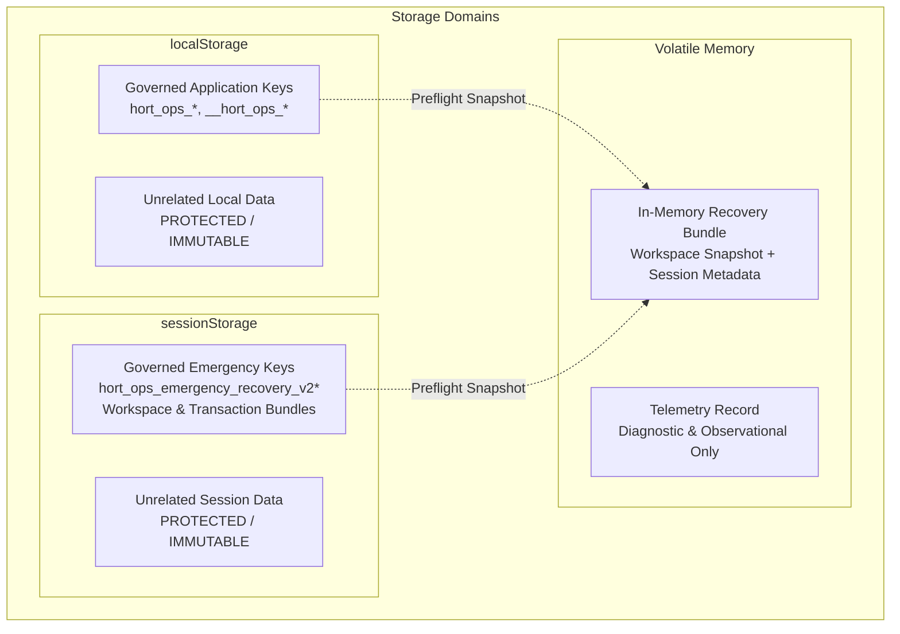
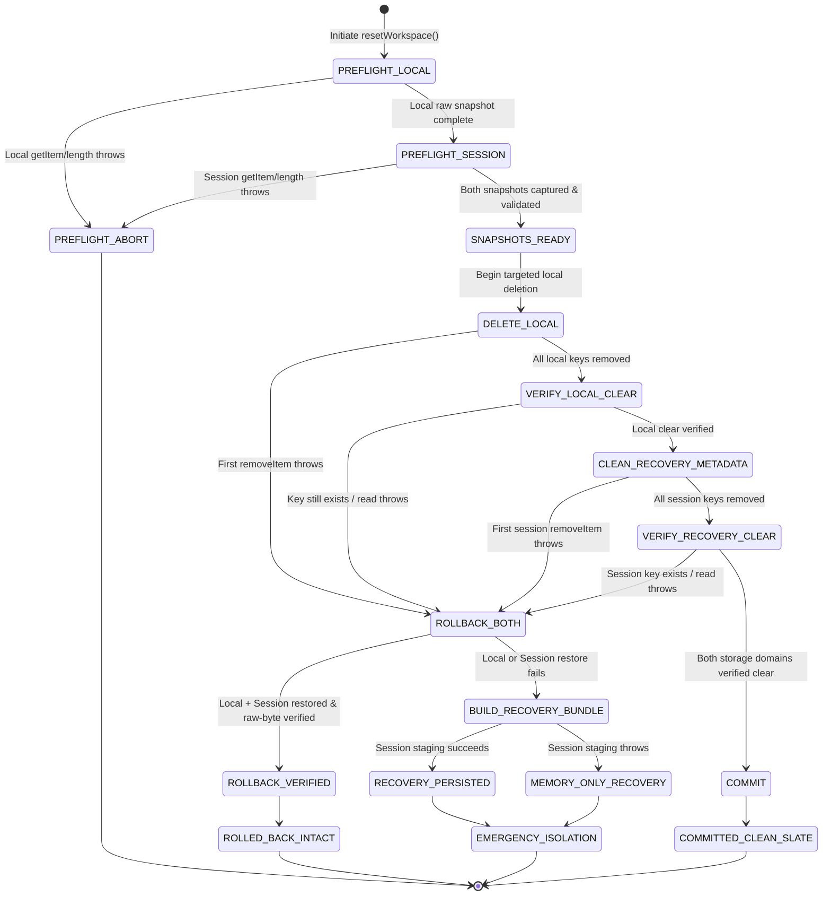
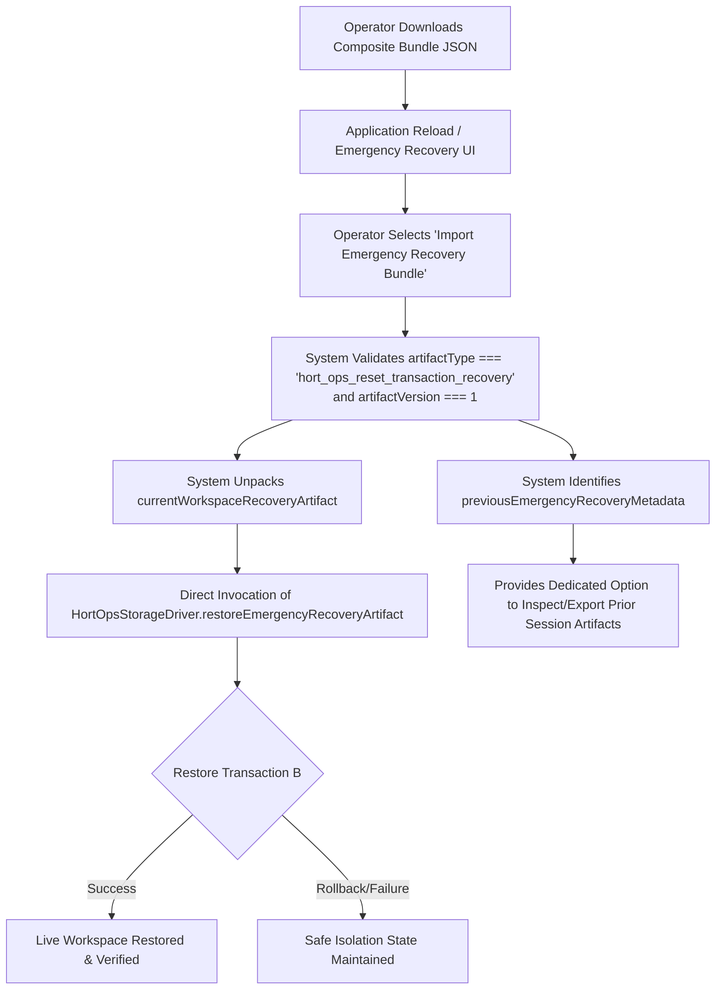
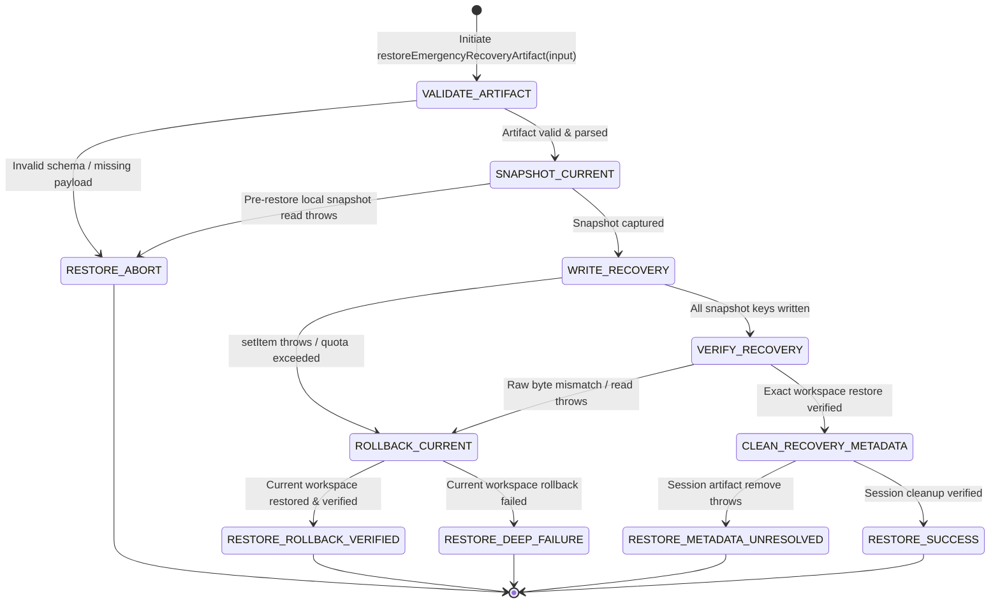

# Stage 2 Transaction-Model Closure Design Submission (PR23_07) — Revision 2

**Document ID:** `STAGE2_TRANSACTION_MODEL_DESIGN_SUBMISSION_02.md`  
**Candidate Target:** `PR23_07 — Stage 2 Transaction-Model Closure Candidate`  
**Role:** Principal Transaction Integrity Engineer and Release Closure Architect  
**Authority:** Supersedes Review 43 implementation instructions per `01_SUPERSESSION_AND_AUTHORITY.md` and `Stage2_Transaction_Model_Closure_Addendum.md`. Incorporates all seven required revisions from `Stage2_Transaction_Model_Design_Gate_Review_01.md`.  
**Governance Status:** Design Gate Submission Revision 2 (Halt Rule Active — Zero Production Code Changes Prior to Independent Review Approval).

---

## Executive Summary & Architectural Paradigm

In accordance with the Stage 2 Transaction Model Closure Readiness Package, its Addendum, and Design Gate Review 01, this revised submission establishes the comprehensive, formal transaction design for both **Transaction A (Clean Slate Reset)** and **Transaction B (Emergency Recovery Restore)**.

Classical browser storage lacks atomic primitives, distributed transaction coordinators, write-ahead logging (WAL), and prepare/commit phases. Therefore, this architecture is strictly defined as:

> **Multi-store transaction orchestration with verified compensating rollback and SAGA-style emergency recovery.**

### Core Platform Boundary & Guarantee Definition (DG-06)
Transaction safety and recoverability are emulated through:
$$\\text{Dual-Domain Snapshot} \\longrightarrow \\text{Controlled Mutation} \\longrightarrow \\text{Byte-for-Byte Compensation} \\longrightarrow \\text{Emergency Isolation}$$
**while the execution context remains available.**

- **Execution Context Boundary:** Compensating transaction guarantees comprehensively cover expected synchronous browser-storage failures (`QuotaExceededError`, `SecurityError`, disk I/O exceptions, read/write errors) while the script execution context remains alive.
- **Process Termination Boundary:** Abrupt browser crash, OS termination, hardware power loss, or SIGKILL of the browser tab during the microsecond critical section of destructive mutations cannot be made fully atomic using browser-storage primitives without a durable native transaction journal. The `beforeunload` lifecycle hook is advisory, not a durability guarantee. Cold-start detection and residual artifact reconciliation on next startup act as mitigations, not proof of atomic rollback.
- **Concurrent Writer Boundary:** The system operates under the standard single-page application assumption of a single active writer tab. If concurrent same-origin tabs mutate `localStorage` or `sessionStorage` during an active transaction, post-mutation raw-byte verification will detect the discrepancy, fail the postcondition check, and transition fail-closed into compensating rollback or emergency isolation.

Zero production code has been modified in preparation of this document. Production implementation will only commence upon receiving formal `DESIGN GATE: PASS` approval.

---

## Section A: Transaction Architecture

### A.1 Governed Storage Domains & Scoped Key Namespaces (DG-03)
The browser environment manages three distinct storage domains under strict scoped ownership rules (Invariant `TM-I02`):

1. **Application-Owned `localStorage`:**
   - **Governed Keys:** Canonical keys matching `hort_ops_*` and internal probe keys `__hort_ops_*`:
     - `hort_ops_workspace_v2` (Canonical workspace state, Schema Version 2)
     - `hort_ops_workspace_v1` (Legacy v1 workspace)
     - `hort_ops_jobs_offline`, `hort_ops_staff_offline`, `hort_ops_assignments_offline`, `hort_ops_permits_offline`, `hort_ops_budget_offline`
     - `__hort_ops_persistence_probe__`
   - **Isolation Boundary:** Any key in `localStorage` not matching `hort_ops_*` or `__hort_ops_*` (e.g., `unrelated-local`, third-party tokens) is strictly untouched and immutable across all phases.

2. **Emergency-Recovery `sessionStorage`:**
   - **Governed Keys:** All keys prefixed with `hort_ops_emergency_recovery_v2*`.
   - **Unified Staging Namespace (DG-03):** To ensure seamless ownership, preflight capture, reset cleanup, retry preservation, and startup discovery without diverging namespaces, all recovery artifacts and transaction bundles are staged under:
     - Workspace Emergency Recovery Artifacts: `hort_ops_emergency_recovery_v2:<timestamp>`
     - Composite Transaction Recovery Bundles: `hort_ops_emergency_recovery_v2:transaction:<transactionId>`
   - **Isolation Boundary:** Any session key not matching `hort_ops_emergency_recovery_v2*` (e.g., `unrelated-session`, auth tokens) is strictly untouched.

3. **In-Memory Volatile State:**
   - Active store state (`HortOpsStorageDriver.memory`).
   - Transaction Telemetry Record (`HortOpsStorageDriver.lastResetResult.telemetry`).
   - Emergency Transaction Recovery Bundle (in-memory object containing current workspace recovery artifact + pre-reset session metadata snapshot).



---

### A.2 State Diagram: Transaction A (Clean Slate Reset)

Clean Slate Reset executes across explicit, non-overlapping phases. Every phase boundary is guarded by strict error capture and stop-on-failure discipline (`TM-I05`).



### A.3 Commit Point Definition (Clean Slate Reset)
The transaction reaches the **Commit Point** if and only if:
1. All application-owned keys in `localStorage` have been deleted and verified absent (`getItem(k) === null`).
2. All emergency-recovery keys in `sessionStorage` have been removed and verified absent.
3. Verification is performed via raw storage inspection:
   > **Catch expected storage exceptions, but never mask them as successful verification.** Any exception thrown during verification is treated as verification failure and triggers compensation.
4. Once verified, memory is purged (`this.memory = {}`) and the transaction transitions to `COMMITTED_CLEAN_SLATE` (`success: true, rolledBack: false`).

### A.4 Compensation Point (Rollback Boundary)
If a failure occurs during:
- Local key deletion (`DELETE_LOCAL`),
- Local clear verification (`VERIFY_LOCAL_CLEAR`),
- Emergency metadata cleanup (`CLEAN_RECOVERY_METADATA`), or
- Session clear verification (`VERIFY_RECOVERY_CLEAR`),

The orchestrator halts further mutations immediately (`TM-I05`) and triggers dual-store compensating rollback (`ROLLBACK_BOTH`):
1. **Compensate `localStorage`:** Re-write every preflight key/value pair that was deleted or targeted; remove any spurious keys created.
2. **Verify `localStorage`:** Inspect every preflight key and assert `window.localStorage.getItem(k) === snapshot[k]` byte-for-byte (`TM-I14`).
3. **Compensate `sessionStorage`:** Re-write every preflight emergency recovery artifact; remove any keys not present in the preflight session snapshot.
4. **Verify `sessionStorage`:** Assert `window.sessionStorage.getItem(k) === sessionSnapshot[k]` byte-for-byte (`TM-I14`).

If and only if **both** compensations succeed and are byte-verified:
- Terminal state is `ROLLED_BACK_INTACT` (`success: false, rolledBack: true`).

---

### A.5 Authoritative Composite Recovery Bundle Contract (DG-03)
When compensating rollback fails in either domain, the system enters `BUILD_RECOVERY_BUNDLE`. The bundle structure is formally defined:

```json
{
  "artifactType": "hort_ops_reset_transaction_recovery",
  "artifactVersion": 1,
  "transactionId": "tx-1727780000000-a7b8c9",
  "transactionType": "clean_slate_reset",
  "createdAt": "2026-10-01T12:00:00.000Z",
  "terminalState": "EMERGENCY_ISOLATION",
  "reason": "Compensating rollback failed verification",
  "currentWorkspaceRecoveryArtifact": {
    "artifactType": "hort_ops_reset_recovery",
    "artifactVersion": 1,
    "recoveryId": "rec-workspace-1727780000000",
    "createdAt": "2026-10-01T12:00:00.000Z",
    "reason": "reset_rollback_failed",
    "storageSnapshot": {
      "hort_ops_workspace_v2": "{\"schemaVersion\":2,...}"
    },
    "failedKey": "hort_ops_workspace_v2",
    "error": "QuotaExceededError"
  },
  "previousEmergencyRecoveryMetadata": {
    "hort_ops_emergency_recovery_v2:1727700000000": "{...}"
  },
  "compensationOutcome": {
    "localRestored": false,
    "localVerified": false,
    "recoveryMetadataRestored": true,
    "recoveryMetadataVerified": true
  }
}
```

#### Governance Rules for the Composite Bundle:
1. **No Schema Version Collisions:** The bundle uses `artifactType: "hort_ops_reset_transaction_recovery"` and `artifactVersion: 1`. It does NOT use `schemaVersion: 2` (which is strictly reserved for the canonical workspace payload).
2. **Session Staging Key:** Staged under `hort_ops_emergency_recovery_v2:transaction:<transactionId>`.
3. **Retry & Immutability Semantics (TM-I06, TM-I12):** Each transaction instance generates a cryptographically unique `transactionId`. If an operator retries reset after an earlier failure, the new transaction's preflight snapshot captures all existing session keys (including earlier transaction bundles). Retries never overwrite, truncate, or degrade prior unresolved recovery artifacts.
4. **Persistence-Independent Export (`TM-I08`):** Staging to `sessionStorage` is attempted as best-effort. If `sessionStorage.setItem` throws, the bundle remains fully preserved in volatile memory (`lastResetResult.recoveryBundle` and `lastResetResult.recoveryBundleJson`) and is immediately downloadable by the operator.

---

### A.6 Operator Recovery & Restore Path for Downloaded Bundles (DG-05)

When emergency isolation occurs, the operator downloads `hort_ops_reset_transaction_recovery_<txId>.json`. To ensure this file is an actionable recovery path rather than dead evidence, the architecture provides a governed extraction and restore pathway:



#### Governed Extraction Utility:
A dedicated helper `HortOpsStorageDriver.extractWorkspaceArtifactFromBundle(bundleInput)`:
1. Accepts raw JSON string or parsed object.
2. Validates `bundleInput.artifactType === 'hort_ops_reset_transaction_recovery'`.
3. Extracts `currentWorkspaceRecoveryArtifact` and validates it against `HortOpsRecoveryArtifact.validateEmergencyRecoveryArtifact`.
4. Hands the validated workspace artifact directly into `restoreEmergencyRecoveryArtifact()`, executing under Transaction B governance without requiring manual operator JSON surgery.

---

### A.7 Diagnostic Telemetry Envelope (Addendum §3)
In strict compliance with Addendum §3:
> *"The telemetry record observes the state machine. It must never drive the state machine."*

Attached to `lastResetResult.telemetry`:
- `transactionId`: Unique identifier (`tx-<timestamp>-<hash>`).
- `transactionType`: `"clean_slate_reset"`.
- `startedAt` & `completedAt`: ISO 8601 timestamps.
- `initialLocalKeyCount` & `initialRecoveryKeyCount`.
- `transitionHistory`: Array of strings recording each phase entered in real-time.
- `compensationOutcome`: Booleans `{ localRestored, localVerified, recoveryMetadataRestored, recoveryMetadataVerified }`.
- `terminalState`: One of `COMMITTED_CLEAN_SLATE`, `ROLLED_BACK_INTACT`, `EMERGENCY_ISOLATION`, or `PREFLIGHT_ABORT`.
- `recoveryBundleAvailable`: Boolean indicating whether an in-memory bundle was formed.
- `errors`: List of sanitized diagnostic error messages.
- `Object.freeze(...)`: Telemetry record is permanently frozen upon entering the terminal state.

---

## Section B: State Table (Transaction A — Clean Slate Reset)

### Clarification on Terminal Outcomes (DG-02, Review Note §10)
There are **three post-mutation terminal outcomes**:
1. `COMMITTED_CLEAN_SLATE`
2. `ROLLED_BACK_INTACT`
3. `EMERGENCY_ISOLATION`
plus **one non-mutating terminal outcome**:
4. `PREFLIGHT_ABORT`

| State Name | Entry Condition | Allowed Mutations | Next States | Operator Behaviour | Autosave Behaviour (DG-02) | Reload Behaviour | Recovery Availability |
|---|---|---|---|---|---|---|---|
| **`PREFLIGHT_LOCAL`** | `resetWorkspace()` called | None (read-only enumeration of `localStorage`) | `PREFLIGHT_SESSION`, `PREFLIGHT_ABORT` | Modal shows progress spinner ("Validating workspace...") | Isolated / paused during execution | Normal startup if interrupted | N/A |
| **`PREFLIGHT_SESSION`** | Local preflight snapshot successful | None (read-only enumeration of `sessionStorage`) | `SNAPSHOTS_READY`, `PREFLIGHT_ABORT` | Modal shows progress spinner ("Validating recovery store...") | Isolated / paused | Normal startup if interrupted | N/A |
| **`PREFLIGHT_ABORT`** | Exception thrown during local or session preflight read | None (stores remain untouched) | Terminal Outcome | Modal displays error banner: "Reset aborted before mutation. Storage read failure." | Remains enabled (existing workspace was never mutated) | Workspace loads normally; uncorrupted | None required |
| **`SNAPSHOTS_READY`** | Both local and session snapshots verified in memory | In-memory transaction telemetry initialization | `DELETE_LOCAL` | Modal shows progress ("Purging workspace data...") | Isolated / paused | Stores untouched | Snapshots held in memory |
| **`DELETE_LOCAL`** | Snapshots ready | `localStorage.removeItem(k)` for application-owned keys | `VERIFY_LOCAL_CLEAR`, `ROLLBACK_BOTH` | Modal shows progress bar | Strictly BLOCKED | Cold-start reconciliation detects partial state | Held in memory snapshot |
| **`VERIFY_LOCAL_CLEAR`**| All targeted local keys passed `removeItem` | Read-only scan of `localStorage` (catches read exceptions) | `CLEAN_RECOVERY_METADATA`, `ROLLBACK_BOTH` | Modal shows progress | Strictly BLOCKED | Cold-start reconciliation detects partial state | Held in memory snapshot |
| **`CLEAN_RECOVERY_METADATA`**| Local clear verified | `sessionStorage.removeItem(k)` for emergency recovery artifacts | `VERIFY_RECOVERY_CLEAR`, `ROLLBACK_BOTH` | Modal shows progress ("Cleaning recovery metadata...") | Strictly BLOCKED | Local clear, session partial | Held in memory snapshot |
| **`VERIFY_RECOVERY_CLEAR`**| Session removals attempted | Read-only scan of `sessionStorage` (catches read exceptions) | `COMMIT`, `ROLLBACK_BOTH` | Modal shows progress | Strictly BLOCKED | Local clear, session partial | Held in memory snapshot |
| **`COMMIT`** | Both local and session storage verified clear | Purge in-memory cache (`this.memory = {}`) | `COMMITTED_CLEAN_SLATE` | Modal transitions to clean slate screen | Re-enabled for new empty workspace | Opens fresh default workspace | Staged recovery cleared; fresh slate |
| **`COMMITTED_CLEAN_SLATE`** | Commit completed | None | Terminal Outcome (Post-Mutation) | Operator sees confirmation banner; clean slate ready | Enabled | Fresh clean workspace | None required (data intentionally cleared) |
| **`ROLLBACK_BOTH`** | Mutation or verification failure in local or session phase | `localStorage.setItem`, `sessionStorage.setItem` to restore snapshots | `ROLLBACK_VERIFIED`, `BUILD_RECOVERY_BUNDLE` | Modal displays "Restoring workspace after failure..." | Strictly BLOCKED | Restoring in progress | Preflight snapshots being applied |
| **`ROLLBACK_VERIFIED`** | Both stores restored and verified byte-identical to preflight | In-memory status update (`rolledBack: true`) | `ROLLED_BACK_INTACT` | Modal displays amber alert: "Reset failed. Workspace was restored intact." | **Strictly BLOCKED (`autosaveBlocked: true`)** | Cold-start reconciliation verifies intact data | Workspace data intact in `localStorage` |
| **`ROLLED_BACK_INTACT`** | Dual-store rollback verified | None | Terminal Outcome (Post-Mutation) | Operator presented with "Reload to Resume" or explicit "Resume Workspace" action | **Strictly BLOCKED.** (DG-02: Never automatically unlocked by mere user edit; requires reload or explicit resume action) | Reload performs cold-start check, reconciles clean state, and unlocks autosave safely | Live data fully restored |
| **`BUILD_RECOVERY_BUNDLE`**| Local or session rollback failed verification | In-memory bundle synthesis | `RECOVERY_PERSISTED`, `MEMORY_ONLY_RECOVERY` | Modal displays critical alert: "Storage failure during restoration." | Strictly BLOCKED | Reload blocked by modal alert | In-memory bundle assembled |
| **`RECOVERY_PERSISTED`** | SessionStorage staging of bundle succeeds | `sessionStorage.setItem` for composite bundle | `EMERGENCY_ISOLATION` | Critical alert with "Download Emergency Recovery Bundle" | Strictly BLOCKED | Reload reconstructs recovery alert from session bundle | Download button active; session artifact ready |
| **`MEMORY_ONLY_RECOVERY`** | SessionStorage staging throws (quota / disabled) | None (storage write aborted) | `EMERGENCY_ISOLATION` | Critical alert: "Persistence failed. Download backup immediately!" | Strictly BLOCKED | Prompt before unload; volatile bundle download available | Download button active from in-memory JSON |
| **`EMERGENCY_ISOLATION`**| Second-order compensation failure reached | None (system locked against further writes) | Terminal Outcome (Post-Mutation) | Operator prompted to download bundle before closing window | **PERMANENTLY BLOCKED** | Emergency recovery banner displayed; recovery import available | Direct file download via Blob/data URI |

---

## Section C: Transaction B — Emergency Recovery Restore Architecture (DG-04)

Emergency Recovery Restore is a first-class governed transaction designed to the exact same architectural depth as Clean Slate Reset.

### C.1 State Diagram: Transaction B (Emergency Recovery Restore)



### C.2 Commit Point Definition (Emergency Recovery Restore)
Transaction B reaches the **Restore Commit Point** (`success: true`) if and only if:
1. Every key present in the artifact's `storageSnapshot` has been written to `localStorage`.
2. Every written key has been read back and verified **byte-for-byte identical** to the artifact snapshot (`TM-I14`).
3. The restored recovery artifact in `sessionStorage` has been removed and verified absent.
4. Active memory is updated with the restored payload.

### C.3 Rollback Definition (Emergency Recovery Restore)
`rolledBack: true` in Transaction B means:
1. Pre-restore `localStorage` state was captured prior to writing the recovery payload.
2. When a write or verification error occurred, all pre-restore keys were re-written.
3. Every pre-restore key was verified byte-for-byte against the pre-restore snapshot.
4. Any key created during the aborted restore that was not in the pre-restore snapshot was removed.

### C.4 Terminal-State Table: Transaction B

| Terminal State | API Result | `localStorage` State | `sessionStorage` State | `recoveryRequired` | Autosave Status | Reload Behaviour | Operator Action |
|---|---|---|---|---|---|---|---|
| **`RESTORE_ABORT`** | `success: false, rolledBack: false` | Unmutated (Pre-restore state intact) | Untouched | False (if no prior recovery) | Unchanged | Normal startup | Alert: "Invalid recovery artifact; no changes made." |
| **`RESTORE_SUCCESS`** | `success: true, rolledBack: false` | Restored workspace verified | Recovery artifact cleaned up | False | Enabled for restored workspace | Loads restored workspace normally | Confirmation banner: "Workspace successfully restored." |
| **`RESTORE_ROLLBACK_VERIFIED`** | `success: false, rolledBack: true` | Pre-restore workspace verified intact | Recovery artifact remains intact | True | **BLOCKED** | Loads pre-restore workspace | Amber alert: "Restore failed; previous workspace restored intact." |
| **`RESTORE_METADATA_UNRESOLVED`**| `success: false, rolledBack: false` | Restored workspace verified | Recovery artifact removal failed | True | **BLOCKED** | Detects unresolved artifact on reload | Warning: "Workspace restored, but session artifact could not be cleared." |
| **`RESTORE_DEEP_FAILURE`** | `success: false, rolledBack: false` | Partial workspace (corruption risk) | Recovery artifact intact | True | **PERMANENTLY BLOCKED** | Detects recovery required on cold boot | Critical Alert: "Restore and rollback failed. Export in-memory emergency bundle immediately." |

### C.5 Helper Sharing & Separation between Transaction A and Transaction B
- **Shared Helpers:**
  - `_captureStoragePreflight()` / `_captureRawStorageSnapshot()`: Shared preflight logic.
  - `_restoreRawStorageSnapshot()`: Shared byte-verified local restoration.
  - `_verifyRawStorageSnapshot()`: Shared byte-for-byte string verification.
- **Transaction-Specific Logic:**
  - `resetWorkspace()`: Governs dual-domain deletion, composite bundle synthesis, and dual rollback.
  - `restoreEmergencyRecoveryArtifact()`: Governs payload ingestion, single-domain workspace rollback, and session artifact retirement.

---

## Section D: Invariant Mapping

| Invariant | Name & Description | Proposed Source Component | Verification Mechanism | Test Coverage (Governed Repository Paths) |
|---|---|---|---|---|
| **TM-I01** | **Dual-domain preflight:** Raw snapshots of `localStorage` and `sessionStorage` taken prior to first destructive mutation; failure halts before mutation. | `js/utils/storage/storageDriver.js`<br/>`_captureStoragePreflight()` | Wraps scans in `try/catch`; validates snapshot non-nullity. Aborts immediately on error. | `scripts/test_stage2_transaction_model_closure_audit.cjs` (TM-F01, TM-F02); `scripts/test_review39_recovery_contract.cjs`. |
| **TM-I02** | **Scoped ownership:** Mutate only `hort_ops_*` and `__hort_ops_*` in local, and `hort_ops_emergency_recovery_v2*` in session. Unrelated data untouched. | `js/utils/storage/storageDriver.js`<br/>`resetWorkspace()`, `_restoreRawStorageSnapshot()` | Explicit prefix matching: `k.startsWith('hort_ops_') \|\| k.startsWith('__hort_ops_')`. | Closure Audit TM-F19: Asserts `unrelated-local` and `unrelated-session` retain exact preflight values. |
| **TM-I03** | **Single commit definition:** `success=true` requires all local and recovery keys deleted and verified absent; no unresolved postcondition. | `js/utils/storage/storageDriver.js`<br/>`resetWorkspace()` Commit Phase | Post-deletion iteration checking `getItem(k) === null` across both stores before setting `success: true`. | Closure Audit TM-F19: Asserts `governedLocal === {}` and `governedSession === {}`. |
| **TM-I04** | **Full rollback definition:** `rolledBack=true` requires both local state and session recovery metadata equal preflight snapshots, verified byte-for-byte. | `js/utils/storage/storageDriver.js`<br/>`_restoreRawStorageSnapshot()`, `_restoreEmergencyRecoveryMetadata()` | Both helper results must report `success: true` and `verified: true`; boolean AND gates `rolledBack`. | Closure Audit TM-F04, TM-F09, TM-F11. |
| **TM-I05** | **Stop-on-failure mutation discipline:** On first failure during deletion or cleanup, halt further mutations and enter compensation. | `js/utils/storage/storageDriver.js`<br/>`resetWorkspace()` Loops | `try { removeItem() } catch(err) { break; }` — Immediate loop termination on first throw. | Closure Audit TM-F04, TM-F08, TM-F09 (middle remove failure halts without touching subsequent keys). |
| **TM-I06** | **Recovery evidence immutability:** Pre-existing recovery artifacts in session storage cannot be discarded until transaction commit succeeds. | `js/utils/storage/storageDriver.js`<br/>Phased sequencing | Session cleanup phase occurs strictly AFTER local clear has been verified. Session metadata is snapshotted first. | Closure Audit TM-F04, TM-F09; `scripts/test_review39_recovery_contract.cjs`. |
| **TM-I07** | **Second-order recovery:** If compensation of either store fails, complete pre-transaction recoverable evidence remains available in memory. | `js/utils/storage/storageDriver.js`<br/>`_buildResetTransactionRecoveryBundle()` | Synthesizes `currentWorkspaceRecoveryArtifact` + `previousEmergencyRecoveryMetadata` bundle into memory. | Closure Audit TM-F15, TM-F18. Asserts `hasTransactionBundle(r) === true`. |
| **TM-I08** | **Persistence-independent export:** Failure of `sessionStorage` or `localStorage` does not prevent in-memory bundle download. | `js/utils/storage/storageDriver.js`<br/>`resetWorkspace()`, `resetWorkspaceModal.js` | Bundle returned in `r.recoveryBundle` and `r.recoveryBundleJson`; modal creates Blob directly from in-memory string. | Closure Audit TM-F17, TM-F18; `scripts/test_stage2_browser_smoke.cjs`. |
| **TM-I09** | **Truthful result semantics:** UI and API never report success for incomplete commit, or rollback for incomplete compensation. | `js/utils/storage/storageDriver.js`, `resetWorkspaceModal.js`, `js/app.js` | Terminal states are strictly partitioned (`COMMITTED_CLEAN_SLATE`, `ROLLED_BACK_INTACT`, `EMERGENCY_ISOLATION`, `PREFLIGHT_ABORT`). | Closure Audit TM-F13, TM-F15; `scripts/test_review40_recovery_restore_contract.cjs`. |
| **TM-I10** | **Autosave isolation (DG-02):** No autosave runs while transaction state is unresolved or rolled back intact. | `js/app.js`, `js/utils/storage/storageDriver.js` | `_autosaveBlocked = true` enforced; requires cold reload reconciliation or explicit operator resume. | `scripts/test_review39_recovery_contract.cjs` (R39-T08); `scripts/test_stage2_browser_smoke.cjs`. |
| **TM-I11** | **Reload semantics:** Cold reload reconstructs recovery state; recovery evidence detected even if canonical workspace is empty. | `js/app.js`<br/>`init()` / recovery reconciler | Startup routine inspects `sessionStorage` for emergency recovery artifacts and bundles before rendering workspace. | Closure Audit TM-F24; `scripts/test_review39_browser_recovery.cjs`. |
| **TM-I12** | **Retry safety:** A retry after failed/incomplete reset cannot degrade the best available recovery evidence. | `js/utils/storage/storageDriver.js`<br/>`_captureEmergencyRecoveryMetadata()` | Preflight snapshots capture existing recovery keys; bundles generate unique transaction IDs and preserve prior evidence. | Closure Audit TM-F20; `scripts/test_review39_recovery_contract.cjs`. |
| **TM-I13** | **Recovery restore atomicity:** Emergency restore either commits completely, restores pre-restore state, or enters deeper recovery. | `js/utils/storage/storageDriver.js`<br/>`restoreEmergencyRecoveryArtifact()` | Pre-restore snapshot taken; failed restore triggers verified rollback of `localStorage`. | `scripts/test_review40_recovery_restore_contract.cjs` (TM-F21, TM-F22). |
| **TM-I14** | **Exact raw-byte verification:** String-based storage compares raw stored strings (`getItem`), not parsed semantic objects. | `js/utils/storage/storageDriver.js`<br/>`_verifyRawStorageSnapshot()`, `_verifyEmergencyRecoveryMetadata()` | Exact string equality assertion: `actualVal === snapshot[k]`. | Closure Audit TM-F06, TM-F11, TM-F14, TM-F16. |
| **TM-I15** | **Evidence retention (DG-07):** Every data-protecting invariant has deterministic Node fault-injection assertions. | `scripts/test_stage2_transaction_model_closure_audit.cjs` | Node.js VM harness with mock storage injecting failures at each boundary. | **Required evidence before closure:** 100% pass on all 24 mapped failure-injection rows in Node test harness. |
| **TM-I16** | **Release retention (DG-01):** All Review 39–43 regression contracts retained; 24-suite permanent release battery unaltered. | `scripts/run_all_release_gates.cjs`, `scripts/test_stage2_workspace_management.cjs` | Retains all 17 Stage 1 and 7 Stage 2 suites without modification or omission. | Full battery run passes 24/24 suites. |

---

## Section E: Failure-Matrix Mapping

Every failure point in `05_FAILURE_INJECTION_MATRIX.md` (TM-F01 through TM-F24) maps to an explicit transition, terminal state, and verification test:

| ID | Transaction Phase | Injected Failure | State Transition | Expected Terminal State | Planned Deterministic Test | Browser Test |
|---|---|---|---|---|---|---|
| **TM-F01** | Local Preflight | First local `getItem` throws | `PREFLIGHT_LOCAL` $\to$ `PREFLIGHT_ABORT` | `PREFLIGHT_ABORT`<br/>(`success: false, rolledBack: false`) | `scripts/test_stage2_transaction_model_closure_audit.cjs` (Row 1) | |
| **TM-F02** | Session Preflight | Recovery metadata `getItem` throws | `PREFLIGHT_SESSION` $\to$ `PREFLIGHT_ABORT` | `PREFLIGHT_ABORT`<br/>(`success: false, rolledBack: false`) | `scripts/test_stage2_transaction_model_closure_audit.cjs` (Row 2) | |
| **TM-F03** | Local Delete | First `removeItem` throws | `DELETE_LOCAL` $\to$ `ROLLBACK_BOTH` $\to$ `ROLLBACK_VERIFIED` | `ROLLED_BACK_INTACT`<br/>(`success: false, rolledBack: true`) | `scripts/test_stage2_transaction_model_closure_audit.cjs` (Row 3) | |
| **TM-F04** | Local Delete | Middle `removeItem` throws | `DELETE_LOCAL` $\to$ `ROLLBACK_BOTH` $\to$ `ROLLBACK_VERIFIED` | `ROLLED_BACK_INTACT`<br/>(`success: false, rolledBack: true`) | `scripts/test_stage2_transaction_model_closure_audit.cjs` (Row 4) | |
| **TM-F05** | Local Delete | Final `removeItem` throws | `DELETE_LOCAL` $\to$ `ROLLBACK_BOTH` $\to$ `ROLLBACK_VERIFIED` | `ROLLED_BACK_INTACT`<br/>(`success: false, rolledBack: true`) | `scripts/test_stage2_transaction_model_closure_audit.cjs` (Row 5) | |
| **TM-F06** | Local Clear Verify | Verification `getItem` throws | `VERIFY_LOCAL_CLEAR` $\to$ `ROLLBACK_BOTH` $\to$ `ROLLBACK_VERIFIED` | `ROLLED_BACK_INTACT`<br/>(`success: false, rolledBack: true`) | `scripts/test_stage2_transaction_model_closure_audit.cjs` (Row 6) | |
| **TM-F07** | Local Clear Verify | Residual key detected (`getItem !== null`) | `VERIFY_LOCAL_CLEAR` $\to$ `ROLLBACK_BOTH` $\to$ `ROLLBACK_VERIFIED` | `ROLLED_BACK_INTACT`<br/>(`success: false, rolledBack: true`) | `scripts/test_stage2_transaction_model_closure_audit.cjs` (Row 7) | |
| **TM-F08** | Session Cleanup | First recovery `removeItem` throws | `CLEAN_RECOVERY_METADATA` $\to$ `ROLLBACK_BOTH` $\to$ `ROLLBACK_VERIFIED` | `ROLLED_BACK_INTACT`<br/>(`success: false, rolledBack: true`) | `scripts/test_stage2_transaction_model_closure_audit.cjs` (Row 8) | `scripts/test_review39_browser_recovery.cjs` |
| **TM-F09** | Session Cleanup | Middle recovery `removeItem` throws | `CLEAN_RECOVERY_METADATA` $\to$ `ROLLBACK_BOTH` $\to$ `ROLLBACK_VERIFIED` | `ROLLED_BACK_INTACT`<br/>(`success: false, rolledBack: true`) | `scripts/test_stage2_transaction_model_closure_audit.cjs` (Row 9) | `scripts/test_review39_browser_recovery.cjs` |
| **TM-F10** | Session Cleanup | Final recovery `removeItem` throws | `CLEAN_RECOVERY_METADATA` $\to$ `ROLLBACK_BOTH` $\to$ `ROLLBACK_VERIFIED` | `ROLLED_BACK_INTACT`<br/>(`success: false, rolledBack: true`) | `scripts/test_stage2_transaction_model_closure_audit.cjs` (Row 10) | |
| **TM-F11** | Session Cleanup Verify| Enumeration/read throws | `VERIFY_RECOVERY_CLEAR` $\to$ `ROLLBACK_BOTH` $\to$ `ROLLBACK_VERIFIED` | `ROLLED_BACK_INTACT`<br/>(`success: false, rolledBack: true`) | `scripts/test_stage2_transaction_model_closure_audit.cjs` (Row 11) | |
| **TM-F12** | Session Cleanup Verify| Residual recovery key detected | `VERIFY_RECOVERY_CLEAR` $\to$ `ROLLBACK_BOTH` $\to$ `ROLLBACK_VERIFIED` | `ROLLED_BACK_INTACT`<br/>(`success: false, rolledBack: true`) | `scripts/test_stage2_transaction_model_closure_audit.cjs` (Row 12) | |
| **TM-F13** | Local Rollback | Local restore `setItem` throws | `ROLLBACK_BOTH` $\to$ `BUILD_RECOVERY_BUNDLE` | `EMERGENCY_ISOLATION`<br/>(`success: false, rolledBack: false`) | `scripts/test_stage2_transaction_model_closure_audit.cjs` (Row 13) | |
| **TM-F14** | Local Rollback Verify | Restored value mismatch/read failure | `ROLLBACK_BOTH` $\to$ `BUILD_RECOVERY_BUNDLE` | `EMERGENCY_ISOLATION`<br/>(`success: false, rolledBack: false`) | `scripts/test_stage2_transaction_model_closure_audit.cjs` (Row 14) | |
| **TM-F15** | Session Rollback | Session restore `setItem` throws | `ROLLBACK_BOTH` $\to$ `BUILD_RECOVERY_BUNDLE` | `EMERGENCY_ISOLATION`<br/>(`success: false, rolledBack: false`) | `scripts/test_stage2_transaction_model_closure_audit.cjs` (Row 15) | |
| **TM-F16** | Session Rollback Verify| Session metadata mismatch/read error | `ROLLBACK_BOTH` $\to$ `BUILD_RECOVERY_BUNDLE` | `EMERGENCY_ISOLATION`<br/>(`success: false, rolledBack: false`) | `scripts/test_stage2_transaction_model_closure_audit.cjs` (Row 16) | |
| **TM-F17** | Recovery Staging | `sessionStorage.setItem` throws | `BUILD_RECOVERY_BUNDLE` $\to$ `MEMORY_ONLY_RECOVERY` | `EMERGENCY_ISOLATION`<br/>(Volatile bundle retained) | `scripts/test_stage2_transaction_model_closure_audit.cjs` (Row 17) | `scripts/test_stage2_browser_smoke.cjs` |
| **TM-F18** | Total Persistence Fail| Local rollback + Session rollback + Staging fail | `ROLLBACK_BOTH` $\to$ `MEMORY_ONLY_RECOVERY` | `EMERGENCY_ISOLATION`<br/>(Volatile bundle retained) | `scripts/test_stage2_transaction_model_closure_audit.cjs` (Row 18) | |
| **TM-F19** | Success Commit | No faults injected | `COMMIT` $\to$ `COMMITTED_CLEAN_SLATE` | `COMMITTED_CLEAN_SLATE`<br/>(`success: true, rolledBack: false`) | `scripts/test_stage2_transaction_model_closure_audit.cjs` (Row 19) | `scripts/test_stage2_browser_smoke.cjs` |
| **TM-F20** | Retry After Incomplete | Second reset attempted after failed rollback | `PREFLIGHT_LOCAL` preserves prior recovery bundle | `EMERGENCY_ISOLATION` / safe state | `scripts/test_stage2_transaction_model_closure_audit.cjs` (Row 20) | |
| **TM-F21** | Emergency Restore Write | Write throws mid-restore | `WRITE_RECOVERY` $\to$ `ROLLBACK_CURRENT` | Pre-restore state restored | `scripts/test_review40_recovery_restore_contract.cjs` | `scripts/test_stage2_browser_smoke.cjs` |
| **TM-F22** | Emergency Restore Verify| Read throws / mismatch | `VERIFY_RECOVERY` $\to$ `ROLLBACK_CURRENT` | Pre-restore state restored | `scripts/test_review40_recovery_restore_contract.cjs` | |
| **TM-F23** | Restore Metadata Clean | Cleanup fails after restore | `CLEAN_RECOVERY_METADATA` $\to$ `RESTORE_METADATA_UNRESOLVED` | Restore not reported resolved | `scripts/test_review40_recovery_restore_contract.cjs` | `scripts/test_review39_browser_recovery.cjs` |
| **TM-F24** | Cold Reload Unresolved | Reload browser after unresolved state | Cold start reconciler detects bundle | Truthful recovery state reconstructed | `scripts/test_review40_release_runner_contract.cjs` | `scripts/test_review39_browser_recovery.cjs` |

---

## Section F: Proposed Source Changes

To avoid layering fragile special-case `try/catch` statements onto the existing implementation, the code changes introduce explicit single-responsibility helpers governed by a clean state-machine orchestrator.

### 1. `js/utils/storage/storageDriver.js`

| Function / Helper | Reason | New Responsibility | Old Responsibility Removed |
|---|---|---|---|
| `_captureStoragePreflight()` *(New)* | Consolidate dual-domain preflight under `TM-I01` | Atomically snapshots governed `localStorage` and `sessionStorage`. If either throws, returns `{ success: false, error }`. | Scattered individual calls in `resetWorkspace` body. |
| `_restoreRawStorageSnapshot()` *(Refactored)* | Strict raw-byte verification under `TM-I04`, `TM-I14` | Restores local keys, verifies byte-for-byte against preflight snapshot. Returns `{ success, restoredCount, unrecoveredKeys, error }`. | Lenient restoration without comprehensive byte verification. |
| `_restoreEmergencyRecoveryMetadata()` *(Refactored)* | Dual-store compensation under `TM-I04`, `TM-I14` | Restores session emergency recovery keys, purges any keys not in snapshot, verifies byte-for-byte. | Partial error handling without verified deletion of unexpected intermediate keys. |
| `_buildResetTransactionRecoveryBundle()` *(New)* | Second-order recovery under `TM-I07`, `TM-I08`, `DG-03` | Builds composite recovery bundle object containing `currentWorkspaceRecoveryArtifact` and `previousEmergencyRecoveryMetadata`. | Single-artifact generation that omitted previous session recovery metadata. |
| `_stageTransactionRecoveryBundle()` *(New)* | Staging isolation under `TM-I08`, `DG-03` | Stages composite bundle to `sessionStorage` under `hort_ops_emergency_recovery_v2:transaction:<transactionId>`. Captures exceptions gracefully without losing in-memory bundle. | Coupling memory bundle availability to storage setItem success. |
| `extractWorkspaceArtifactFromBundle()` *(New)* | Governed operator recovery path under `DG-05` | Validates bundle type and extracts inner workspace artifact for direct hand-off to `restoreEmergencyRecoveryArtifact()`. | Manual operator JSON extraction. |
| `_executeCompensatingRollback()` *(New)* | Unified dual-domain rollback orchestrator | Executes local and session restoration in order; evaluates whether both verified; if not, triggers bundle creation. | Duplicated rollback logic in multiple branches of `resetWorkspace`. |
| `resetWorkspace()` *(Refactored Orchestrator)* | State-machine transition governance | Orchestrates `PREFLIGHT` $\to$ `DELETE_LOCAL` $\to$ `VERIFY_LOCAL` $\to$ `CLEAN_SESSION` $\to$ `VERIFY_SESSION` $\to$ `COMMIT`, with immediate transition to `_executeCompensatingRollback()` on any failure. Emits frozen telemetry record. | Ad-hoc nested branching with incomplete session rollback. |
| `restoreEmergencyRecoveryArtifact()` *(Transaction B)* | Strict atomicity and raw-byte verification (`TM-I13`, `TM-I14`) | Aligns with Transaction B state machine: pre-restore local snapshot, write, byte verification, session metadata cleanup, rollback on failure. | Retains Review 40/41 contract with verified byte-for-byte guarantees. |

### 2. `js/components/resetWorkspaceModal.js`

| Component / Method | Reason | New Responsibility | Old Responsibility Removed |
|---|---|---|---|
| `render()` / Result Handlers | Presentation of 3 valid post-mutation terminal states + preflight abort | Explicitly render: (1) Green clean slate confirmation, (2) Amber "Workspace restored intact" alert for `ROLLED_BACK_INTACT` with "Reload to Resume" prompt, (3) Red critical alert with **"Download Emergency Recovery Bundle"** button for `EMERGENCY_ISOLATION`. | Ambiguous error displays for partial rollback; automatic unlock assumptions. |
| `downloadEmergencyBundle()` *(New)* | Persistence-independent export (`TM-I08`) | Creates a downloadable `Blob` from `lastResetResult.recoveryBundleJson` directly from memory, triggering immediate client download. | Reliance on session storage to recover files after catastrophic rollback failure. |

### 3. `js/app.js`

| Module / Handler | Reason | New Responsibility | Old Responsibility Removed |
|---|---|---|---|
| Autosave Coordinator | Strict isolation under `TM-I10`, `DG-02` | When `lastResetResult` indicates `EMERGENCY_ISOLATION` or `ROLLED_BACK_INTACT`, lock autosave (`_autosaveBlocked = true`) until explicit reload reconciliation or explicit operator resume. | Autosave could attempt background writes while rollback state was ambiguous or upon initial user edit. |
| Workspace Initialization (`init`) | Truthful cold reload under `TM-I11` | Check for all `hort_ops_emergency_recovery_v2*` keys on cold boot, reconciling composite transaction recovery bundles and workspace recovery artifacts before rendering. | Missing compound transaction recovery bundle during startup scan. |

---

## Section G: Test Strategy & Governed Repository Inventory (DG-01)

### G.1 Authoritative Governed Release Topology (24 Suites Total)
Per Invariant `TM-I16`, no previously accepted regression contracts will be deleted, renamed, bypassed, or weakened.

#### Master Production Release Runner:
- **`scripts/run_all_release_gates.cjs`** (Runs all 24 release suites across Stage 1 and Stage 2)

#### 17 Stage 1 Frozen & Retained Release Suites (Gates A–D):
1. `gate-a-core-sanity` (`scripts/test_gate_a_core_sanity.cjs`)
2. `gate-a-storage-smoke` (`scripts/test_gate_a_storage_smoke.cjs`)
3. `gate-b1-shift-engine` (`scripts/test_gate_b1_shift_engine.cjs`)
4. `gate-b1-overtime-rules` (`scripts/test_gate_b1_overtime_rules.cjs`)
5. `gate-b1-break-rules` (`scripts/test_gate_b1_break_rules.cjs`)
6. `gate-b2-export-integrity` (`scripts/test_gate_b2_export_integrity.cjs`)
7. `gate-b2-import-validation` (`scripts/test_gate_b2_import_validation.cjs`)
8. `gate-b2-csv-compliance` (`scripts/test_gate_b2_csv_compliance.cjs`)
9. `gate-b3-staffing-calc` (`scripts/test_gate_b3_staffing_calc.cjs`)
10. `gate-b3-roster-balance` (`scripts/test_gate_b3_roster_balance.cjs`)
11. `gate-c-browser-e2e` (`scripts/test_gate_c_browser_e2e.cjs`)
12. `gate-c-dom-accessibility` (`scripts/test_gate_c_dom_accessibility.cjs`)
13. `gate-c-keyboard-nav` (`scripts/test_gate_c_keyboard_nav.cjs`)
14. `gate-d-performance` (`scripts/test_gate_d_performance.cjs`)
15. `gate-d-bundle-size` (`scripts/test_gate_d_bundle_size.cjs`)
16. `gate-d-audit-trail` (`scripts/test_gate_d_audit_trail.cjs`)
17. `gate-d-release-manifest` (`scripts/test_gate_d_release_manifest.cjs`)

#### 7 Stage 2 Acceptance Release Suites:
1. `stage2-workspace-contract` $\longrightarrow$ **`scripts/test_stage2_workspace_contract.cjs`**
2. `stage2-review39-recovery-contract` $\longrightarrow$ **`scripts/test_review39_recovery_contract.cjs`**
3. `stage2-runner-contract` $\longrightarrow$ **`scripts/test_runner_contract.cjs`**
4. `stage2-review40-recovery-restore-contract` $\longrightarrow$ **`scripts/test_review40_recovery_restore_contract.cjs`**
5. `stage2-review40-release-runner-contract` $\longrightarrow$ **`scripts/test_review40_release_runner_contract.cjs`**
6. `stage2-browser-smoke` $\longrightarrow$ **`scripts/test_stage2_browser_smoke.cjs`**
7. `stage2-review39-browser-recovery` $\longrightarrow$ **`scripts/test_review39_browser_recovery.cjs`**

#### Stage 2 Cumulative Dispatcher:
- **`scripts/test_stage2_workspace_management.cjs`** (Executes the 7 Stage 2 suites listed above)

---

### G.2 Temporary Closure-Audit Harness (DG-01, DG-07)
The temporary closure audit harness is maintained as:
- **`scripts/test_stage2_transaction_model_closure_audit.cjs`**
- It serves as a **temporary readiness gate for PR23_07** and will NOT be added to `scripts/run_all_release_gates.cjs` as a permanent 25th suite.
- **Coverage Requirement (DG-07):**
  > **Required evidence before closure:** 100% pass on all 24 mapped failure-injection rows in Node test harness.
  Currently, the harness exercises TM-F02, TM-F04, TM-F09, TM-F11, TM-F15, TM-F18, TM-F19. It will be expanded during implementation to include all remaining rows (TM-F01 through TM-F24).

---

## Section H: Challenge Register

| Field | Entry |
|---|---|
| **Prescription Challenged** | **None.** |
| **Proposed Alternative** | N/A |
| **Rationale** | All architectural prescriptions in `Stage2_Transaction_Model_Closure_Readiness_Package`, the Addendum, and `Stage2_Transaction_Model_Design_Gate_Review_01.md` are accepted in full. All seven required revisions (DG-01 through DG-07) are integrated without dispute. |
| **Invariants Preserved** | All (`TM-I01` through `TM-I16`). |
| **Governance Impact** | Full alignment with reviewer directives; zero disputes. |

---

## Section I: Scope Statement

We explicitly and unequivocally affirm the following governance boundaries:

1. **Stage 1 Frozen & Immutable:**
   - No files in Stage 1 (Gates A–D) will be modified, reconfigured, or touched.
   - All 17 Stage 1 retained test suites will run and pass cleanly without alterations.

2. **Stage 3 Strictly Unauthorized:**
   - No features, modules, or APIs belonging to Stage 3 will be entered, prototyped, or implemented.
   - Work is confined strictly to Stage 2 Transaction-Model Closure (`PR23_07`).

3. **Permanent Release Battery Unaltered (Exactly 24 Suites):**
   - The permanent governed release inventory remains exactly **24 suites** (17 Stage 1 Retained + 7 Stage 2 Acceptance).
   - The closure-audit harness (`scripts/test_stage2_transaction_model_closure_audit.cjs`) is a **temporary readiness gate** for `PR23_07` and will NOT be added as a permanent 25th release suite.

4. **Single-File Deterministic Parity:**
   - Byte-identical parity between `index.html` and `dist/hort_ops_offline_planner.html` will be verified and maintained via `node scripts/build_single_file.cjs`.

5. **Stop Rule Adherence:**
   - Zero production code has been modified.
   - Gemini will halt and await independent review approval of this revised design submission before any production code implementation begins.

---

*Submitted by Gemini (Principal Transaction Integrity Engineer & Release Closure Architect) for Gate 1 Independent Review Evaluation.*
