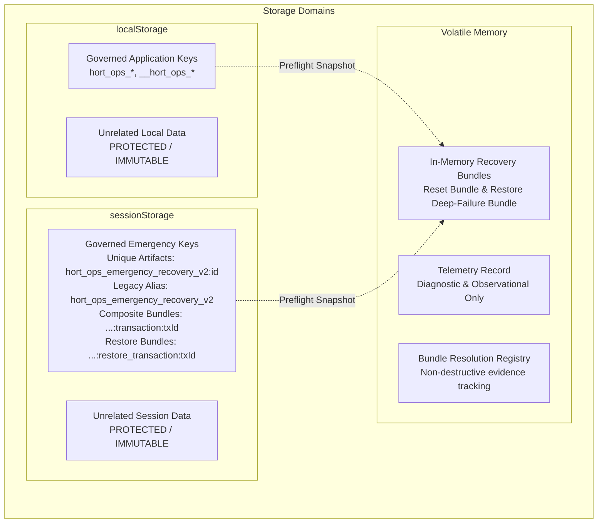
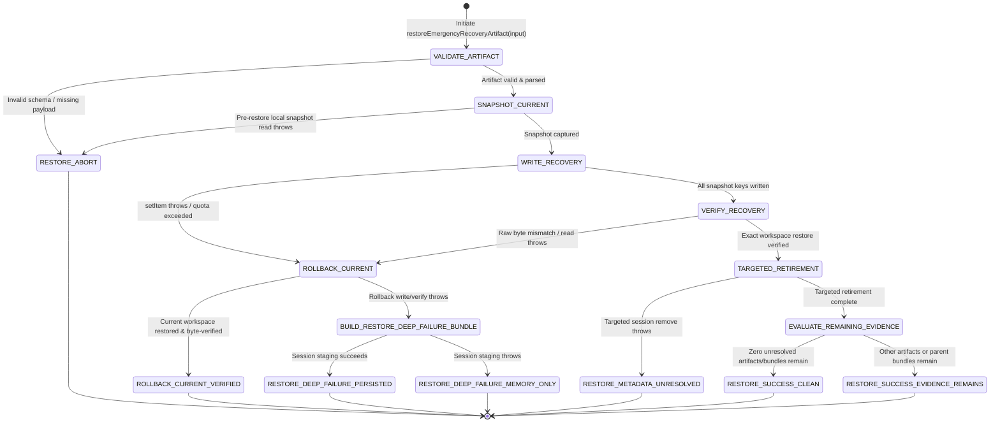

# Stage 2 Transaction-Model Closure Design Submission (PR23_07) — Revision 4

**Document ID:** `STAGE2_TRANSACTION_MODEL_DESIGN_SUBMISSION_04.md`  
**Candidate Target:** `PR23_07 — Stage 2 Transaction-Model Closure Candidate`  
**Role:** Principal Transaction Integrity Engineer and Release Closure Architect  
**Authority:** Supersedes Review 43 implementation instructions per `01_SUPERSESSION_AND_AUTHORITY.md` and `Stage2_Transaction_Model_Closure_Addendum.md`. Incorporates all closed items from `Stage2_Transaction_Model_Design_Gate_Review_01.md` and `Stage2_Transaction_Model_Design_Gate_Review_02.md`, and comprehensively resolves all required revisions from `Stage2_Transaction_Model_Design_Gate_Review_03.md` (DG3-01, DG3-02, DG3-03, and minor items), incorporating feedback from `Stage2_Transaction_Model_Gate4_Intake_Handoff_Assessment.md`.  
**Governance Status:** Design Gate Submission Revision 4 (Halt Rule Active — Zero Production Code Changes Prior to Independent Review Approval).

---

## Executive Summary & Architectural Paradigm

In accordance with the Stage 2 Transaction Model Closure Readiness Package, its Addendum, and Design Gate Reviews 01, 02, and 03, this revised submission establishes the complete, authoritative transaction model for both **Transaction A (Clean Slate Reset)** and **Transaction B (Emergency Recovery Restore)**.

Classical browser storage lacks native atomic multi-key primitives, write-ahead logging (WAL), distributed transaction coordinators, and two-phase commit protocols. Therefore, this architecture is strictly defined as:

> **Multi-store transaction orchestration with verified compensating rollback and SAGA-style emergency recovery.**

### Core Platform Boundary & Guarantee Definition (DG-06, DG2-04)
Transaction safety and recoverability are emulated through:
$$\text{Dual-Domain Snapshot} \longrightarrow \text{Controlled Mutation} \longrightarrow \text{Byte-for-Byte Compensation} \longrightarrow \text{Emergency Isolation}$$
**while the execution context remains available.**

- **Execution Context Boundary:** Compensating transaction guarantees cover expected synchronous browser-storage failures (`QuotaExceededError`, `SecurityError`, disk I/O exceptions, read/write errors) while the script execution context remains alive.
- **Process Termination Boundary:** Abrupt browser crash, OS process termination, hardware power loss, or SIGKILL of the browser tab during destructive mutation cannot be made fully atomic using browser-storage primitives without a durable native transaction journal. The `beforeunload` lifecycle hook is advisory, not a durability guarantee. Cold-start detection and residual artifact reconciliation on next startup act as mitigations, not proof of atomic rollback.
- **Concurrent Writer Boundary (DG2-04):** Concurrent same-origin writers are outside the guaranteed transaction model. Stage 2 assumes one active writer for governed workspace mutations. Verification may detect some concurrent interference, but it is not a complete concurrency-control mechanism. Cross-tab locking is outside the Stage 2 transaction model.

**Governance Halt Rule:** Zero production code has been modified in preparation of this document. Production implementation will only commence upon receiving formal `DESIGN GATE: PASS` approval.

---

## Section A: Transaction Architecture

### A.1 Governed Storage Domains, Namespaces & Startup Enumeration (DG-03, DG2-02, DG3-01, Review 03 Minor)
The browser environment manages three distinct storage domains under strict scoped ownership rules (Invariant `TM-I02`):

1. **Application-Owned `localStorage`:**
   - **Governed Keys:** Canonical keys matching `hort_ops_*` and internal probe keys `__hort_ops_*`:
     - `hort_ops_workspace_v2` (Canonical workspace state, Schema Version 2)
     - `hort_ops_workspace_v1` (Legacy v1 workspace)
     - `hort_ops_jobs_offline`, `hort_ops_staff_offline`, `hort_ops_assignments_offline`, `hort_ops_permits_offline`, `hort_ops_budget_offline`
     - `__hort_ops_persistence_probe__`
   - **Isolation Boundary:** Any key in `localStorage` not matching `hort_ops_*` or `__hort_ops_*` (e.g., `unrelated-local`, third-party tokens) is strictly untouched and immutable across all phases.

2. **Emergency-Recovery `sessionStorage`:**
   - **Governed Keys:** All keys prefixed with `hort_ops_emergency_recovery_v2*`.
   - **Key Terminology Disambiguation (Review 03 Minor):**
     - **Unique Recovery Artifact Key:** `hort_ops_emergency_recovery_v2:<recoveryId>` (e.g. `hort_ops_emergency_recovery_v2:1727764800000-a1b2c3d4`).
     - **Legacy Compatibility Alias:** `hort_ops_emergency_recovery_v2` (un-suffixed compatibility key).
     - **Composite Transaction Recovery Bundle:** `hort_ops_emergency_recovery_v2:transaction:<transactionId>`.
     - **Transaction B Restore Recovery Bundle:** `hort_ops_emergency_recovery_v2:restore_transaction:<transactionId>` (DG3-03).
   - **Isolation Boundary:** Any session key not matching `hort_ops_emergency_recovery_v2*` (e.g., `unrelated-session`, auth tokens) is strictly untouched.
   - **Startup Enumeration & Classification (Review 03 Minor):** On cold startup, the application does **not** pick an arbitrary first emergency key. It enumerates and classifies all matching entries into:
     - Workspace Emergency Recovery Artifacts (unique keys and legacy alias)
     - Transaction Recovery Bundles (Clean Slate Reset bundles and Emergency Restore bundles)
     and presents them transparently to the operator.

3. **In-Memory Volatile State:**
   - Active store state (`HortOpsStorageDriver.memory`).
   - Transaction Telemetry Record (`HortOpsStorageDriver.lastResetResult.telemetry`).
   - Emergency Transaction Recovery Bundles (in-memory objects for reset and restore deep-failures).
   - Bundle Resolution Tracking State (`HortOpsStorageDriver.resolvedBundles`).



---

### A.2 State Diagram: Transaction A (Clean Slate Reset)

Clean Slate Reset executes across explicit, non-overlapping phases. Every phase boundary is guarded by strict error capture, stop-on-failure discipline (`TM-I05`), and isolation pre-checks (`DG3-02`).

```mermaid
stateDiagram-v2
    [*] --> PREFLIGHT_ISOLATION_CHECK: Initiate resetWorkspace()
    
    PREFLIGHT_ISOLATION_CHECK --> RESET_REJECTED_ISOLATION: Active EMERGENCY_ISOLATION exists (DG3-02)
    PREFLIGHT_ISOLATION_CHECK --> PREFLIGHT_LOCAL: No unresolved isolation; proceed
    
    PREFLIGHT_LOCAL --> PREFLIGHT_ABORT_READ: Local getItem/key/length throws
    PREFLIGHT_LOCAL --> PREFLIGHT_SESSION: Local raw snapshot complete
    
    PREFLIGHT_SESSION --> PREFLIGHT_ABORT_READ: Session getItem/key/length throws
    PREFLIGHT_SESSION --> SNAPSHOTS_READY: Both snapshots captured & validated
    
    SNAPSHOTS_READY --> DELETE_LOCAL: Begin targeted local deletion
    DELETE_LOCAL --> ROLLBACK_BOTH: First removeItem throws
    DELETE_LOCAL --> VERIFY_LOCAL_CLEAR: All local keys removed
    
    VERIFY_LOCAL_CLEAR --> ROLLBACK_BOTH: Key still exists / read throws
    VERIFY_LOCAL_CLEAR --> CLEAN_RECOVERY_METADATA: Local clear verified
    
    CLEAN_RECOVERY_METADATA --> ROLLBACK_BOTH: First session removeItem throws
    CLEAN_RECOVERY_METADATA --> VERIFY_RECOVERY_CLEAR: All session keys removed
    
    VERIFY_RECOVERY_CLEAR --> ROLLBACK_BOTH: Session key exists / read throws
    VERIFY_RECOVERY_CLEAR --> COMMIT: Both storage domains verified clear
    
    ROLLBACK_BOTH --> ROLLBACK_VERIFIED: Local + Session restored & raw-byte verified
    ROLLBACK_BOTH --> BUILD_RECOVERY_BUNDLE: Local or Session restore fails
    
    BUILD_RECOVERY_BUNDLE --> RECOVERY_PERSISTED: Session staging succeeds
    BUILD_RECOVERY_BUNDLE --> MEMORY_ONLY_RECOVERY: Session staging throws
    
    PREFLIGHT_ABORT_READ --> [*]
    RESET_REJECTED_ISOLATION --> [*]
    COMMIT --> COMMITTED_CLEAN_SLATE
    COMMITTED_CLEAN_SLATE --> [*]
    ROLLBACK_VERIFIED --> ROLLED_BACK_INTACT
    ROLLED_BACK_INTACT --> [*]
    RECOVERY_PERSISTED --> EMERGENCY_ISOLATION_PERSISTED
    MEMORY_ONLY_RECOVERY --> EMERGENCY_ISOLATION_MEMORY_ONLY
    EMERGENCY_ISOLATION_PERSISTED --> [*]
    EMERGENCY_ISOLATION_MEMORY_ONLY --> [*]
```



### A.3 Commit Point Definition (Clean Slate Reset)
The transaction reaches the **Commit Point** if and only if:
1. All application-owned keys in `localStorage` have been deleted and verified absent (`getItem(k) === null`).
2. All emergency-recovery keys in `sessionStorage` have been removed and verified absent.
3. Verification is performed via raw storage inspection:
   > **Catch expected storage exceptions, but never mask them as successful verification.** Any exception thrown during verification is treated as verification failure and triggers compensation.
4. Once verified, memory is purged (`this.memory = {}`) and the transaction transitions to `COMMITTED_CLEAN_SLATE` (`success: true, rolledBack: false`).

### A.4 Compensation Point (Rollback Boundary)
If a failure occurs during:
- Local key deletion (`DELETE_LOCAL`),
- Local clear verification (`VERIFY_LOCAL_CLEAR`),
- Emergency metadata cleanup (`CLEAN_RECOVERY_METADATA`), or
- Session clear verification (`VERIFY_RECOVERY_CLEAR`),

The orchestrator halts further mutations immediately (`TM-I05`) and triggers dual-store compensating rollback (`ROLLBACK_BOTH`):
1. **Compensate `localStorage`:** Re-write every preflight key/value pair that was deleted or targeted; remove any spurious keys created.
2. **Verify `localStorage`:** Inspect every preflight key and assert `window.localStorage.getItem(k) === snapshot[k]` byte-for-byte (`TM-I14`).
3. **Compensate `sessionStorage`:** Re-write every preflight emergency recovery artifact; remove any keys not present in the preflight session snapshot.
4. **Verify `sessionStorage`:** Assert `window.sessionStorage.getItem(k) === sessionSnapshot[k]` byte-for-byte (`TM-I14`).

If and only if **both** compensations succeed and are byte-verified:
- Terminal state is `ROLLED_BACK_INTACT` (`success: false, rolledBack: true`).

---

### A.5 Authoritative Composite Recovery Bundle Contract (Transaction A) (DG-03, Review 03 Minor)
When compensating rollback fails in either storage domain, the orchestrator constructs an authoritative in-memory composite bundle before attempting session staging:

```json
{
  "artifactType": "hort_ops_reset_transaction_recovery",
  "artifactVersion": 1,
  "transactionId": "tx-1727764800000-a1b2c3d4",
  "transactionType": "clean_slate_reset",
  "createdAt": "2026-10-01T12:00:00.000Z",
  "reason": "dual_storage_rollback_failed",
  "compensationOutcome": {
    "localRestored": false,
    "localVerified": false,
    "recoveryMetadataRestored": true,
    "recoveryMetadataVerified": true,
    "unrecoveredLocalKeys": ["hort_ops_workspace_v2"],
    "unrecoveredSessionKeys": []
  },
  "currentWorkspaceRecoveryArtifact": {
    "artifactType": "hort_ops_reset_recovery",
    "artifactVersion": 1,
    "recoveryId": "rec-1727764800000-w9x8y7z6",
    "createdAt": "2026-10-01T12:00:00.000Z",
    "reason": "rollback_compensation_failure",
    "storageSnapshot": {
      "hort_ops_workspace_v2": "{\"version\":2,...}",
      "hort_ops_jobs_offline": "[...]"
    }
  },
  "previousEmergencyRecoveryMetadata": {
    "hort_ops_emergency_recovery_v2:prior-1": "{\"artifactType\":\"hort_ops_reset_recovery\",...}"
  }
}
```

*Note on Transaction ID Fallback Generation (Review 03 Minor):* Standard format is `tx-${Date.now()}-${Math.random().toString(36).slice(2, 9)}` (syntactically clean, zero stray braces).

---

### A.6 Authoritative Restore Transaction Recovery Bundle Contract (Transaction B) (DG3-03)
When Emergency Recovery Restore fails mid-mutation **and** compensating rollback of the pre-restore current workspace also fails, the orchestrator transitions to `RESTORE_DEEP_FAILURE` and constructs an explicit in-memory bundle preserving both data sets:

```json
{
  "artifactType": "hort_ops_restore_transaction_recovery",
  "artifactVersion": 1,
  "transactionId": "restore-tx-1727764800000-f5e4d3c2",
  "transactionType": "emergency_recovery_restore",
  "createdAt": "2026-10-01T12:00:00.000Z",
  "reason": "restore_mutation_and_rollback_failed",
  "targetRecoverySource": {
    "recoveryId": "rec-1727764800000-w9x8y7z6",
    "sessionKey": "hort_ops_emergency_recovery_v2:rec-1727764800000-w9x8y7z6",
    "parentTransactionId": null
  },
  "preRestoreWorkspaceSnapshot": {
    "hort_ops_workspace_v2": "{\"version\":2,\"state\":\"pre-restore-current\",...}",
    "hort_ops_jobs_offline": "[...]"
  },
  "targetRecoveryArtifact": {
    "artifactType": "hort_ops_reset_recovery",
    "artifactVersion": 1,
    "recoveryId": "rec-1727764800000-w9x8y7z6",
    "createdAt": "2026-10-01T11:00:00.000Z",
    "storageSnapshot": {
      "hort_ops_workspace_v2": "{\"version\":2,\"state\":\"target-recovery\",...}"
    }
  },
  "rollbackOutcome": {
    "restored": false,
    "verified": false,
    "unrecoveredKeys": ["hort_ops_workspace_v2"],
    "error": "QuotaExceededError: restore rollback write failed"
  }
}
```

#### Guarantees for `RESTORE_DEEP_FAILURE` (DG3-03):
1. `success = false`, `rolledBack = false`, `recoveryRequired = true`, `autosave = BLOCKED`.
2. Both pre-restore current workspace bytes and target recovery artifact bytes remain intact in memory.
3. Best-effort persistent staging is attempted under `sessionStorage.setItem('hort_ops_emergency_recovery_v2:restore_transaction:' + txId, bundleJson)`.
4. If staging throws, **direct in-memory export via UI Blob download is guaranteed** (`this.lastRestoreResult.recoveryBundleJson`).

---

### A.7 Transaction Telemetry Envelope (DG-02)
Attached to `lastResetResult.telemetry` and frozen (`Object.freeze`):
- `transactionId`: Unique identifier (`tx-<timestamp>-<hash>`).
- `transactionType`: `"clean_slate_reset"`.
- `startedAt` & `completedAt`: ISO 8601 timestamps.
- `initialLocalKeyCount` & `initialRecoveryKeyCount`.
- `transitionHistory`: Array of strings recording each phase entered in real-time.
- `compensationOutcome`: Booleans `{ localRestored, localVerified, recoveryMetadataRestored, recoveryMetadataVerified }`.
- `terminalState`: One of `COMMITTED_CLEAN_SLATE`, `ROLLED_BACK_INTACT`, `EMERGENCY_ISOLATION`, `PREFLIGHT_ABORT_READ`, or `RESET_REJECTED_ISOLATION`.
- `recoveryPersistence`: `"persisted"`, `"memory_only"`, or `null`.
- `recoveryBundleAvailable`: Boolean indicating whether an in-memory bundle was formed.
- `errors`: List of sanitized diagnostic error messages.

---

## Section B: State Table (Transaction A — Clean Slate Reset)

### Comprehensive Terminal Outcomes & Non-Mutating Aborts (DG-02, DG2-03, DG3-02)

| State Name | Entry Condition | Allowed Mutations | Next States | Operator Behaviour | Autosave Behaviour (DG3-02) | Reload Behaviour (DG2-04) | Recovery Availability |
|---|---|---|---|---|---|---|---|
| **`PREFLIGHT_ISOLATION_CHECK`** | `resetWorkspace()` called | None (inspect memory & stores for active isolation) | `PREFLIGHT_LOCAL`, `RESET_REJECTED_ISOLATION` | Modal checks safety precondition | Unchanged | Normal startup | Pre-existing bundles preserved untouched |
| **`RESET_REJECTED_ISOLATION`** (DG3-02) | Active `EMERGENCY_ISOLATION` exists | **NONE.** (Pre-existing `lastResetResult` & memory bundle strictly preserved!) | Terminal Outcome (Non-mutating) | Modal displays error banner: "Reset rejected: unresolved emergency recovery active." | **Strictly BLOCKED (`autosave = BLOCKED`)** | Depends on prior isolation state | Prior bundle preserved byte-for-byte in memory and/or session |
| **`PREFLIGHT_LOCAL`** | Isolation check passes | None (read-only enumeration of `localStorage`) | `PREFLIGHT_SESSION`, `PREFLIGHT_ABORT_READ` | Modal shows progress spinner ("Validating workspace...") | Isolated / paused during execution | Normal startup if interrupted | N/A |
| **`PREFLIGHT_SESSION`** | Local snapshot successful | None (read-only enumeration of `sessionStorage`) | `SNAPSHOTS_READY`, `PREFLIGHT_ABORT_READ` | Modal shows progress spinner ("Validating recovery store...") | Isolated / paused | Normal startup if interrupted | N/A |
| **`PREFLIGHT_ABORT_READ`** (DG3-02) | Exception during local/session read/key/length | None (stores untouched) | Terminal Outcome (Non-mutating) | Modal displays error: "Reset aborted before mutation: storage read failure." | **Previous State (Remains enabled if workspace was valid)** | Workspace loads normally; uncorrupted | Prior bundles preserved untouched |
| **`SNAPSHOTS_READY`** | Snapshots verified | Telemetry initialization | `DELETE_LOCAL` | Modal shows progress ("Purging workspace data...") | Strictly BLOCKED | Stores untouched | Snapshots held in memory |
| **`DELETE_LOCAL`** | Snapshots ready | `localStorage.removeItem(k)` | `VERIFY_LOCAL_CLEAR`, `ROLLBACK_BOTH` | Modal shows progress bar | Strictly BLOCKED | Cold-start reconciliation detects partial state | Held in memory snapshot |
| **`VERIFY_LOCAL_CLEAR`**| Local keys removed | Read scan of `localStorage` | `CLEAN_RECOVERY_METADATA`, `ROLLBACK_BOTH` | Modal shows progress | Strictly BLOCKED | Cold-start reconciliation detects partial state | Held in memory snapshot |
| **`CLEAN_RECOVERY_METADATA`**| Local clear verified | `sessionStorage.removeItem(k)` for recovery artifacts | `VERIFY_RECOVERY_CLEAR`, `ROLLBACK_BOTH` | Modal shows progress ("Cleaning recovery metadata...") | Strictly BLOCKED | Local clear, session partial | Held in memory snapshot |
| **`VERIFY_RECOVERY_CLEAR`**| Session removals done | Read scan of `sessionStorage` | `COMMIT`, `ROLLBACK_BOTH` | Modal shows progress | Strictly BLOCKED | Local clear, session partial | Held in memory snapshot |
| **`COMMIT`** | Both stores verified clear | Purge in-memory cache (`this.memory = {}`) | `COMMITTED_CLEAN_SLATE` | Modal transitions to clean slate screen | Re-enabled for fresh workspace | Opens fresh default workspace | Staged recovery cleared; fresh slate |
| **`COMMITTED_CLEAN_SLATE`** | Commit completed | None | Terminal Outcome (Post-Mutation) | Confirmation banner; clean slate ready | **Enabled** | Fresh clean workspace | None required (clean slate committed) |
| **`ROLLBACK_BOTH`** | Mutation or verification failure | Restore local and session snapshots | `ROLLBACK_VERIFIED`, `BUILD_RECOVERY_BUNDLE` | Modal displays "Restoring workspace after failure..." | Strictly BLOCKED | Restoring in progress | Preflight snapshots applied |
| **`ROLLBACK_VERIFIED`** | Both stores restored & byte-verified | In-memory status update (`rolledBack: true`) | `ROLLED_BACK_INTACT` | Modal displays amber alert: "Reset failed. Workspace was restored intact." | **Strictly BLOCKED (`autosaveBlocked: true`)** | Cold-start reconciliation verifies intact data | Workspace data intact in `localStorage` |
| **`ROLLED_BACK_INTACT`** | Dual-store rollback verified | None | Terminal Outcome (Post-Mutation) | Operator presented with "Reload to Resume" or "Resume Workspace" action | **Strictly BLOCKED.** (Requires reload or explicit resume action) | Reload performs cold-start check, reconciles clean state, unlocks autosave | Live data fully restored |
| **`BUILD_RECOVERY_BUNDLE`**| Local or session rollback failed | In-memory bundle synthesis | `RECOVERY_PERSISTED`, `MEMORY_ONLY_RECOVERY` | Modal displays critical alert: "Storage failure during restoration." | Strictly BLOCKED | Reload blocked by modal alert | In-memory bundle assembled |
| **`RECOVERY_PERSISTED`** | Session staging succeeds | `sessionStorage.setItem` for composite bundle | `EMERGENCY_ISOLATION` (`recoveryPersistence: 'persisted'`) | Critical alert with "Download Emergency Recovery Bundle" | Strictly BLOCKED | **Cold reload CAN rediscover bundle in sessionStorage** | Download button active; session artifact ready |
| **`MEMORY_ONLY_RECOVERY`** | Session staging throws | None (storage write aborted) | `EMERGENCY_ISOLATION` (`recoveryPersistence: 'memory_only'`) | Critical alert: "Persistence failed. Download backup immediately!" | Strictly BLOCKED | **Cold reload WILL lose volatile bundle.** Immediate download mandatory | Download button active from in-memory JSON |
| **`EMERGENCY_ISOLATION`**| Second-order compensation failure | None (locked against writes) | Terminal Outcome (Post-Mutation) | Operator prompted to download bundle before closing window. **New reset attempts rejected at preflight.** | **PERMANENTLY BLOCKED** | Reload behavior depends strictly on substate (persisted vs memory_only) | Direct file download via Blob/data URI |

---

## Section C: Transaction B — Emergency Recovery Restore Architecture (DG-04, DG2-02, DG3-01, DG3-02, DG3-03)

Emergency Recovery Restore is a first-class governed transaction designed to the exact same architectural depth as Clean Slate Reset.

### C.1 State Diagram: Transaction B (Emergency Recovery Restore)



---

### C.2 Recovery Resolution Set & Targeted Retirement Rules (DG3-01)
To prevent silent destruction of unrelated recovery evidence, Transaction B executes **Targeted Artifact Retirement**:

1. **Target Artifact Retirement:**
   - Remove unique key `hort_ops_emergency_recovery_v2:<recoveryId>` corresponding to the restored artifact.
2. **Legacy Compatibility Alias Retirement (`hort_ops_emergency_recovery_v2`):**
   - Inspect raw value of `window.sessionStorage.getItem('hort_ops_emergency_recovery_v2')`.
   - **Retire legacy alias ONLY IF** its raw bytes are byte-identical to the exact restored artifact JSON.
   - If the legacy alias is absent, or contains differing data (e.g. from another crash), it is **left strictly untouched**.
3. **Preservation of Unrelated Evidence:**
   - All other unique recovery keys (`hort_ops_emergency_recovery_v2:<otherId>`), composite transaction bundles (`...:transaction:<txId>`), restore transaction bundles (`...:restore_transaction:<txId>`), and unrelated session data are preserved byte-for-byte.

---

### C.3 Parent Composite Transaction Bundle Lifecycle & Governed Resolution (DG3-01)
When an operator restores an inner workspace artifact extracted from a composite transaction bundle (`hort_ops_emergency_recovery_v2:transaction:<transactionId>`):

1. **Parent Bundle Preservation:**
   - The parent bundle is **never automatically deleted** upon workspace restoration because it contains earlier recovery metadata (`previousEmergencyRecoveryMetadata`) that may be critical historical evidence.
2. **Governed Resolution Tracking (Option A — Immutable Bundle with Separate Resolution Registry):**
   - The original composite bundle remains immutable in `sessionStorage`.
   - The application registers the transaction resolution in a dedicated resolution registry (`HortOpsStorageDriver.resolvedBundles[transactionId] = { workspaceRecovered: true, recoveredAt: new Date().toISOString(), priorEvidenceAcknowledged: false, retired: false }`).
3. **Operator Interaction Flow:**
   - Upon successful workspace restore, the operator is presented with a non-blocking modal:
     > *"Workspace restored successfully. Prior recovery evidence remains preserved in Transaction Bundle `<transactionId>`."*
   - Operator Actions Available:
     - **"Inspect / Export Prior Recovery Evidence"**: Directly downloads `previousEmergencyRecoveryMetadata` as JSON.
     - **"Retain Bundle"**: Keeps the parent bundle active in storage.
     - **"Acknowledge & Retire Bundle"**: Explicit governed action that marks prior evidence resolved and removes the parent bundle from `sessionStorage`.
4. **Autosave Gating (DG3-02):**
   - As long as the parent bundle remains unretired, `recoveryRequired = true` and `autosave = BLOCKED`. Autosave unblocks only when all recovery evidence has been retired.

---

### C.4 State Table: Transaction B (Emergency Recovery Restore) (DG3-01, DG3-02, DG3-03)

| State Name | Entry Condition | Allowed Mutations | Next States | Operator Behaviour | Autosave Behaviour (DG3-02) | Reload Behaviour | Recovery Availability |
|---|---|---|---|---|---|---|---|
| **`VALIDATE_ARTIFACT`** | `restoreEmergencyRecoveryArtifact()` called | None (parse & schema validation) | `SNAPSHOT_CURRENT`, `RESTORE_ABORT` | Modal shows validation spinner | Paused | Normal startup | Source artifact held in memory |
| **`SNAPSHOT_CURRENT`** | Artifact schema valid | None (read current `localStorage` workspace keys) | `WRITE_RECOVERY`, `RESTORE_ABORT` | Modal shows progress | Strictly BLOCKED | Normal startup | Pre-restore workspace snapshot in memory |
| **`RESTORE_ABORT`** | Artifact invalid OR local read throws | None (storage untouched) | Terminal Outcome | Modal displays validation/read error banner | Previous state (unaltered) | Unaltered | Original artifacts preserved |
| **`WRITE_RECOVERY`** | Snapshot ready | `localStorage.setItem` for target workspace keys | `VERIFY_RECOVERY`, `ROLLBACK_CURRENT` | Modal shows restore progress bar | Strictly BLOCKED | Partial restore state | Pre-restore snapshot held in memory |
| **`VERIFY_RECOVERY`** | Write operations passed | Read scan of `localStorage` (catches read exceptions) | `TARGETED_RETIREMENT`, `ROLLBACK_CURRENT` | Modal shows verification progress | Strictly BLOCKED | Partial restore state | Pre-restore snapshot held in memory |
| **`ROLLBACK_CURRENT`** | Target write or verify throws | `localStorage.setItem` to restore pre-restore snapshot | `ROLLBACK_CURRENT_VERIFIED`, `BUILD_RESTORE_DEEP_FAILURE_BUNDLE` | Modal displays "Restoring previous workspace..." | Strictly BLOCKED | Restoring in progress | Pre-restore snapshot applied |
| **`ROLLBACK_CURRENT_VERIFIED`**| Current workspace restored & verified | In-memory status update (`rolledBack: true`) | Terminal Outcome | Amber alert: "Restore failed; current workspace restored intact." | **Strictly BLOCKED** | Reload restores clean pre-restore workspace | Current workspace intact; recovery artifact preserved |
| **`BUILD_RESTORE_DEEP_FAILURE_BUNDLE`** (DG3-03) | Rollback of current workspace throws | Synthesize `hort_ops_restore_transaction_recovery` bundle | `RESTORE_DEEP_FAILURE_PERSISTED`, `RESTORE_DEEP_FAILURE_MEMORY_ONLY` | Modal shows critical alert: "Restore and rollback failed." | Strictly BLOCKED | Volatile state | Both pre-restore workspace & target artifact held in bundle |
| **`RESTORE_DEEP_FAILURE_PERSISTED`** (DG3-03) | Bundle staging to `sessionStorage` succeeds | `sessionStorage.setItem` for restore bundle | Terminal Outcome | Red critical alert: "Download Restore Recovery Bundle". Direct export active. | **Strictly BLOCKED** | Cold reload discovers restore bundle | Export button active; session artifact ready |
| **`RESTORE_DEEP_FAILURE_MEMORY_ONLY`** (DG3-03) | Bundle staging throws | None (staging aborted) | Terminal Outcome | Critical alert: "Persistence failed. Download Restore Recovery Bundle immediately!" | **Strictly BLOCKED** | Cold reload loses memory bundle | Direct memory Blob export guaranteed |
| **`TARGETED_RETIREMENT`** (DG3-01) | Target workspace verified | `sessionStorage.removeItem` for unique key (+ legacy alias if byte-identical) | `EVALUATE_REMAINING_EVIDENCE`, `RESTORE_METADATA_UNRESOLVED` | Modal shows cleanup progress | Strictly BLOCKED | Target workspace restored | Restored artifact being retired |
| **`RESTORE_METADATA_UNRESOLVED`**| Targeted session removeItem throws | None | Terminal Outcome | Warning alert: "Workspace restored, but recovery artifact could not be retired." | **Strictly BLOCKED (`recoveryRequired = true`)** | Cold reload detects remaining artifact | Workspace restored; target artifact remains in session |
| **`EVALUATE_REMAINING_EVIDENCE`**| Targeted retirement verified | Inspect `sessionStorage` for other artifacts / bundles | `RESTORE_SUCCESS_CLEAN`, `RESTORE_SUCCESS_EVIDENCE_REMAINS` | Modal evaluates recovery state | Gated | Target workspace restored | Unrelated artifacts preserved |
| **`RESTORE_SUCCESS_CLEAN`** (DG3-02) | All recovery evidence retired | Clear recovery state flags | Terminal Outcome | Green banner: "Workspace restored successfully." | **ENABLED (`recoveryRequired = false, autosave = enabled`)** | Fresh start on restored workspace | Clean recovery state |
| **`RESTORE_SUCCESS_EVIDENCE_REMAINS`** (DG3-02) | Other recovery artifacts or parent bundles remain | Update UI banner | Terminal Outcome | Amber banner: "Workspace restored. Additional unresolved recovery evidence remains." | **Strictly BLOCKED (`recoveryRequired = true, autosave = BLOCKED`)** | Cold reload detects remaining evidence | Parent bundle / other artifacts available in recovery UI |

---

## Section D: Transaction Invariants

| ID | Formal Invariant Name | Scope | Verification Method |
|---|---|---|---|
| **`TM-I01`** | **Dual-Domain Preflight Capture** | Pre-mutation | Both `localStorage` and `sessionStorage` are fully snapshotted in memory before any destructive operation. |
| **`TM-I02`** | **Strict Scoped Key Isolation** | Boundary | Only governed application keys (`hort_ops_*`, `__hort_ops_*`) and recovery keys (`hort_ops_emergency_recovery_v2*`) are touched. Unrelated keys remain byte-identical. |
| **`TM-I03`** | **Atomic Commit Point** | Transition | Commit occurs if and only if both local and session storage deletions pass raw verification. |
| **`TM-I04`** | **Verified Compensating Rollback** | Compensation | On mutation/verify failure, both storage domains are restored and byte-verified against preflight snapshots. |
| **`TM-I05`** | **Stop-on-First-Failure Discipline** | Execution | If any deletion, write, or cleanup operation throws, further mutations halt immediately. |
| **`TM-I06`** | **Discriminated Terminal Outcomes** | Interface | Results report distinct terminal states (`COMMITTED_CLEAN_SLATE`, `ROLLED_BACK_INTACT`, `EMERGENCY_ISOLATION`, `PREFLIGHT_ABORT_READ`, `RESET_REJECTED_ISOLATION`, `RESTORE_SUCCESS_CLEAN`, `RESTORE_SUCCESS_EVIDENCE_REMAINS`, `RESTORE_DEEP_FAILURE`). |
| **`TM-I07`** | **Composite Recovery Preservation** | Recovery | Second-order failure packages current workspace AND pre-reset session metadata snapshot into an authoritative bundle. |
| **`TM-I08`** | **Persistence-Independent Export** | Durability | In-memory recovery bundles remain directly exportable via Blob/data URI even if `sessionStorage.setItem` throws. |
| **`TM-I09`** | **Observational Telemetry Envelope** | Telemetry | Telemetry records are diagnostic only, frozen on terminal transition, and never drive control flow. |
| **`TM-I10`** | **Fail-Closed Autosave Gating** | Safety | Autosave is strictly blocked upon entering `ROLLED_BACK_INTACT`, `EMERGENCY_ISOLATION`, `RESET_REJECTED_ISOLATION`, or while any unresolved recovery evidence remains. |
| **`TM-I11`** | **Truthful Cold Reload Semantics** | Persistence | Cold reload truthfully reflects persisted state: persisted bundles survive; memory-only bundles do not. |
| **`TM-I12`** | **Targeted Artifact Retirement** | Transaction B | Restoring one recovery artifact retires only its unique key (and byte-identical legacy alias), preserving all other artifacts and parent bundles. |
| **`TM-I13`** | **Governed Parent Bundle Resolution**| Transaction B | Composite transaction bundles are never silently deleted on workspace restore; resolution is explicitly tracked and governed by operator action. |
| **`TM-I14`** | **Strict Raw Storage Verification** | Verification | Storage states are verified by direct raw reads; exceptions are caught and treated as verification failure. |
| **`TM-I15`** | **Retry Safety Under Isolation** | Safety | If `EMERGENCY_ISOLATION` is active, new destructive reset attempts are rejected at preflight without mutating stores or clearing existing in-memory recovery bundles. |
| **`TM-I16`** | **Cumulative Contract Preservation** | Governance | Exactly 24 release suites maintained; no previously accepted Stage 1 or Stage 2 assertions are weakened or bypassed. |

---

## Section E: Failure Injection & Verification Matrix (TM-F01 through TM-F25)

| Row ID | Phase Injected | Injected Failure Condition | Transition Path | Terminal State & Result | Node Contract | Browser Contract |
|---|---|---|---|---|---|---|
| **TM-F01** | Preflight Local | `localStorage.getItem` throws | `PREFLIGHT_LOCAL` $\to$ `PREFLIGHT_ABORT_READ` | `PREFLIGHT_ABORT_READ`<br/>(`success: false, rolledBack: false, autosave: previous`) | Closure Audit (Row 1) | |
| **TM-F02** | Preflight Local | `localStorage.key` throws | `PREFLIGHT_LOCAL` $\to$ `PREFLIGHT_ABORT_READ` | `PREFLIGHT_ABORT_READ`<br/>(`success: false, rolledBack: false`) | Closure Audit (Row 2) | `scripts/test_review39_recovery_contract.cjs` (R39-T07) |
| **TM-F03** | Preflight Local | `localStorage.length` getter throws | `PREFLIGHT_LOCAL` $\to$ `PREFLIGHT_ABORT_READ` | `PREFLIGHT_ABORT_READ`<br/>(`success: false, rolledBack: false`) | Closure Audit (Row 3) | |
| **TM-F04** | Preflight Session | `sessionStorage.getItem` throws | `PREFLIGHT_SESSION` $\to$ `PREFLIGHT_ABORT_READ` | `PREFLIGHT_ABORT_READ`<br/>(`success: false, rolledBack: false`) | Closure Audit (Row 4) | |
| **TM-F05** | Preflight Session | `sessionStorage.key` throws | `PREFLIGHT_SESSION` $\to$ `PREFLIGHT_ABORT_READ` | `PREFLIGHT_ABORT_READ`<br/>(`success: false, rolledBack: false`) | Closure Audit (Row 5) | |
| **TM-F06** | Preflight Session | `sessionStorage.length` getter throws | `PREFLIGHT_SESSION` $\to$ `PREFLIGHT_ABORT_READ` | `PREFLIGHT_ABORT_READ`<br/>(`success: false, rolledBack: false`) | Closure Audit (Row 6) | |
| **TM-F07** | Local Delete | `localStorage.removeItem` throws on key 1 | `DELETE_LOCAL` $\to$ `ROLLBACK_BOTH` $\to$ `ROLLBACK_VERIFIED` | `ROLLED_BACK_INTACT`<br/>(`success: false, rolledBack: true, autosave: BLOCKED`) | Closure Audit (Row 7) | `scripts/test_stage2_browser_smoke.cjs` |
| **TM-F08** | Local Delete | `localStorage.removeItem` throws mid-sequence | `DELETE_LOCAL` $\to$ `ROLLBACK_BOTH` $\to$ `ROLLBACK_VERIFIED` | `ROLLED_BACK_INTACT`<br/>(`success: false, rolledBack: true`) | Closure Audit (Row 8) | `scripts/test_stage2_workspace_contract.cjs` |
| **TM-F09** | Local Clear Verify | `localStorage.getItem` returns residual key | `VERIFY_LOCAL_CLEAR` $\to$ `ROLLBACK_BOTH` $\to$ `ROLLBACK_VERIFIED` | `ROLLED_BACK_INTACT`<br/>(`success: false, rolledBack: true`) | Closure Audit (Row 9) | |
| **TM-F10** | Local Clear Verify | `localStorage.getItem` throws during scan | `VERIFY_LOCAL_CLEAR` $\to$ `ROLLBACK_BOTH` $\to$ `ROLLBACK_VERIFIED` | `ROLLED_BACK_INTACT`<br/>(`success: false, rolledBack: true`) | Closure Audit (Row 10) | |
| **TM-F11** | Session Cleanup | `sessionStorage.removeItem` throws on key 1 | `CLEAN_RECOVERY_METADATA` $\to$ `ROLLBACK_BOTH` $\to$ `ROLLBACK_VERIFIED` | `ROLLED_BACK_INTACT`<br/>(`success: false, rolledBack: true`) | Closure Audit (Row 11) | `scripts/test_review39_recovery_contract.cjs` (R39-T08) |
| **TM-F12** | Session Cleanup | `sessionStorage.removeItem` throws mid-sequence | `CLEAN_RECOVERY_METADATA` $\to$ `ROLLBACK_BOTH` $\to$ `ROLLBACK_VERIFIED` | `ROLLED_BACK_INTACT`<br/>(`success: false, rolledBack: true`) | Closure Audit (Row 12) | `scripts/test_review39_browser_recovery.cjs` (R39-E) |
| **TM-F13** | Session Clear Verify| Residual emergency artifact found in scan | `VERIFY_RECOVERY_CLEAR` $\to$ `ROLLBACK_BOTH` $\to$ `ROLLBACK_VERIFIED` | `ROLLED_BACK_INTACT`<br/>(`success: false, rolledBack: true`) | Closure Audit (Row 13) | |
| **TM-F14** | Session Clear Verify| `sessionStorage.getItem` throws during scan | `VERIFY_RECOVERY_CLEAR` $\to$ `ROLLBACK_BOTH` $\to$ `ROLLBACK_VERIFIED` | `ROLLED_BACK_INTACT`<br/>(`success: false, rolledBack: true`) | Closure Audit (Row 14) | |
| **TM-F15** | Local Rollback Fail | `localStorage.setItem` throws during rollback | `ROLLBACK_BOTH` $\to$ `BUILD_RECOVERY_BUNDLE` $\to$ `RECOVERY_PERSISTED` | `EMERGENCY_ISOLATION` (`persisted`)<br/>(Composite bundle in session) | Closure Audit (Row 15) | `scripts/test_review39_recovery_contract.cjs` (R39-T01) |
| **TM-F16** | Session Rollback Fail| `sessionStorage.setItem` throws during rollback | `ROLLBACK_BOTH` $\to$ `BUILD_RECOVERY_BUNDLE` $\to$ `RECOVERY_PERSISTED` | `EMERGENCY_ISOLATION` (`persisted`)<br/>(Composite bundle in session) | Closure Audit (Row 16) | `scripts/test_review39_browser_recovery.cjs` (R39-A) |
| **TM-F17** | Recovery Staging | `sessionStorage.setItem` throws staging bundle | `BUILD_RECOVERY_BUNDLE` $\to$ `MEMORY_ONLY_RECOVERY` | `EMERGENCY_ISOLATION` (`memory_only`)<br/>(Volatile bundle retained) | Closure Audit (Row 17) | `scripts/test_stage2_browser_smoke.cjs` |
| **TM-F18** | Total Persistence Fail| Local rollback + Session rollback + Staging fail | `ROLLBACK_BOTH` $\to$ `MEMORY_ONLY_RECOVERY` | `EMERGENCY_ISOLATION` (`memory_only`)<br/>(Volatile bundle retained) | Closure Audit (Row 18) | |
| **TM-F19** | Success Commit | No faults injected | `COMMIT` $\to$ `COMMITTED_CLEAN_SLATE` | `COMMITTED_CLEAN_SLATE`<br/>(`success: true, rolledBack: false`) | Closure Audit (Row 19) | `scripts/test_stage2_browser_smoke.cjs` |
| **TM-F20** | Retry While Unresolved (DG3-02) | Attempt reset while unresolved isolation active | `PREFLIGHT_ISOLATION_CHECK` rejects reset before mutation or telemetry wipe | `RESET_REJECTED_ISOLATION`<br/>(`success: false, rolledBack: false, autosave: BLOCKED`) | Closure Audit (Row 20); `scripts/test_review39_recovery_contract.cjs` (R39-T04) | |
| **TM-F21** | Emergency Restore Write | Write throws mid-restore | `WRITE_RECOVERY` $\to$ `ROLLBACK_CURRENT` | `ROLLBACK_CURRENT_VERIFIED`<br/>(Pre-restore state restored) | `scripts/test_review40_recovery_restore_contract.cjs` | `scripts/test_stage2_browser_smoke.cjs` |
| **TM-F22** | Emergency Restore Verify| Read throws / mismatch during verify | `VERIFY_RECOVERY` $\to$ `ROLLBACK_CURRENT` | `ROLLBACK_CURRENT_VERIFIED`<br/>(Pre-restore state restored) | `scripts/test_review40_recovery_restore_contract.cjs` | |
| **TM-F23** | Targeted Retire Fail (DG2-02, DG3-01) | Targeted session remove throws after restore | `TARGETED_RETIREMENT` $\to$ `RESTORE_METADATA_UNRESOLVED` | `RESTORE_METADATA_UNRESOLVED`<br/>(Workspace restored; target artifact unresolved; autosave blocked) | `scripts/test_review40_recovery_restore_contract.cjs` | `scripts/test_review39_browser_recovery.cjs` |
| **TM-F24** | Cold Reload Unresolved (DG2-05) | Reload browser after unresolved state | Cold start reconciler detects bundle | Truthful recovery state reconstructed | `scripts/test_review39_recovery_contract.cjs`; Closure Audit (Row 24) | `scripts/test_review39_browser_recovery.cjs` (R39-B) |
| **TM-F25** | Restore Deep Failure (DG3-03, Intake H-02) | Restore write throws AND rollback write throws | `ROLLBACK_CURRENT` $\to$ `BUILD_RESTORE_DEEP_FAILURE_BUNDLE` | `RESTORE_DEEP_FAILURE`<br/>(`preRestoreWorkspace` & `targetArtifact` in exportable bundle) | Closure Audit (Row 25); `scripts/test_review40_recovery_restore_contract.cjs` | Planned browser scenario |

### E.1 Rationale, Traceable Mapping and Governance Scope for TM-F25 (Addressing Intake Assessment Finding H-02)
- **Origin & Rationale:** The original failure injection matrix (`05_FAILURE_INJECTION_MATRIX.md`) in the readiness package defined rows `TM-F01` through `TM-F24`. These comprehensively covered single-point and second-order failures for Transaction A (Clean Slate Reset) and single-fault scenarios for Transaction B (TM-F21, TM-F22, TM-F23). However, Gate 1 Review 03 (`DG3-03`) explicitly mandated formal modeling and fault injection of Transaction B's second-order double-fault scenario: where `restoreEmergencyRecoveryArtifact()` write/verification throws **and** compensating rollback of the pre-restore current workspace also throws (`RESTORE_DEEP_FAILURE`).
- **Traceable Mapping:**
  - **Matrix Designation:** `TM-F25 (Restore Deep-Failure Double Fault)`
  - **Governing Invariants:** `TM-I06` (Discriminated Terminal Outcomes) and `TM-I08` (Persistence-Independent Export).
  - **Injected Fault:** Fault-injected write/verify denial during workspace restore, coupled with fault-injected write/verify denial during compensating rollback of the pre-restore current workspace snapshot.
  - **Expected Terminal State:** `RESTORE_DEEP_FAILURE` (`success: false`, `rolledBack: false`, `recoveryRequired = true`, `autosave = BLOCKED`).
  - **Preserved Evidence:** Both `preRestoreWorkspaceSnapshot` and `targetRecoveryArtifact` are packaged into an in-memory `hort_ops_restore_transaction_recovery` bundle, with guaranteed direct in-memory download via UI Blob export if session staging throws.
  - **Test Implementation:** Exercised as a dedicated case in `scripts/test_stage2_transaction_model_closure_audit.cjs` (Row 25) and `scripts/test_review40_recovery_restore_contract.cjs`.
- **Release Contract Governance:** All original rows `TM-F01` through `TM-F24` remain 100% covered without any weakening or consolidation. `TM-F25` is an additive test case within the **temporary closure audit** only; it does NOT alter the permanent 24-suite production release runner (`scripts/run_all_release_gates.cjs`).

---

## Section F: Proposed Source Changes

To avoid layering fragile special-case `try/catch` statements onto the existing implementation, the code changes introduce explicit single-responsibility helpers governed by a clean state-machine orchestrator.

### 1. `js/utils/storage/storageDriver.js`

| Function / Helper | Reason | New Responsibility | Old Responsibility Removed |
|---|---|---|---|
| `_checkUnresolvedEmergencyIsolation()` *(New, DG3-02)* | Isolation gating & telemetry safety | Inspects in-memory and persistent storage for active isolation **before** modifying or wiping `this.lastResetResult`. Returns `{ hasUnresolvedIsolation: boolean, reason }`. | Wiping `lastResetResult = null` before verifying isolation state. |
| `_captureStoragePreflight()` *(New)* | Consolidate dual-domain preflight under `TM-I01` | Atomically snapshots governed `localStorage` and `sessionStorage`. If either throws, returns `{ success: false, error }`. | Scattered individual calls in `resetWorkspace` body. |
| `_restoreRawStorageSnapshot()` *(Refactored)* | Strict raw-byte verification under `TM-I04`, `TM-I14` | Restores local keys, verifies byte-for-byte against preflight snapshot. Returns `{ success, restoredCount, unrecoveredKeys, error }`. | Lenient restoration without comprehensive byte verification. |
| `_restoreEmergencyRecoveryMetadata()` *(Refactored)* | Dual-store compensation under `TM-I04`, `TM-I14` | Restores session emergency recovery keys, purges any keys not in snapshot, verifies byte-for-byte. | Partial error handling without verified deletion of unexpected intermediate keys. |
| `_buildResetTransactionRecoveryBundle()` *(New)* | Second-order recovery under `TM-I07`, `TM-I08`, `DG-03` | Builds composite recovery bundle object containing `currentWorkspaceRecoveryArtifact` and `previousEmergencyRecoveryMetadata`. | Single-artifact generation that omitted previous session recovery metadata. |
| `_buildRestoreTransactionRecoveryBundle()` *(New, DG3-03)* | Restore deep-failure under `DG3-03` | Builds `hort_ops_restore_transaction_recovery` bundle containing `preRestoreWorkspaceSnapshot` and `targetRecoveryArtifact`. | Non-existent; restore deep-failure had no explicit exportable bundle. |
| `_stageTransactionRecoveryBundle()` *(New)* | Staging isolation under `TM-I08`, `DG-03` | Stages composite bundle to `sessionStorage`. Captures exceptions gracefully without losing in-memory bundle. | Coupling memory bundle availability to storage setItem success. |
| `_executeCompensatingRollback()` *(New)* | Unified dual-domain rollback orchestrator | Executes local and session restoration in order; evaluates whether both verified; if not, triggers bundle creation. | Duplicated rollback logic in multiple branches of `resetWorkspace`. |
| `resetWorkspace()` *(Refactored Orchestrator)* | State-machine transition governance | Orchestrates `ISOLATION_CHECK` $\to$ `PREFLIGHT` $\to$ `DELETE_LOCAL` $\to$ `VERIFY_LOCAL` $\to$ `CLEAN_SESSION` $\to$ `VERIFY_SESSION` $\to$ `COMMIT`. Rejects reset if unresolved isolation exists without wiping prior in-memory bundle. | Ad-hoc nested branching with incomplete session rollback. |
| `restoreEmergencyRecoveryArtifact()` *(Transaction B, DG3-01, DG3-02, DG3-03)* | Strict atomicity, raw-byte verification, targeted retirement, deep failure bundle | Pre-restore snapshot, write recovery, raw-byte verify, **targeted retirement of restored artifact (+ byte-identical legacy alias only)**, preservation of parent bundles, deep failure bundle generation on double fault. Evaluates remaining evidence and gates autosave. | Prefix-wide deletion that wiped unrelated recovery artifacts/bundles; no restore deep-failure bundle. |
| `retireCompositeParentBundle()` *(New, DG3-01)* | Governed bundle lifecycle under `DG3-01` | Explicit governed action to acknowledge and retire a parent composite transaction bundle after workspace restore. | Ad-hoc or automatic deletion. |
| `extractWorkspaceArtifactFromBundle()` *(New)* | Governed operator recovery path under `DG-05` | Validates bundle type and extracts inner workspace artifact for direct hand-off to `restoreEmergencyRecoveryArtifact()`. | Manual operator JSON extraction. |

### 2. `js/components/resetWorkspaceModal.js`

| Component / Method | Reason | New Responsibility | Old Responsibility Removed |
|---|---|---|---|
| `render()` / Result Handlers | Presentation of terminal states + preflight aborts | Explicitly render: (1) Green clean slate confirmation, (2) Amber "Workspace restored intact" alert for `ROLLED_BACK_INTACT`, (3) Red critical alert with **"Download Emergency Recovery Bundle"** button for `EMERGENCY_ISOLATION`, (4) Blue/Amber banner for `RESTORE_SUCCESS_EVIDENCE_REMAINS`, (5) Red alert with **"Download Restore Recovery Bundle"** for `RESTORE_DEEP_FAILURE`. | Ambiguous error displays for partial rollback; automatic unlock assumptions. |
| `downloadEmergencyBundle()` *(New)* | Persistence-independent export (`TM-I08`) | Creates a downloadable `Blob` from `lastResetResult.recoveryBundleJson` or `lastRestoreResult.recoveryBundleJson` directly from memory, triggering immediate client download. | Reliance on session storage to recover files after catastrophic rollback failure. |

### 3. `js/app.js`

| Module / Handler | Reason | New Responsibility | Old Responsibility Removed |
|---|---|---|---|
| Autosave Coordinator | Strict isolation under `TM-I10`, `DG3-02` | Lock autosave (`_autosaveBlocked = true`) when: (1) in `EMERGENCY_ISOLATION`, (2) in `ROLLED_BACK_INTACT`, (3) reset rejected due to isolation, (4) any unresolved recovery artifacts or unretired parent bundles remain. Unlocks ONLY when all evidence is resolved or explicit resume action taken. | Autosave could attempt background writes while rollback state was ambiguous or upon initial user edit. |
| Workspace Initialization (`init`) | Truthful cold reload under `TM-I11`, `DG2-04`, Review 03 Minor | Enumerate and classify all `hort_ops_emergency_recovery_v2*` keys on cold boot (separating unique artifacts from composite bundles). Reconcile state truthfully. Never pick an arbitrary first key. | Missing compound transaction recovery bundle during startup scan; arbitrary key selection. |

---

## Section G: Test Strategy & Authoritative Release Inventory (DG-01, DG2-01)

### G.1 Authoritative Governed Release Topology (24 Suites Total)
Per Invariant `TM-I16`, no previously accepted regression contracts will be deleted, renamed, bypassed, or weakened.

> **Controlling Governance Contract:** The authoritative suite inventory is imported from, and must remain descriptor-identical to, `MANDATORY_SUITE_CONTRACT` in `scripts/release_runner_core.cjs`.

#### Master Production Release Runner:
- **`scripts/run_all_release_gates.cjs`** (Executes all 24 release suites across Stage 1 and Stage 2)

#### 17 Stage 1 Frozen & Retained Release Suites (MANDATORY_SUITE_CONTRACT):
1. `stage1-gate-b1` $\longrightarrow$ `scripts/test_gate_b1.cjs`
2. `stage1-gate-b2` $\longrightarrow$ `scripts/test_gate_b2.cjs`
3. `stage1-gate-b3` $\longrightarrow$ `scripts/test_gate_b3.cjs`
4. `stage1-gate-c` $\longrightarrow$ `scripts/test_gate_c.cjs`
5. `stage1-restore-canonical` $\longrightarrow$ `scripts/test_r23_restore_canonical.cjs`
6. `stage1-r29-negative-domains` $\longrightarrow$ `scripts/test_r29_negative_canonical_domains.cjs`
7. `stage1-fr02-schedule-validation` $\longrightarrow$ `scripts/test_fr02_schedule_validation.cjs`
8. `stage1-fr03-dst-rest` $\longrightarrow$ `scripts/test_fr03_dst_rest.cjs`
9. `stage1-rg1-static-syntax` $\longrightarrow$ `scripts/test_static_release.cjs`
10. `stage1-rg2-scheduler` $\longrightarrow$ `scripts/test_scheduler.cjs`
11. `stage1-rg3-workforce` $\longrightarrow$ `scripts/test_workforce.cjs`
12. `stage1-rg4-persistence` $\longrightarrow$ `scripts/test_persistence.cjs`
13. `stage1-rg5-rostering-engine` $\longrightarrow$ `scripts/test_rostering_engine.cjs`
14. `stage1-rg6-recovery-ui` $\longrightarrow$ `scripts/test_recovery_ui.cjs`
15. `stage1-rg7-multi-year` $\longrightarrow$ `scripts/test_multi_year_differential.cjs`
16. `stage1-rg8-rostering-lifecycle` $\longrightarrow$ `scripts/test_rostering_lifecycle.cjs`
17. `stage1-rg9-browser-smoke` $\longrightarrow$ `scripts/test_browser_smoke.cjs`

#### 7 Stage 2 Acceptance Release Suites:
18. `stage2-workspace-contract` $\longrightarrow$ `scripts/test_stage2_workspace_contract.cjs`
19. `stage2-review39-recovery-contract` $\longrightarrow$ `scripts/test_review39_recovery_contract.cjs`
20. `stage2-runner-contract` $\longrightarrow$ `scripts/test_runner_contract.cjs`
21. `stage2-review40-recovery-restore-contract` $\longrightarrow$ `scripts/test_review40_recovery_restore_contract.cjs`
22. `stage2-review40-release-runner-contract` $\longrightarrow$ `scripts/test_review40_release_runner_contract.cjs`
23. `stage2-browser-smoke` $\longrightarrow$ `scripts/test_stage2_browser_smoke.cjs`
24. `stage2-review39-browser-recovery` $\longrightarrow$ `scripts/test_review39_browser_recovery.cjs`

#### Stage 2 Cumulative Dispatcher:
- **`scripts/test_stage2_workspace_management.cjs`** (Executes the 7 Stage 2 suites listed above)

---

### G.2 Temporary Closure-Audit Harness (DG-01, DG-07, DG3-01, DG3-02, DG3-03, Intake H-02)
The temporary closure audit harness is maintained as:
- **`scripts/test_stage2_transaction_model_closure_audit.cjs`**
- It serves as a **temporary readiness gate for PR23_07** and will NOT be added to `scripts/run_all_release_gates.cjs` as a permanent 25th suite.
- **Coverage Requirement:**
  > **Required evidence before closure:** 100% pass on all 25 mapped failure-injection rows in Node test harness.
  Will be seeded from the readiness package and expanded during implementation to include:
  1. All 25 failure rows (TM-F01 through TM-F25), including TM-F20 (preflight isolation rejection without wiping in-memory bundle) and TM-F25 (`RESTORE_DEEP_FAILURE` in-memory bundle export, per DG3-03 and Intake Finding H-02).
  2. Targeted retirement assertions (unique key removed, legacy alias removed only if byte-identical, other artifacts and parent bundles preserved).
  3. Parent bundle governed resolution lifecycle.
  4. Gated autosave tests verifying autosave remains blocked while any unresolved recovery evidence exists.

---

## Section H: Challenge Register

| Field | Entry |
|---|---|
| **Prescription Challenged** | **None.** |
| **Proposed Alternative** | N/A |
| **Rationale** | All architectural prescriptions in `Stage2_Transaction_Model_Closure_Readiness_Package`, the Addendum, and all three Design Gate Reviews (01, 02, and 03) are accepted in full. Directives DG3-01, DG3-02, DG3-03, and minor items are integrated without dispute. |
| **Invariants Preserved** | All (`TM-I01` through `TM-I16`). |
| **Governance Impact** | Complete alignment with reviewer directives; zero disputes. |

---

## Section I: Scope Statement

We explicitly and unequivocally affirm the following governance boundaries:

1. **Stage 1 Frozen & Immutable:**
   - No files in Stage 1 (Gates A–D) will be modified, reconfigured, or touched.
   - All 17 Stage 1 retained test suites will run and pass cleanly without alterations.

2. **Stage 3 Strictly Unauthorized:**
   - No features, modules, or APIs belonging to Stage 3 will be entered, prototyped, or implemented.
   - Work is confined strictly to Stage 2 Transaction-Model Closure (`PR23_07`).

3. **Permanent Release Battery Unaltered (Exactly 24 Suites):**
   - The permanent governed release inventory remains exactly **24 suites** (17 Stage 1 Retained + 7 Stage 2 Acceptance).
   - The closure-audit harness (`scripts/test_stage2_transaction_model_closure_audit.cjs`) is a **temporary readiness gate** for `PR23_07` and will NOT be added as a permanent 25th release suite.

4. **Single-File Deterministic Parity:**
   - Byte-identical parity between `index.html` and `dist/hort_ops_offline_planner.html` will be verified and maintained via `node scripts/build_single_file.cjs`.

5. **Stop Rule Adherence:**
   - Zero production code has been modified in preparation of this document.
   - Gemini will halt and await independent review approval of this revised design submission before any production code implementation begins.

---

*Submitted by Gemini (Principal Transaction Integrity Engineer & Release Closure Architect) for Gate 1 Revision 4 Independent Review Evaluation.*
