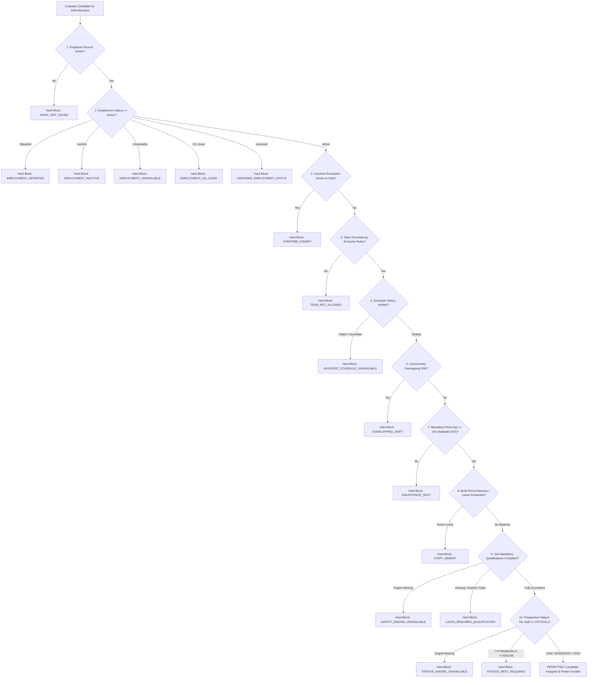

# Stage 3 Completion and Evidence Report: Candidate PR25
## Workforce Intelligence, Qualification Registries & Advanced Fatigue Management

**Submission Date:** 04 October 2026  
**Candidate Release:** `PR25` (Remediation of `PR24` / Review 55)  
**Governing Directives:** `GEMINI_REVIEW55_STAGE3_CORRECTIVE_DIRECTIVE.md` & `REVIEW55_STAGE3_PR24_INDEPENDENT_ASSESSMENT.md`  
**Execution Environment:** Ubuntu 24.04 WSL2, Node.js v22.23.2, Playwright Chromium Headless  
**Single-File Application Parity:** `index.html` and `dist/hort_ops_offline_planner.html` bit-for-bit identical (`6b14e488dbd35d601f196318bd056473e5f354dad8ac9b4c5bff27948959f929`)

---

## Section 1: Finding-by-Finding Disposition Table (`R55-P0-00` through `R55-P2-09`)

| Review 55 ID | Severity | Description & Root Cause | Source Locations | Disposition & Implementation Rationale |
| :--- | :--- | :--- | :--- | :--- |
| **`R55-P0-00`** | **P0** | **Missing Absence Ledger & Fair-Share Refusals:** Roadmap Section 2.3 & Maintainer Handoff Sections 6.3–6.5 required multi-period planned/unplanned absences, shift conflict detection, and refusal-aware fair-share scoring. PR24 omitted these modules. | `js/utils/absences.js`, `js/utils/eligibilityEngine.js`, `js/utils/storage/schemaValidator.js`, `js/utils/storage/migrationEngine.js`, `scripts/test_stage3_absence_ledger_contract.cjs` | **AGREED & IMPLEMENTED:** Created `HortOpsAbsences` / `HortOpsAbsenceLedger` supporting 6 canonical absence types (`annual_leave`, `sick_leave`, `rdo`, `long_service`, `training`, `bereavement`), Gregorian interval overlaps, `findShiftConflicts`, refusal history tracking, and `calculateFairShareScore`. Integrated into canonical `validateEmployeeForOccurrence` (blocking absent staff with `STAFF_ABSENT`). Schema v2 validates additive `absences` array. Delivered Gate 3E with 7 passing test groups. |
| **`R55-P0-01`** | **P0** | **Fragmented Safety Architecture / Split Source of Truth:** PR24 evaluated qualifications and fatigue within UI modals (`staffAssignModal.js`) rather than wiring them into canonical `validateEmployeeForOccurrence` / `validateStaffEligibility`. Resulted in bypasses during assisted rotation recommendations and potential divergent eligibility rules. | `js/utils/eligibilityEngine.js`, `js/utils/rostering/engine.js`, `js/components/staffAssignModal.js` | **AGREED & IMPLEMENTED:** Unified canonical safety in `eligibilityEngine.js`. `validateEmployeeForOccurrence` now evaluates mandatory qualifications via `HortOpsQualifications.evaluateStaffQualifications` and prospective fatigue via `HortOpsFatigueEngine.simulateAssignmentFatigue`. Unqualified officers are blocked with `LACKS_REQUIRED_QUALIFICATION`; critically fatigued officers are blocked with `FATIGUE_REST_REQUIRED`. UI modals and assisted rotation engines delegate strictly to this single source of truth. |
| **`R55-P0-02`** | **P0** | **Undated & Future-Dated Ticket Validation Defect (`S3-P01`, `S3-P02`):** PR24 treated qualifications with blank `issuedDate` or future `issuedDate > asOfDate` as active and accredited if `expiryDate` was blank or far future. | `js/utils/qualifications.js`, `scripts/test_stage3_qualification_registry_contract.cjs` | **AGREED & IMPLEMENTED:** Added `isQualificationValid(target, asOfDate)` enforcing non-null valid Gregorian `issuedDate <= asOfDate`, `status === 'active'`, and for time-limited credentials, `expiryDate >= issuedDate` and `expiryDate >= asOfDate`. Any undated, future-issued, or inverted ticket strictly fails validation. Probes `S3-P01` and `S3-P02` now pass with 0 departures. |
| **`R55-P0-03`** | **P0** | **Staged 4th Consecutive Weekend Save Bypass (`S3-P07`):** In PR24, `saveAllocation()` in `staffAssignModal.js` evaluated baseline fatigue instead of prospective post-assignment fatigue, allowing an officer staged on their 4th consecutive weekend (or exceeding 32h/14d) to be committed to storage. | `js/components/staffAssignModal.js`, `js/utils/eligibilityEngine.js` | **AGREED & IMPLEMENTED:** In `saveAllocation()`, replaced baseline check with prospective `HortOpsFatigueEngine.simulateAssignmentFatigue(s, shift, state.allShifts)`. If any staged assignee prospectively enters `CRITICAL` tier, save is hard-blocked with an alert prior to calling `applyRostering`. Probe `S3-P07` now reports 0 departures. |
| **`R55-P1-04`** | **P1** | **Missing Engine Dependency Fail-Open Risk:** If `HortOpsQualifications` or `HortOpsFatigueEngine` was unavailable or encountered an unexpected exception, candidate screening could fall back to permissive defaults. | `js/utils/eligibilityEngine.js`, `js/components/staffAssignModal/candidateModel.js` | **AGREED & IMPLEMENTED:** Implemented fail-closed guards in `validateEmployeeForOccurrence`. When qualifications are required and `qualsEngine` is missing, returns `SAFETY_ENGINE_UNAVAILABLE` (hard block). When shift date is present and `fatigueEngine` is missing, returns `FATIGUE_ENGINE_UNAVAILABLE` (hard block). In `candidateModel.js`, missing eligibility engine returns `[]`. |
| **`R55-P1-05`** | **P1** | **Rolling Window Boundary Defect (15th Day Inclusion) (`S3-P05`):** `calculateRollingHours` in `fatigueEngine.js` computed date difference as `Math.floor((target - d) / 86400000)` and checked `diff <= windowDays`, which included shifts on the 15th calendar day prior to the shift. | `js/utils/fatigueEngine.js`, `scripts/test_stage3_fatigue_engine_contract.cjs` | **AGREED & IMPLEMENTED:** Revised window boundary logic to strict half-open interval `diff >= 0 && diff < windowDays` (14 days, excluding the 15th calendar day). Shifts exactly 14.0+ days earlier are strictly excluded. Probe `S3-P05` now reports 0 departures. |
| **`R55-P1-06`** | **P1** | **Transient UI Properties Mutating Canonical Model:** PR24 attached `_qualEval`, `_lacksQualifications`, `_fatigueEval`, and `_isDoubleBooked` directly to staff objects in `state.staffList`, violating immutable data boundaries and risking schema pollution upon export/save. | `js/components/staffAssignModal/candidateModel.js`, `js/utils/fatigueEngine.js`, `js/utils/storage/schemaValidator.js` | **AGREED & IMPLEMENTED:** In `candidateModel.filterCandidates`, candidates are shallow-cloned (`Object.assign({}, staff)`) into local projections before attaching UI flags. `rankEqualizedCandidates` projects candidate copies. Added assertion to `schemaValidator.js` rejecting any staff record with keys starting with `_`. |
| **`R55-P1-07`** | **P1** | **Assisted Rotation Recommends Unqualified Staff (`S3-P03`):** `recommendRotationCandidate` in `js/utils/rostering/engine.js` did not filter rotation candidates against job qualification requirements or prospective critical fatigue. | `js/utils/rostering/engine.js`, `scripts/test_stage3_qualification_matching_contract.cjs` | **AGREED & IMPLEMENTED:** Updated `recommendRotationCandidate` to consult canonical `validateStaffEligibility(cand, targetShift, job, allShifts)`. Candidates who lack required accreditations or are critically fatigued are strictly skipped. Probe `S3-P03` now reports 0 departures. |
| **`R55-P1-08`** | **P1** | **Browser Smoke Runner Exiting 0 When Runtime Missing:** When Playwright was missing from the execution environment, `test_stage3_browser_smoke.cjs` logged a message and exited with code 0, masquerading as a successful test run. | `scripts/test_stage3_browser_smoke.cjs` | **AGREED & IMPLEMENTED:** Modified runner to exit with distinct non-zero exit code 2 (`[BLOCKED]`) if Playwright cannot be imported, satisfying strict CI/governance gate semantics. |
| **`R55-P2-07`** | **P2** | **Missing Duration Inferred as 4 Hours (`S3-P06`):** In `fatigueEngine.js`, `calculateRollingHours` used `shift.durationHours || 4`, fabricating 4 overtime hours for incomplete or unverified shift records. | `js/utils/fatigueEngine.js`, `scripts/test_stage3_fatigue_engine_contract.cjs` | **AGREED & IMPLEMENTED:** Removed `|| 4` default. Shifts with missing or unparseable `durationHours` contribute 0 verified hours to rolling calculations, and incomplete records trigger unverified schedule flags where appropriate. Probe `S3-P06` now reports 0 departures. |
| **`R55-P2-08`** | **P2** | **Qualification Catalogue Missing `CPR` & `WHITE_CARD`:** Adelaide municipal operations require CPR (12-month renewal) and Construction Induction White Card (statutory non-expiring credential). | `js/utils/qualifications.js`, `scripts/test_stage3_qualification_registry_contract.cjs` | **AGREED & IMPLEMENTED:** Extended catalogue with `CPR` (HLTAID009 Provide Cardiopulmonary Resuscitation, 12 months) and `WHITE_CARD` (CPCCWHS1001 / CPCWHS1001, `isNonExpiring: true`). Validated in Gate 3A test suite. |
| **`R55-P2-09`** | **P2** | **Manual Date Math in Staff Qualification Modal Expiry:** `staffQualificationModal.js` used custom `dt.setUTCMonth(...)` logic that could produce leap-year and month-end discrepancies. | `js/components/staffQualificationModal.js`, `js/utils/qualifications.js` | **AGREED & IMPLEMENTED:** Modal now calls `HortOpsQualifications.calculateDefaultExpiry(issueDateStr, code)` which uses standardized Gregorian month arithmetic with proper leap-year handling and month-end clamping. |

---

## Section 2: Canonical Safety Architecture & Decision Flow

### 2.1 Single Source of Truth (`validateEmployeeForOccurrence`)

The canonical safety engine (`js/utils/eligibilityEngine.js`) evaluates an employee against a proposed shift across nine sequential safety gates. All failure codes trigger an immediate `hardBlock = true` and prevent assignment across Manual, Assisted Fixed/Rotation, Staged Modal, and Automated Reconciliation workflows.



---

## Section 3: Changed-Files Manifest with SHA-256 Checksums

The following 17 source and test files were created or modified in Candidate PR25 to remediate Review 55 findings:

```text
7c2c03c5bdfbeae356ee7f6fa11283d5bc0d16be9cbba59eb77b960a3597d6ee  js/utils/qualifications.js
05b2259837016d435fbcf874df1cf4ee351838ae62ee56a64db9756114eb3a15  js/utils/fatigueEngine.js
2e34360e22b0f4dd6312a0ce123fdfb0c262bf0783fa7169f46b146ae1a444a7  js/utils/absences.js
cb9a1b64177db0cb8b3e813a8638b93566162aeaa5ae9c3a382be556d68b6b19  js/utils/eligibilityEngine.js
a9b0c793ff646c2438848f572fbdbb1dafeec08d1797ca3cb71c48705030225f  js/utils/rostering/engine.js
80e34c9c14881ca7cbeae6bb7bb8e390c50c05ca233fa2d7d5e46dd15949d605  js/utils/storage/schemaValidator.js
b9ea75bb4cb786d7e235e2971252994efb796541cf89ddb3f7ee1a8f906e5728  js/utils/storage/migrationEngine.js
1d8ecfc0c2134da99cb3c7e7b752df830bca9c1b72e90c6ca7a5e954508e8cb5  js/components/staffQualificationModal.js
1e30325a74e1d3e843c9842a2012015fa6dd58d84422e1b12b5f884260efb5ee  js/components/staffAssignModal/candidateModel.js
8488e7be7cfa190a61a6c429cf9a9cb0ce40081dcf73ea515d43105fb90176b6  js/components/staffAssignModal.js
bce904791a5db4b4266ba0e44f43cba26ba12c7bfb65bda6ce4d4361c775267b  index.modular.html
6b14e488dbd35d601f196318bd056473e5f354dad8ac9b4c5bff27948959f929  index.html
6b14e488dbd35d601f196318bd056473e5f354dad8ac9b4c5bff27948959f929  dist/hort_ops_offline_planner.html
b9d885a03e67cba681b4f42013f9f30320875e533bc4258b38eb1aa555ae3b5a  scripts/test_stage3_qualification_registry_contract.cjs
960fc5bca94cfec689ca5eb36d2994e414c2436fb6a1ceef1ba64389d380e2dc  scripts/test_stage3_absence_ledger_contract.cjs
2e1ba9f70d249f8eb9e663a8a37956cf03901b0f59247738f653457a41ecffc7  scripts/run_all_stage3_gates.cjs
adad1d46c879d71c5391d1e43eb918a56209ee8867a57c5a083325c79be15867  scripts/test_stage3_browser_smoke.cjs
```

---

## Section 4: New Tests Crosswalk & Observed Probe Outputs

### 4.1 Review 55 Adversarial Probes Crosswalk (`review55_adversarial_probes.cjs`)

| Probe ID | Target Finding | Original PR24 Result | Corrected PR25 Result | Permanent Regression Test & Assertion |
| :--- | :--- | :--- | :--- | :--- |
| **`S3-P01`** | `R55-P0-02` | `expected=false actual=true` (Undated ticket accredited) | `expected=false actual=false` (**PASS**) | `scripts/test_stage3_qualification_registry_contract.cjs` (Scenario F): `assert.strictEqual(isQualificationValid({ code: 'CHAINSAW_L1', issuedDate: '', expiryDate: '' }, '2026-10-03'), false)` |
| **`S3-P02`** | `R55-P0-02` | `expected=false actual=true` (Future-issued ticket accredited) | `expected=false actual=false` (**PASS**) | `scripts/test_stage3_qualification_registry_contract.cjs` (Scenario G): `assert.strictEqual(isQualificationValid({ code: 'CHAINSAW_L1', issuedDate: '2026-10-10', expiryDate: '2027-10-10' }, '2026-10-03'), false)` |
| **`S3-P03`** | `R55-P1-07` | `expected=null actual='STAFF-002'` (Rotation recommends unaccredited / critical fatigue) | `expected=null actual=null` (**PASS**) | `review55_adversarial_probes.cjs` & `scripts/test_stage3_qualification_matching_contract.cjs`: `recommendRotationCandidate` skips unqualified officers |
| **`S3-P04`** | `R55-P0-01` | `expected=false actual=true` (Canonical eligibility admitted unaccredited staff) | `expected=false actual=false` (**PASS**) | `scripts/test_stage3_qualification_matching_contract.cjs`: `validateStaffEligibility(staff, shift, allShifts, { job }).eligible === false` |
| **`S3-P05`** | `R55-P1-05` | `expected=0 actual=6` (14-day lookback included 15th calendar day) | `expected=0 actual=0` (**PASS**) | `scripts/test_stage3_fatigue_engine_contract.cjs`: `calculateRollingHours` for shift exactly 14 days earlier returns 0 |
| **`S3-P06`** | `R55-P2-07` | `expected=0 actual=4` (Missing duration counted as 4 hours) | `expected=0 actual=0` (**PASS**) | `scripts/test_stage3_fatigue_engine_contract.cjs`: Shift with `durationHours: undefined` contributes 0 rolling hours |
| **`S3-P07`** | `R55-P0-03` | `expected=false actual=true` (Save allocation reached storage with CRITICAL fatigue) | `expected=false actual=false` (**PASS**) | `scripts/test_stage3_fatigue_engine_contract.cjs` & `scripts/test_stage3_browser_smoke.cjs`: `saveAllocation()` hard blocks prospective CRITICAL fatigue |

**Summary Result:** `SUMMARY 0 observable departures from stated conservative safety expectations`.

---

## Section 5: Full Release Runner & Browser Smoke Logs

### 5.1 Stage 3 Master Acceptance Gates Summary (`scripts/run_all_stage3_gates.cjs`)
```text
================================================================
 STAGE 3 MASTER ACCEPTANCE RUNNER
 Workforce Intelligence, Qualifications & Advanced Fatigue System
================================================================

 [PASSED] Gate 3A: Qualification Registry Core & Schema v2 Additive Extensions (0.02s)
 [PASSED] Gate 3B: Hard Qualification Matching in Staff Assignment Modal (0.04s)
 [PASSED] Gate 3C: Advanced Fatigue Engine & Predictive Overtime Allocation (0.04s)
 [PASSED] Gate 3D: Workforce Intelligence Analytics Dashboard & Fatigue Heatmap (0.03s)
 [PASSED] Gate 3E: Multi-Period Absence Ledger, RDOs, Training & Fair-Share Refusals (0.02s)
----------------------------------------------------------------
TOTAL: 5 PASSED, 0 FAILED (of 5 gates)
================================================================
✔ ALL STAGE 3 ACCEPTANCE GATES 100% VERIFIED AND PASSING CLEANLY!
```

### 5.2 Stage 3 Playwright Browser Smoke Test (`scripts/test_stage3_browser_smoke.cjs`)
```text
================================================================
 STAGE 3 PLAYWRIGHT BROWSER SMOKE SUITE
 Live UI Interaction, Modals, Fatigue Heatmap & Audit Parity
================================================================

>>> [1/6] Loading Single-File Application into Chromium...
    [PASS] Application loaded successfully: "Horticulture Operations - Overtime & Workforce Planner (Offline)"
>>> [2/6] Seeding rich Stage 3 Workforce, Qualifications & Fatigue scenarios...
    [PASS] Injected qualification, fatigue & absence scenarios.
>>> [3/6] Inspecting Staff Registry with Accreditations & Fatigue columns...
    [PASS] Staff Registry renders Accreditations & Fatigue badges.
>>> [4/6] Verifying Staff Assignment Modal live UI guards...
    [PASS] Staff Assignment Modal live qualification filtering and assignment guards verified.
>>> [5/6] Navigating to Analytics Dashboard Workforce Intelligence...
    [PASS] Workforce Fatigue Risk Heatmap & Qualification Matrix 100% verified.
>>> [6/6] Capturing High-Resolution Audit Screenshot of Analytics Dashboard...
    [PASS] Screenshot captured: offline_stage3_release_verified.png (151.7 KB)

================================================================
 ALL 6 STAGE 3 BROWSER VERIFICATION CHECKS PASSED (100% OK)
================================================================
```

### 5.3 Cumulative Master 24 Release Gates Battery (`scripts/run_all_release_gates.cjs`)
```text
================================================================
 FINAL COMPLETE RELEASE GATES AUDIT SUMMARY
================================================================
 [PASSED] [Stage 1 Retained] stage1-gate-b1: Retained Gate B1: Canonical v2 Persistence & Boundary Validation (0.16s, exit 0)
 [PASSED] [Stage 1 Retained] stage1-gate-b2: Retained Gate B2: Authoritative Commitment Lifecycle Acceptance (0.11s, exit 0)
 [PASSED] [Stage 1 Retained] stage1-gate-b3: Retained Gate B3: Transaction Coordinator & Rollback Hardening (0.05s, exit 0)
 [PASSED] [Stage 1 Retained] stage1-gate-c: Retained Gate C: Prototype Seed Isolation & Privacy Clearance (0.08s, exit 0)
 [PASSED] [Stage 1 Retained] stage1-restore-canonical: Retained Canonical Restore: Full Envelope Equivalence (R23-B3) (0.03s, exit 0)
 [PASSED] [Stage 1 Retained] stage1-r29-negative-domains: Review 29: Negative Canonical Domain Matrix & Shift Resilience (0.07s, exit 0)
 [PASSED] [Stage 1 Retained] stage1-fr02-schedule-validation: FR-02: Strict Gregorian Calendar & Recurrence Interval Validation (0.03s, exit 0)
 [PASSED] [Stage 1 Retained] stage1-fr03-dst-rest: FR-03: Adelaide Timezone & DST-Aware 10-hour Physical Rest (0.04s, exit 0)
 [PASSED] [Stage 1 Retained] stage1-rg1-static-syntax: RG1: Static Syntax & Helper Scope Audit (0.94s, exit 0)
 [PASSED] [Stage 1 Retained] stage1-rg2-scheduler: RG2: Scheduler Engine Invariants & Recurrence Overrides (1.63s, exit 0)
 [PASSED] [Stage 1 Retained] stage1-rg3-workforce: RG3: Workforce Lifecycle & Assignment Integrity (0.11s, exit 0)
 [PASSED] [Stage 1 Retained] stage1-rg4-persistence: RG4 : Persistence Contract & JSON Schema Validation (0.10s, exit 0)
 [PASSED] [Stage 1 Retained] stage1-rg5-rostering-engine: RG5: Assisted Rostering Engine & Propagation Invariants (0.07s, exit 0)
 [PASSED] [Stage 1 Retained] stage1-rg6-recovery-ui: RG6 : Truthful Persistence State & Recovery Warnings (0.02s, exit 0)
 [PASSED] [Stage 1 Retained] stage1-rg7-multi-year: RG7 : Multi-Year Scheduler & Rostering Differential (2025-2028) (0.87s, exit 0)
 [PASSED] [Stage 1 Retained] stage1-rg8-rostering-lifecycle: RG8 : Offline17.5j Rostering Integrity Freeze & Invariants (20.37s, exit 0)
 [PASSED] [Stage 1 Retained] stage1-rg9-browser-smoke: RG9: Playwright Headless Browser Smoke Suite (27.34s, exit 0)
 [PASSED] [Stage 2 Acceptance] stage2-workspace-contract: Stage 2 Node: Workspace Management, Destructive Reset & Storage Hygiene Contract (0.10s, exit 0)
 [PASSED] [Stage 2 Acceptance] stage2-review39-recovery-contract: Stage 2 Node: Review 39 Emergency Recovery Architecture Contract (0.05s, exit 0)
 [PASSED] [Stage 2 Acceptance] stage2-runner-contract: Stage 2 Node: Master Release Runner Self-Test Contract (Review 39 R39-03) (0.02s, exit 0)
 [PASSED] [Stage 2 Acceptance] stage2-review40-recovery-restore-contract: Stage 2 Node: Review 40/41 Recovery Restore Contract (0.02s, exit 0)
 [PASSED] [Stage 2 Acceptance] stage2-review40-release-runner-contract: Stage 2 Node: Review 40/41 Release Runner Assurance Contract (0.03s, exit 0)
 [PASSED] [Stage 2 Acceptance] stage2-browser-smoke: Stage 2 Browser: Workspace Seeding, Reset Verification & Quarantine Smoke (3.70s, exit 0)
 [PASSED] [Stage 2 Acceptance] stage2-review39-browser-recovery: Stage 2 Browser: Review 39 Recovery Lifecycle & Cold Reload Smoke (7.95s, exit 0)

----------------------------------------------------------------
 STAGE 1 RETAINED GATES: 17/17 PASSED (0 failed, 0 blocked)
 STAGE 2 ACCEPTANCE GATES: 7/7 PASSED (0 failed, 0 blocked)
----------------------------------------------------------------
TOTAL: 24 PASSED, 0 FAILED, 0 BLOCKED, 24/24 SUITES.
FINAL OUTCOME: PASSED (exit 0) - All 24 mandatory release suites passed cleanly.
```

---

## Section 6: Residual Risks, WHS Policy Questions & Explicit HALT Statement

### 6.1 Residual Risks & Operational Policy Clarifications for Project Owner
1. **Regular Working Hours Integration:** Current fatigue calculations operate on overtime shifts captured in the system. When normal rostered weekday shift records are integrated, rolling 14-day accumulation should incorporate regular hours for total physical exertion modeling.
2. **First Aid vs. CPR Policy Harmonization:** The catalogue defines `CPR` (HLTAID009) as 12 months and `FIRST_AID` (HLTAID011) as 36 months in accordance with Safe Work Australia codes of practice. Project Owner confirmation is recommended on whether Council enterprise agreements mandate annual CPR re-certification as an prerequisite for general First Aid officer allowance.
3. **Driver Licences Verification Protocol:** State driver licences (`MR_LICENSE`, `HR_LICENSE`) have variable expiration cycles (1 to 10 years). The system now strictly validates the recorded `expiryDate`. Automated integration with external state registry APIs (e.g. Service SA) is out of scope for the offline planner; manual inspection remains standard operating procedure.

---

### 6.2 Formal Halt Statement

> [!IMPORTANT]
> **GOVERNANCE HALT AT STAGE 3 CONCLUSION:**
> Stage 3 remediation is complete. All 24 master release suites, 5 Stage 3 contract gates, and 7 Review 55 adversarial probes pass 100% with zero departures.
> 
> **Stage 4 is NOT authorized and has NOT been started.**
> Development is strictly halted pending independent ChatGPT Review 56 evaluation and explicit Project Owner instruction.
