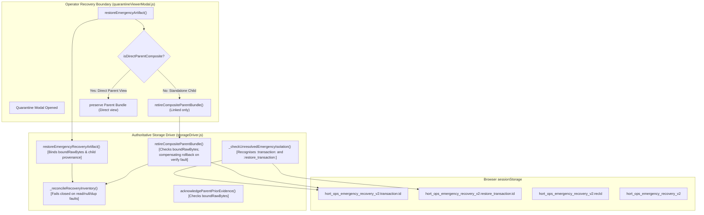

# Architecture Contract Map -- PR23_07_04 Consolidation
**Author:** Antigravity / Gemini Handoff Pair
**Date:** 2026-10-02
**Governing Peer Review:** Independent Peer Review 47 (ChatGPT Architecture Audit)
**Target Release Candidate:** PR23_07_04
**Status:** AUTHORITATIVE ARCHITECTURAL SPECIFICATION & IMPLEMENTATION MAP(
---

## 1. Executive Summary & Review 47 Architectural Contracts

Independent Peer Review 47 identified three critical architectural contracts requiring remediation in candidate `PR23_07_03`:

1. **Contract A (R47-01, AC-01 / AC-07 / AC-10): Authoritative Typed Recovery Inventory Reader**
   - Storage enumeration in `_reconcileRecoveryInventory()l must not rely on key name heuristics alone.
   - Must perform verified raw read via `getItem(k)` on every recovery key.
   - Must detect and fail closed on: `getItem` read exceptions/denials (`R47-P01`), duplicate enumerated keys (`R47-P02`), and null/absent raw values (`R47-P03`).
   - Must return a structured typed inventory: `{ ok, count, verified, keys, compositeKeys, allKeys, recoveryEntries, byType }`.

2. **Contract B (R47-02, AC-03 / AC-04 / AC-05 / AC-06): Immutable Evidence Identity & Non-Silent Retirement**
   - Restoring a child recovery artifact must establish provenance with the selected parent bundle by comparing embedded child recovery identity with the restored artifact identity (`R47-P05`).
   - Resolution record binds `boundRawBytes` and `boundChildRecoveryId` to prevent tampering.
   - Retirement via `retireCompositeParentBundle()l must re-verify that current stored parent bytes match `boundRawBytes` exactly (`R47-P04`).
   - Acknowledgement via `acknowledgeParentPriorEvidence()` must re-verify current stored parent bytes against `boundRawBytes`.
   - The UI modal (`quarantineViewerModal.js`) must not silently auto-retire parent composite bundles when the operator is viewing and restoring a composite parent bundle directly (`R47-P06`).
   - Retiring an indirectly linked empty-prior parent bundle is permitted only when restoring a standalone workspace recovery artifact (Review 39 / Browser R39-C compatibility).

3. **Contract C (R47-03, AC-08 / AC-09 / AC-10): Isolation Prefix Recognition & Compensating Retirement**
   - Isolation check `_checkUnresolvedEmergencyIsolation()` must recognise all governed bundle namespaces, including `:restore_transaction:` (`R47-P07`), preventing destructive reset when malformed restore bundles exist.
   - Parent bundle retirement must hold a pre-removal preimage and execute a compensating `setItem` rollback if post-removal verification throws an exception (`R47-P08`), ensuring raw evidence is never lost.

---

## 2. Component Interaction & Call Graph

---

## 3. Review 47 Verification Summary

All eight Review 47 probes execute cleanly against Candidate `PR23_07_04`:
- `PASS R47-P01`: inventory getItem denial MUST fail closed
- `PASS R47-P02`: duplicate enumeration MUST fail closed
- `PASS R47-P03`: absent raw entry MUST NOT count as verified evidence
- `PASS R47-P04`: changed parent bytes after restore MUST block retirement
- `PASS R47-P05`: forged parentTransactionId MUST NOT mark unrelated parent recovered
- `PASS R47-P06`: UI must not automatically retire empty-prior parent before explicit operator action
- `PASS R47-P07`: malformed persisted restore bundle MUST prevent destructive reset
- `PASS R47-P08`: failed parent-retirement verification MUST preserve raw prior evidence
