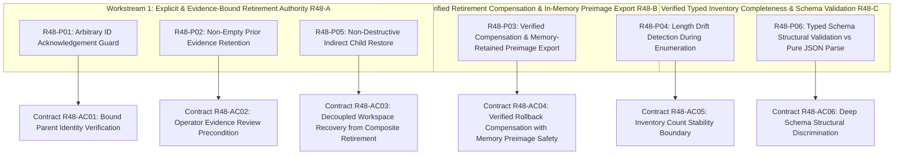

# Review 48 Architecture Contract Map: Stage 2 Consolidation (Candidate PR23_07_05)

**Document Reference:** `governance_and_reviews/R48_ARCHITECTURE_CONTRACT_MAP.md`  
**Candidate Release Package:** `HortOps-Stage2-Corrective-PR23_07_05.zip`  
**Baseline Review:** Independent Peer Review 48 (`REVIEW48_PR23_07_04_INDEPENDENT_ASSESSMENT.md`)  
**Target Review:** Independent Peer Review 49 / Stage 2 Closure Validation  
**Date:** 02 October 2026  

---

## 1. Architectural Contract Mapping Overview

Independent Peer Review 48 classified six reproduced probe failures into three structural workstreams across the dual-store emergency recovery architecture:



---

## 2. Invariant & Contract Specification

| Contract ID | Review 48 Workstream | Governing Method | Architectural Requirement | Verification Mechanism |
| :--- | :--- | :--- | :--- | :--- |
| **R48-AC01** | Workstream 1 (R48-A) | `acknowledgeParentPriorEvidence(txId)` | Must fail closed (`success: false`) if transaction ID is unrecovered or not resolved in internal registry. Unbound direct calls cannot mint acknowledgement. | Tested by `R48-P01` |
| **R48-AC02** | Workstream 1 (R48-A) | `acknowledgeParentPriorEvidence(txId, options)` & `retireCompositeParentBundle(txId)` | If parent bundle contains non-empty `previousEmergencyRecoveryMetadata`, acknowledgement requires genuine operator inspection or export confirmation. Bare calls fail closed. Retirement without prior acknowledgement preserves parent bytes in storage. | Tested by `R48-P02`, Req 4.2 |
| **R48-AC03** | Workstream 1 (R48-A) | `quarantineViewerModal.js::restoreEmergencyArtifact()` | Restoring child workspace from quarantine modal must NEVER retire composite parent bundle as a side-effect. Parent evidence remains preserved until explicit operator retirement. | Tested by `R48-P05`, Req 4.1 |
| **R48-AC04** | Workstream 2 (R48-B) | `storageDriver.js::retireCompositeParentBundle(txId)` | Post-removal verification failure initiates compensating rollback write, which MUST be verified via re-read. Under compensation write failure, silent no-op, or readback divergence, in-memory preimage is retained on `_retirementRecoveryBundleJson` and `lastRestoreResult`, and system enters active `EMERGENCY_ISOLATION`. | Tested by `R48-P03`, Req 5.1, Req 5.2 |
| **R48-AC05** | Workstream 3 (R48-C) | `storageDriver.js::_reconcileRecoveryInventory()` | Pre-enumeration `sessionStorage.length` is compared against post-enumeration `length` and enumerated key count. Any count divergence returns `ok: false, verified: false`, preventing false completeness reporting under concurrent storage drift. | Tested by `R48-P04` |
| **R48-AC06** | Workstream 3 (R48-C) | `storageDriver.js::_reconcileRecoveryInventory()` | Raw JSON strings are not validated by pure parse alone. Parent transaction bundles must conform to structural schema (`artifactType === 'hort_ops_reset_transaction_recovery'`, non-empty `transactionId`, valid `currentWorkspaceRecoveryArtifact`). Invalid objects like `'{}'` are classified `validationStatus: 'malformed'`. | Tested by `R48-P06` |

---

## 3. Interaction Architecture & Lifecycle Flow

```mermaid
sequenceDiagram
  autonumber
  actor Operator as Operator (UI / API)
  participant QM as Quarantine Viewer Modal
  participant SD as HortOpsStorageDriver
  participant SS as Browser sessionStorage
  participant LS as Browser localStorage

  Note over Operator,SS: Scenario A: Workspace Restore Preserves Parent Evidence
  Operator->>QM: Click Restore Emergency Artifact (Child)
  QM->>SD: restoreEmergencyRecoveryArtifact(childPayload, { parentTransactionId })
  SD->>LS: Restore pre-reset workspace snapshot
  SD->>SS: Remove child key and legacy alias (if byte-identical)
  Note over SD,SS: Parent composite bundle is NOT deleted!
  SD->>SD: Record workspaceRecovered: true for parentTxId
  SD-->>QM: Return restoreSuccess (evidenceRemains: true)
  QM-->>Operator: Display workspace restored warning; autosave remains blocked

  Note over Operator,SS: Scenario B: Governed Parent Inspection & Retirement
  Operator->>QM: Inspect / Export Parent Evidence
  QM->>SD: acknowledgeParentPriorEvidence(parentTxId, { operatorConfirmed: true, evidenceExported: true })
  SD->>SD: Set priorEvidenceAcknowledged: true for parentTxId
  SD-->>QM: Acknowledgement confirmed
  Operator->>QM: Request Parent Retirement
  QM->>SD: retireCompositeParentBundle(parentTxId)
  SD->>SS: removeItem(parentKey)
  SD->>SS: getItem(parentKey) -> Verify removed
  alt Removal Verified
    SD->>SD: Inventory scan -> count === 0
    SD-->>QM: Retirement successful; autosave unlocked
  else Removal Unverified
    SD->>SS: setItem(parentKey, preRemovalPreimage)
    SD->>SS: getItem(parentKey) -> Verify compensation
    alt Compensation Verified
      SD-->>QM: Return failure; evidence preserved in storage
    else Compensation Failed / No-op / Mismatch
      SD->>SD: Retain preimage in _retirementRecoveryBundleJson
      SD->>SD: Enter EMERGENCY_ISOLATION (_autosaveBlocked: true)
      SD-->>QM: Return failure with retained exportable bundle
    end
  end
```
