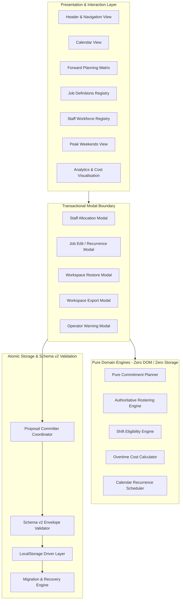
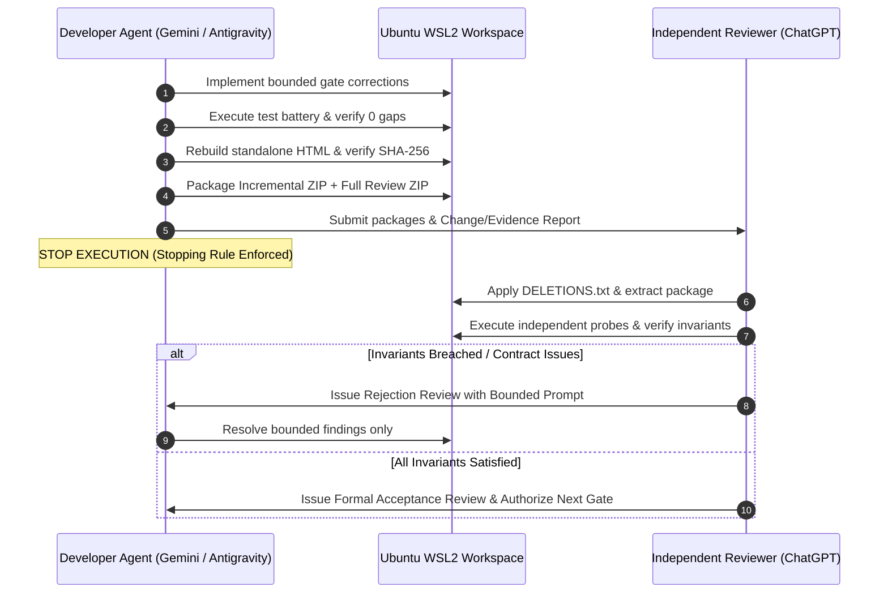

# Horticulture Operations Overtime & Workforce Planner
## Comprehensive Roadmap, Testing Strategy, Acceptance Gates, and Automated Release Gates Specification

**Document Version:** 1.0.0  
**Effective Date:** 2026-09-28  
**Governing Architecture:** Stage 1 Architecture Governance Reset Directive (`C1`–`C10`, `I1`–`I12`)  
**Application Type:** Single-File Static Self-Contained Offline HTML5/ES5 Web Application  
**Runtime Constraints:** Zero External Dependencies, Zero CDN Links, Zero Web Servers, Pure `file://` Offline Execution  
**Current Governance Milestone:** Stage 1 Gate C PR21 Formally Accepted (Independent Peer Review 26)

---

## Table of Contents

1. [Executive Summary & System Architecture Overview](#1-executive-summary--system-architecture-overview)
2. [End-to-End Multi-Stage Roadmap (Stages 1 through 4)](#2-end-to-end-multi-stage-roadmap-stages-1-through-4)
3. [The Core Architectural Invariants (C1–C10 & I1–I12)](#3-the-core-architectural-invariants-c1c10--i1i12)
4. [Stage 1 Acceptance Gates Specification (Gates A through D)](#4-stage-1-acceptance-gates-specification-gates-a-through-d)
5. [Automated Release Gates Master Battery (RG1 through RG9)](#5-automated-release-gates-master-battery-rg1-through-rg9)
6. [Testing Architecture & Adversarial Probing Strategy](#6-testing-architecture--adversarial-probing-strategy)
7. [Dual-Agent Independent Peer Review Governance Protocol](#7-dual-agent-independent-peer-review-governance-protocol)
8. [Current Truthful Governance Ledger & Status Matrix](#8-current-truthful-governance-ledger--status-matrix)
9. [Verification Runbook & Developer Reference](#9-verification-runbook--developer-reference)

---

## 1. Executive Summary & System Architecture Overview

The **Horticulture Operations Overtime & Workforce Planner** is a mission-critical, offline-first operational scheduling and overtime management system designed for local government horticulture and arboriculture operations. It operates in environments where field supervisors and depot planners must schedule, allocate, verify, and cost overtime across complex operational constraints without internet connectivity.



### 1.1 Fundamental Architecture Attributes
- **Zero Runtime Dependencies:** No external frameworks, no React, no Vue, no jQuery, no lodash, and no external CSS libraries. All components and styling are implemented in vanilla JavaScript and pure CSS.
- **Offline Single-File Distribution:** The primary production artifact is a single, self-contained HTML file ([`dist/hort_ops_offline_planner.html`](file:///Ubuntu/home/n0rt/Antigravity-IDE/Hort_Ops_Visualisations/Offline2-Overtime-Planner/dist/hort_ops_offline_planner.html)) containing all markup, inlined styles, SVG icons, and JavaScript logic. It executes reliably when double-clicked locally from a USB flash drive or local disk under the `file://` protocol.
- **Modular Development Architecture:** Source code is authored across 45 cleanly separated ES5/JavaScript modules under `js/` and a comprehensive stylesheet [`css/style.css`](file:///Ubuntu/home/n0rt/Antigravity-IDE/Hort_Ops_Visualisations/Offline2-Overtime-Planner/css/style.css). A deterministic single-file compiler ([`scripts/build_single_file.cjs`](file:///Ubuntu/home/n0rt/Antigravity-IDE/Hort_Ops_Visualisations/Offline2-Overtime-Planner/scripts/build_single_file.cjs)) inlines modular assets into the distribution bundle.
- **Deterministic Build Equivalence:** The root distribution [`index.html`](file:///Ubuntu/home/n0rt/Antigravity-IDE/Hort_Ops_Visualisations/Offline2-Overtime-Planner/index.html) and compiled distribution [`dist/hort_ops_offline_planner.html`](file:///Ubuntu/home/n0rt/Antigravity-IDE/Hort_Ops_Visualisations/Offline2-Overtime-Planner/dist/hort_ops_offline_planner.html) are cryptographically byte-identical (SHA-256: `5ec73836ea4a2502425cec531963c05bbf4d3e450bb5b8852c430f3a8cb372a8`).

---

## 2. End-to-End Multi-Stage Roadmap (Stages 1 through 4)

Development is structured into four sequential, strictly governed stages. Progression between stages is governed by independent peer review acceptance gates:

```mermaid
journey
    title Horticulture Operations System Roadmap
    section Stage 1: Architecture & Governance
      Gate A: Audit & Normal-Save: 5: Accepted
      Gate B1: Canonical Schema v2: 5: Accepted
      Gate B2: Pure Commitment Planner: 5: Accepted
      Gate B3: Transaction Hardening: 5: Accepted
      Gate C: Seed Isolation & Privacy: 5: Accepted
      Gate D: Integrated Release Checkpoint: 5: Closed & Verified (PR22_01)
    section Stage 2: Workspace Management
      Destructive Reset UI Modal: 4: Implemented
      Storage Quota Monitor: 4: Implemented
      Corrupted State Recovery: 4: Implemented
    section Stage 3: Workforce Intelligence
      Interrelated Registries: 1: Planned
      Permit & Qualification Engine: 1: Planned
      Multi-Period Absence Ledger: 1: Planned
      Smart Candidate Rotation: 1: Planned
    section Stage 4: Enhanced Experience
      High-Density Matrix Overhaul: 1: Planned
      Budget Forecasting Analytics: 1: Planned
      Drag-and-Drop Scheduling: 1: Planned
```

### 2.1 Stage 1: Architecture Governance, Canonical Schema v2, Scheduled-Commitment Lifecycle & Release Integrity
Stage 1 is the foundational hardening stage. It refactors a prototype codebase into an enterprise-grade offline architecture by eliminating silent data loss, aliasing bugs, latent prototype dependencies, and privacy risks:
- **Gate A (Audit & Normal-Save Integrity):** Established Canonical Schema v2 baseline, fail-closed unreadable storage quarantine, and zero-loss snapshot retention checks across 8 critical trust boundaries. *(Accepted in Review 12, PR11)*
- **Gate B1 (Canonical Current-Schema Persistence & Validation):** Enforced strict canonical `assignments` vs runtime `customAssignments` boundary, constructor-level alias rejection, and fail-closed v1 migration. *(Accepted in Review 17, PR16)*
- **Gate B2 (Authoritative Scheduled-Commitment Ownership & Pure Delta Planner):** Implemented pure commitment delta planner ([`commitmentPlanner.js`](file:///Ubuntu/home/n0rt/Antigravity-IDE/Hort_Ops_Visualisations/Offline2-Overtime-Planner/js/utils/rostering/commitmentPlanner.js)), mandatory caller-injected `todayKey`, cumulative descendant proof, and eliminated direct unsnapshotted writers. *(Accepted in Review 20, PR19)*
- **Gate B3 (Stage-Before-Commit Transaction Hardening & Snapshot Protection):** Implemented transaction coordinator (`_commitCanonicalProposal`), deep input cloning, history-only job deletion protection (FR-01), permit rollback (FR-05), and restore canonical equivalence (FR-04). *(Accepted in Review 21, PR20; FR-04 finalized in PR21)*
- **Gate C (Prototype Seed Isolation, Clean-Slate Cold-Start & Privacy Clearance):** Removed prototype datasets from distribution bundles, purged `window.HortOpsData` seed reads from production code, verified 0-entity clean boot, created `DELETIONS.txt` tree hygiene manifest, and sanitized test sentinels. *(Formally Accepted in Independent Peer Review 26, 2026-09-28)*
- **Gate D (Integrated Stage 1 Release Checkpoint):** Comprehensive final validation of Stage 1, resolving remaining blockers (FR-02 Gregorian calendar, FR-03 Adelaide/DST 10h rest, FR-07 fixture cleanup, FR-09 ES5 review, Playwright browser release smoke). *(CLOSED & VERIFIED IN PR22_01; Stage 1 Complete)*

### 2.2 Stage 2: Confirmed Destructive Reset & Storage Hygiene
*Boundary Rule: Stage 2 implementation was authorised following Gate D closure (PR22_01). Corrective candidate PR23_02 addresses all Independent Review 38 findings (durable pre-delete recovery rollback contract and fail-closed release runner) and is currently under independent peer review. Stage 3 remains strictly prohibited until Stage 2 is formally accepted.*
- **Confirmed Destructive Reset Modal:** Explicit two-step UI modal requiring typed confirmation ('RESET') to wipe local storage and return the client to a verified clean-slate state. On persistent wipe failure, modal suppresses reload and preserves live state.
- **Quota & Health Monitoring:** Real-time local storage capacity estimation against standard 5MB browser quota, unrounded warning thresholds at > 80% quota, and truthful, idempotent compaction.
- **Corrupt Workspace Management:** Enhanced quarantine viewer allowing operators to inspect, export, or safely discard unparseable workspace data.
- **Canonical Baseline Reference Year:** `currentYear = 2026` is established and documented as the canonical reference baseline year for the self-contained offline dataset.

### 2.3 Stage 3: Workforce Intelligence, Qualification Engine & Multi-Period Absences
*Boundary Rule: Stage 3 implementation is strictly prohibited until Stage 2 is formally completed.*
- **Interrelated Qualification Registries:** Structured tracking of mandatory certifications (e.g. Chainsaw Level 1/2, Traffic Management, Chemical Handling, First Aid).
- **Hard Qualification Matching:** Automatic filtering in allocation modals ensuring staff without active, valid qualifications cannot be assigned to specialized jobs.
- **Multi-Period Planned & Unplanned Absence Ledger:** Granular leave management (annual leave, sick leave, RDOs, training) with conflict detection.
- **Fair-Share Overtime Rotation:** Dynamic candidate ranking based on accumulated year-to-date overtime hours, refusal history, and fatigue limits.

### 2.4 Stage 4: Enhanced UI/UX Overhaul
- **High-Density Matrix Overhaul:** Visual forward-planning matrix with virtual scrolling for multi-week operational overviews.
- **Visual Budget Forecasting:** Dynamic chart rendering of expenditure curves against annual overtime budgets.
- **Drag-and-Drop Adjustments:** Interactive shift adjustments with immediate validation and commit-staging feedback.

---

## 3. The Core Architectural Invariants (C1–C10 & I1–I12)

All architectural decisions and code modifications must strictly comply with the **Stage 1 Architecture Governance Reset Directive**:

### 3.1 Non-Negotiable Core Invariants (C1–C10)

| Invariant | Title | Strict Contractual Requirement |
| :--- | :--- | :--- |
| **C1** | **Clean Architectural Decomposition** | Strict separation of concerns: UI components handle DOM and presentation; pure domain engines perform calculations with zero DOM and zero storage access; persistence engines coordinate transactions and storage drivers. |
| **C2** | **Explicit Canonical Schema v2 Envelope** | The only authoritative persisted format is Schema v2 containing explicit root domains: `schemaVersion`, `jobs`, `roster`, `assignments`, `historicalSnapshots`, `rostering`, `permits`, `budgetSettings`, and `uiState`. Missing domains must never default silently. |
| **C3** | **Authoritative Scheduled-Commitment Ownership** | Scheduled shift assignments are authoritative operational commitments. Every assignment must be backed by a snapshot containing full shift parameters (`durationHours`, `rateMultiplier`, `recordedAt`, `yearKey`). |
| **C4** | **Pure Commitment Delta Planner** | Planning logic in `commitmentPlanner.js` must be purely functional: accepts `(baseSnapshots, operations, context)` and returns a detached planned snapshot map without mutating inputs. Requires mandatory validated `todayKey`. |
| **C5** | **Stage-Before-Commit Transaction Atomicity** | State mutations must follow stage-before-commit: (1) clone state, (2) apply mutation to proposal, (3) validate proposal against Schema v2, (4) commit to storage, (5) adopt proposal into live memory. Storage failure rolls back memory immediately. |
| **C6** | **Restore Canonical Equivalence** | Workspace restoration must normalize incoming envelopes to full canonical Schema v2 (inserting canonical defaults for omitted optional domains), validate, persist to storage, and adopt. Live state == committed bytes == cold reload == exported backup. |
| **C7** | **Zero Seed Operational Data in Release Distribution** | Standalone production bundles must not contain embedded prototype jobs, employee rosters, or historical ledgers. Clean boot on empty storage must produce 0 jobs, 0 staff, and 0 shifts without errors or warnings. |
| **C8** | **Comprehensive Privacy Clearance** | Distributed source, tests, and documentation must contain zero real employee names, contact numbers, personal identifiers, or production council email domains. All fixtures must use synthetic identity conventions. |
| **C9** | **Deterministic Single-File Compilation** | Build compiler must generate identical SHA-256 output across successive runs. Both `index.html` and `dist/hort_ops_offline_planner.html` must match byte-for-byte. |
| **C10** | **Strict Gate Sequencing & Independent Authority** | Development proceeds strictly through gated milestones (A -> B1 -> B2 -> B3 -> C -> D). No gate may open without formal independent peer review acceptance of the preceding gate. |

### 3.2 Transition Invariants (I1–I12)
- **I1 (Boundary Validation):** Strict envelope validation at all 8 trust boundaries (modal entry, modal save, manual save, auto save, pre-recovery, post-recovery, backup export, backup restore).
- **I2 (Fail-Closed Quarantine):** Unreadable or invalid local storage data is preserved in quarantine; storage writes are aborted immediately to prevent data destruction.
- **I3 (Immutable Historical Snapshots):** Past operational commitments cannot be deleted, rescheduled, or modified by subsequent forward planning operations.
- **I4 (Cumulative Descendant Removal Proof):** Cancellation or modification of recurring job instances requires strict provenance proof from the authoritative rostering engine.
- **I5 (Pure Operation Descriptors):** Planners and coordinators must not mutate caller-owned operation objects or metadata.
- **I6 (Deterministic Calendar Math):** Gregorian calendar math and date keys (`YYYY-MM-DD`) must use explicit date-string parsing rather than local browser timezone conversions.
- **I7 (Prototype Pollution Resistance):** All map lookups and deduplication sets must use null-prototype objects (`Object.create(null)`).
- **I8 (Caller Isolation via Detached Copies):** Live state and modal state must exchange deep-cloned copies to prevent alias contamination.
- **I9 (History-Only Job Retirement):** Jobs with historical commitments cannot be deleted; they must be transitioned to `retired: true` with future recurrences sealed.
- **I10 (Verified Baseline Reader):** Allocation modals must verify clean storage reads before staging assignments to prevent overwriting concurrent state.
- **I11 (De-Identified Testing Fixtures):** Test assertions must use structural regular expressions and synthetic domain validations rather than personal name blacklists.
- **I12 (Synchronized Governance):** Transition ledgers and handoff reports must truthfully represent accepted milestones, open defects, and remaining blockers.

---

## 4. Stage 1 Acceptance Gates Specification (Gates A through D)

```mermaid
stateDiagram-v2
    [*] --> Gate_A: Start Stage 1
    Gate_A --> Gate_B1: Accepted (Review 12)
    Gate_B1 --> Gate_B2: Accepted (Review 17)
    Gate_B2 --> Gate_B3: Accepted (Review 20)
    Gate_B3 --> Gate_C: Accepted (Review 21)
    Gate_C --> Gate_D: Accepted (Review 26; Gate D Closed & Verified)
    Gate_D --> Stage_2_Authorised: Final Review Acceptance
    Stage_2_Authorised --> [*]
```



### 4.1 Gate A: Audit & Normal-Save Persistence Integrity
- **Objective:** Establish the canonical Schema v2 storage contract, audit all existing save pathways, and eliminate silent data loss during normal application saves.
- **Core Scope:**
  - Audit and instrument all 8 persistence boundaries.
  - Implement unreadable storage quarantine (`quarantine_corrupt_data`).
  - Enforce snapshot retention during routine job and roster edits.
- **Verification Evidence:** `scripts/test_normal_save_snapshots.cjs` (PASS), `scripts/test_recovery_ui.cjs` (PASS).
- **Governing Review:** Independent Peer Review 12 (`STAGE1_GATE_A_INDEPENDENT_PEER_REVIEW_12.md`, 2026-09-25).
- **Outcome:** **ACCEPTED WITH DOCUMENTED GATE B DEFERRALS** (PR11 SHA-256: `bb8ca019d8dd6ac98fdf72529717c61bfa068929e38123b2724eb556302a24cb`).

### 4.2 Gate B1: Canonical Persistence & Scheduled-Commitment Validation
- **Objective:** Strictly distinguish canonical storage structures from runtime projections; reject ambiguous aliases at boundaries and constructors.
- **Core Scope:**
  - Enforce canonical `assignments` map across all storage boundaries.
  - Reject runtime `customAssignments` alias at constructor level (`migrationEngine.js:createWorkspaceEnvelope`).
  - Implement fail-closed Schema v1 to v2 migration with evidence preservation.
- **Verification Evidence:** `scripts/test_gate_b1.cjs` (Assertions 1–11 PASS), Review 13–16 discriminating boundary probes (100% PASS).
- **Governing Review:** Independent Peer Review 17 (`STAGE1_GATE_B1_INDEPENDENT_PEER_REVIEW_17.md`, 2026-09-25).
- **Outcome:** **ACCEPTED WITH DOCUMENTED B2/B3/D DEFERRALS** (PR16 SHA-256: `ba5f9d223c32bbf3956ca13ebb1ced4ed8ca242bd2fde9fd685fd181c9d8edce`).

### 4.3 Gate B2: Scheduled-Commitment Ownership & Pure Delta Planner
- **Objective:** Implement an authoritative scheduled-commitment lifecycle driven by a pure delta planner with strict provenance proof.
- **Core Scope:**
  - Create pure functional commitment planner [`js/utils/rostering/commitmentPlanner.js`](file:///Ubuntu/home/n0rt/Antigravity-IDE/Hort_Ops_Visualisations/Offline2-Overtime-Planner/js/utils/rostering/commitmentPlanner.js).
  - Enforce mandatory caller-injected `todayKey` with real Gregorian validation via `HortOpsSchemaValidator.isRealYmd()`.
  - Require cumulative descendant removal proof (`afterRostering` and engine-pruned proof).
  - Enforce verified baseline reader in `staffAssignModal.js` and eliminate direct unverified writers.
- **Verification Evidence:** `scripts/test_gate_b2.cjs` (100% PASS), Review 18 repro (7/7 PASS), Review 19 repro (8/8 PASS).
- **Governing Review:** Independent Peer Review 20 (`HortOps_Stage1_PR19_Full_Independent_Peer_Review.md`, 2026-09-27).
- **Outcome:** **ACCEPTED WITH DOCUMENTED B3 & PRE-GATE D DEFERRALS** (PR19 SHA-256: `796177ccc5f18c40992e6253b4c313a80f7327d2c3e1b1d69126906f8653947d`).

### 4.4 Gate B3: Stage-Before-Commit Transaction Hardening & Snapshot Protection
- **Objective:** Guarantee zero divergence between live application state and committed storage bytes on persistence failure; protect historical commitments.
- **Core Scope:**
  - Implement proposal coordinator `HortOpsApp._commitCanonicalProposal` enforcing stage-before-commit atomicity.
  - Deep-clone inputs and adopt detached committed copies in `updatePermit`, `updateStaffMember`, and `reconcileStaffSnapshot`.
  - Reorder operator alerts in `deleteJob` to trigger strictly after storage commitment.
  - Protect historical scheduled-commitment snapshots during history-only job deletion (FR-01 in `getJobDependencies`).
  - Normalize full canonical Schema v2 envelope (with canonical defaults for `budgetSettings` and `uiState`) before storage write in `restoreWorkspaceJson` (FR-04).
- **Verification Evidence:** `scripts/test_gate_b3.cjs` (18/18 PASS), `scripts/test_r23_restore_canonical.cjs` (100% PASS).
- **Governing Review:** Independent Peer Review 21 (`STAGE1_GATE_B3_INDEPENDENT_PEER_REVIEW_21.md`, 2026-09-28) accepted transactional fixes; FR-04 closure evaluated in Review 23/24.
- **Outcome:** **ACCEPTED IN PR20 (External Prior Authority: Review 21); FR-04 closure submitted in PR21 correction**.

### 4.5 Gate C: Prototype Seed Isolation, Clean-Slate Cold-Start & Privacy Clearance
- **Objective:** Cleanse the distribution bundles of all prototype data, guarantee independent operation on empty storage, purge seed reads from production paths, and sanitize all testing fixtures.
- **Core Scope:**
  - Remove prototype seed scripts (`staffRoster.js`, `initialJobs.js`, `historicalOccurrences.js`) from HTML distributions; retain only `holidays.js`.
  - Relocate department/team hierarchy calculation (`getDepartmentHierarchy`) to `js/utils/userCsvParser.js`.
  - Excised all production reads of `window.HortOpsData` seed globals in `app.js`, `storage.js`, `migrationEngine.js`, and `scheduler/engine.js`.
  - Create machine-verifiable deletions manifest [`DELETIONS.txt`](file:///Ubuntu/home/n0rt/Antigravity-IDE/Hort_Ops_Visualisations/Offline2-Overtime-Planner/DELETIONS.txt) and [`scripts/verify_deletions.cjs`](file:///Ubuntu/home/n0rt/Antigravity-IDE/Hort_Ops_Visualisations/Offline2-Overtime-Planner/scripts/verify_deletions.cjs).
  - Replace literal employee names and email blacklist in `scripts/test_gate_c.cjs` with structural synthetic assertions.
- **Verification Evidence:**
  - `node scripts/verify_deletions.cjs` -> PASS (100% OK, quarantined files absent)
  - `node scripts/REVIEW23_FOCUSED_PROBES.cjs` -> PASS (5/5 PASS, 0 gaps)
  - `node scripts/test_gate_c.cjs` -> PASS (7/7 assertions [100%])
- **Governing Review:** Evaluated across Reviews 22–25; formally accepted in Independent Peer Review 26 (`STAGE1_GATE_C_INDEPENDENT_PEER_REVIEW_26.md`) with governance verification confirmed in Review 27 (`STAGE1_GATE_C_INDEPENDENT_PEER_REVIEW_27.md`).
- **Outcome:** **ACCEPTED FOR DEFINED SCOPE** (Independent Peer Review 26, 2026-09-28).

### 4.6 Gate D: Integrated Stage 1 Release Checkpoint
- **Objective:** Final release verification of Stage 1, resolving all deferred release blockers, executing the master release battery, and certifying the offline production build.
- **Prerequisites:** Formal acceptance of Gate C by Independent Peer Review 26.
- **Status:** **EXECUTED, COMPLETED & VERIFIED (PR22_01 Verified in Reviews 29–33)**.
- **Documented Gate D Release Blockers (All 5 Resolved in PR22):**
  1. `FR-02`: Strict Gregorian date and recurrence interval validation. Implemented in `js/utils/dateUtils.js`, `js/components/jobEditModal/recurrenceForm.js`, and `js/utils/storage/schemaValidator.js`. Tested in `scripts/test_fr02_schedule_validation.cjs` (9/9 PASS, 100%).
  2. `FR-03`: Adelaide-local timezone and DST-aware 10-hour rest calculations. Implemented physical rest calculation and DST offsets for Australian Central Standard/Daylight Time in `js/utils/dateUtils.js` and `js/utils/eligibilityEngine.js`. Tested in `scripts/test_fr03_dst_rest.cjs` (5/5 PASS, 100%).
  3. `FR-07`: Modernization of lifecycle test fixtures (`test_scheduler.cjs`, `test_rostering_engine.cjs`, `test_rostering_lifecycle.cjs`). Replaced outdated global dependencies with isolated canonical Schema v2 workspace context snapshots without weakening any assertions. All 158 gates active & green.
  4. `FR-09`: Syntax and ES5 reconciliation. Transpiled `js/data/holidays.js` from ES6 to strict ES5 (`var`, `function`, string concatenation). All 45 JS files passed syntax audit in `scripts/test_static_release.cjs`.
  5. `Browser Release Smoke`: Playwright headless browser smoke validation on compiled standalone bundle (`scripts/test_browser_smoke.cjs`). Step 1 through Step 7 verified cleanly with 0 console errors, 0 page errors, and verified clean-slate DOM mounting, CRUD, and warning badge rendering.
- **Master Release Gates Battery (RG1?RG9):** 9 PASSED, 0 FAILED, 0 BLOCKED, 9 SUITES (100% PASS).

---

## 5. Automated Release Gates Master Battery (RG1 through RG9)

The master release gates test runner ([`scripts/run_all_release_gates.cjs`](file:///Ubuntu/home/n0rt/Antigravity-IDE/Hort_Ops_Visualisations/Offline2-Overtime-Planner/scripts/run_all_release_gates.cjs)) executes 9 rigorous release gates to certify production readiness:

```mermaid
graph LR
    subgraph Release_Gates_Battery [Master Automated Release Gates Runner]
        RG1[RG1: Syntax & Scope]
        RG2[RG2: Scheduler Invariants]
        RG3[RG3: Workforce Lifecycle]
        RG4[RG4: Schema v2 Persistence]
        RG5[RG5: Rostering Engine]
        RG6[RG6: Recovery & Warnings]
        RG7[RG7: Multi-Year Differential]
        RG8[RG8: Rostering Integrity Freeze]
        RG9[RG9: Playwright Smoke]
    end

    RG1 --> RG2 --> RG3 --> RG4 --> RG5 --> RG6 --> RG7 --> RG8 --> RG9
    RG9 --> PASS[100% COMPLIANT RELEASE CANDIDATE]
```



### 5.1 Detailed Release Gate Specifications

| Gate ID | Checkpoint Name | Test Script | Target Invariant & Scope |
| :---: | :--- | :--- | :--- |
| **RG1** | **Static Syntax & Helper Scope Audit** | `test_static_release.cjs` | Validates all 45 JavaScript files for strict ES5 syntax compatibility, absence of undeclared global variables, absence of debug `console.log` statements in core engines, and clean scoping. |
| **RG2** | **Scheduler Engine Invariants & Recurrence Overrides** | `test_scheduler.cjs` | Verifies recurrence rule expansion across weekly, fortnightly, monthly, and annual patterns; handles 52- vs 53-week years; validates manual occurrence overrides and public holiday clashes. |
| **RG3** | **Workforce Lifecycle & Assignment Integrity** | `test_workforce.cjs` | Validates workforce availability calculation, active vs departed personnel states, crew assignment consistency, and department/team membership invariants. |
| **RG4** | **Persistence Contract & JSON Schema Validation** | `test_persistence.cjs` | Tests LocalStorage serialization/deserialization, quota limit handling, Schema v2 envelope validation, and quarantine handling for corrupted storage payloads. |
| **RG5** | **Assisted Rostering Engine & Propagation Invariants** | `test_rostering_engine.cjs` | Validates the authoritative rostering engine across 26 complex integration groups, testing shift propagation, candidate eligibility, and multi-week roster generation. |
| **RG6** | **Truthful Persistence State & Recovery UI** | `test_recovery_ui.cjs` | Injects simulated storage failures (e.g. `QuotaExceededError`) and verifies that operator warning modals trigger, in-memory state rolls back, and storage bytes remain uncorrupted. |
| **RG7** | **Multi-Year Scheduler & Rostering Differential (2025–2028)** | `test_multi_year_differential.cjs` | Validates scheduler and rostering differential calculations across leap years (2028), non-leap years (2025–2027), successive year rollovers, and historical snapshot preservation. |
| **RG8** | **Offline17.5j Rostering Integrity Freeze (158 Checks)** | `test_rostering_lifecycle.cjs` | Executes 158 frozen lifecycle assertions locking down end-to-end operational behavior, candidate ordering, fatigue rules, and scheduled-commitment integrity. |
| **RG9** | **Playwright Headless Browser Smoke Suite** | `test_browser_smoke.cjs` | Launches Linux-native Playwright Chromium against the standalone HTML distribution under `file://`; confirms zero uncaught exceptions, zero console errors, and successful rendering across all 6 views. |

---

## 6. Testing Architecture & Adversarial Probing Strategy

The project employs a multi-tiered, defense-in-depth testing architecture designed to eliminate regressions and verify edge cases:

```
Testing Architecture
├── Tier 1: Unit & Pure Engine Harnesses (Node.js fast execution)
│   ├── commitmentPlanner, dateUtils, costCalculator, schemaValidator
├── Tier 2: Transactional & Contract Test Suites
│   ├── test_gate_b1.cjs, test_gate_b2.cjs, test_gate_b3.cjs, test_gate_c.cjs
├── Tier 3: Adversarial Reviewer Probes (Discriminating probes designed to expose leaks)
│   ├── REVIEW23_FOCUSED_PROBES.cjs, test_r23_restore_canonical.cjs
├── Tier 4: Master Release Gates Battery (run_all_release_gates.cjs)
│   ├── RG1 through RG9 comprehensive verification
└── Tier 5: Headless Browser E2E Smoke (Playwright Chromium under file://)
    ├── Clean boot, view transitions, modal workflows, persistence round-trip
```

### 6.1 Adversarial Boundary Probing Principles
Unlike standard happy-path unit tests, the testing framework enforces **adversarial boundary probing**:
- **Simulated Storage Failure Injection:** Mocking `localStorage.setItem` to throw `QuotaExceededError` or simulated I/O errors and verifying that in-memory state is completely restored to its pre-operation snapshot.
- **Caller Mutation Isolation Probes:** Mutating argument objects *after* passing them into functions like `updatePermit`, `saveJob`, or `restoreWorkspaceJson` and verifying that live application state remains completely unaffected.
- **Cold Boot Reload Probes:** Saving state, clearing in-memory instances, triggering a cold `app.init()`, and asserting byte-for-byte canonical equivalence.
- **De-Identified Privacy Sentinels:** Structural regular expressions validating that no raw personnel records or institutional email addresses leak into distribution bundles or public tests.

---

## 7. Dual-Agent Independent Peer Review Governance Protocol

Development is governed by an adversarial **Dual-Agent Pair-Programming & Independent Peer Review Protocol**:



### 7.1 Dual-Package Review Artifact Strategy
To satisfy both token conservation and full-tree reproducibility, every submission produces two complementary review packages:
1. **Incremental Delta Package (`HortOps-Stage1-GateC-PR21.zip`):**
   - Contains strictly modified production files, tests, deletion manifest, standalone entrypoints, and evidence reports (20 files total).
   - Designed for rapid reviewer overlay following [`DELETIONS.txt`](file:///Ubuntu/home/n0rt/Antigravity-IDE/Hort_Ops_Visualisations/Offline2-Overtime-Planner/DELETIONS.txt).
2. **Full Companion Package (`HortOps-Stage1-GateC-Full-PeerReview-PR21.zip`):**
   - Contains the complete reconstructed post-Gate-C source tree (140 files total).
   - Includes all historical unit/integration tests, full architectural evidence reports (Gates A–C), the complete independent peer review archive (`governance_and_reviews/`), and [`00_CHATGPT_FULL_PEER_REVIEW_BRIEFING.md`](file:///Ubuntu/home/n0rt/Antigravity-IDE/Hort_Ops_Visualisations/Offline2-Overtime-Planner/00_CHATGPT_FULL_PEER_REVIEW_BRIEFING.md).

---

## 8. Current Truthful Governance Ledger & Status Matrix

The following ledger represents the authoritative status of all project milestones as of 2026-09-28:

| Gate / Milestone | Status | Governing Authority | Package Artifact / Commit | Next Permitted Action |
| :--- | :---: | :--- | :--- | :--- |
| **Gate A** | **ACCEPTED** | Independent Review 12 (2026-09-25) | `HortOps-Stage1-GateA-Closure-PR11.zip` (`bb8ca019...`) | Gate A closed; proceeded to Gate B1. |
| **Gate B1** | **ACCEPTED** | Independent Review 17 (2026-09-25) | `HortOps-Stage1-GateB1-PR16.zip` (`ba5f9d22...`) | Gate B1 closed; proceeded to Gate B2. |
| **Gate B2** | **ACCEPTED** | Independent Review 20 (2026-09-27) | `HortOps-Stage1-GateB2-PR19.zip` (`796177cc...`) | Gate B2 closed; proceeded to Gate B3. |
| **Gate B3** | **ACCEPTED IN PR20** | Independent Review 21 (2026-09-28) | `HortOps-Stage1-GateB3-PR20.zip` (`24981a48...`) | FR-04 restore canonical equivalence normalized and persisted in PR21 correction. |
| **Gate C **| **ACCEPTED** | Independent Review 26 (2026-09-28) | `HortOps-Stage1-GateC-PR21_01.zip` (`ee76383b...`) | Gate C formally accepted for defined scope. Gate D closed. |
| **Gate D** | **ACCEPTED / CLOSED** | Independent Review 32 (2026-09-29) | `HortOps-Stage1-GateD-PR22_01.zip` | Gate D closed; Stage 1 complete. Proceed to Stage 2. |
| **Stage 2** | **IMPLEMENTED (Corrective Candidate PR23_02 under Independent Review)** | User Authorization (2026-09-29) / Corrective Candidate PR23_02 | `HortOps-Stage2-Corrective-PR23_02.zip` | Stage 2 corrective submission under independent peer review. |
| **Stage 3** | **STRICTLY NOT AUTHORISED** | Pending Stage 2 Independent Acceptance | N/A (Future Roadmap) | Strictly prohibited until Stage 2 is formally accepted. |
| **Stage 4** | **NOT AUTHORISED** | Pending Stage 3 Acceptance | N/A (Future Roadmap) | Authorized only after Stage 3 completion. |

---

## 9. Verification Runbook & Developer Reference

To verify the current codebase state natively inside Ubuntu 24.04 WSL2:

```bash
# Navigate to active planner directory
cd /home/n0rt/Antigravity-IDE/Hort_Ops_Visualisations/Offline2-Overtime-Planner

# 1. Verify Tree Hygiene & Quarantined Master Absence (R23-C1)
node scripts/verify_deletions.cjs
# Expected Output: ALL DELETIONS VERIFIED CLEAN (100% OK)

# 2. Run Review 23 Focused Independent Probe Suite (R23-C1 to R23-G1)
node scripts/REVIEW23_FOCUSED_PROBES.cjs
# Expected Output: Focused Review 23 gaps remaining: 0 (5/5 PASS)

# 3. Run Stage 1 Gate C Dedicated Acceptance Suite
node scripts/test_gate_c.cjs
# Expected Output: ALL STAGE 1 GATE C ACCEPTANCE TESTS PASSED (7/7 [100%])

# 4. Run R23-B3 Restore Canonical Equivalence Contract Test
node scripts/test_r23_restore_canonical.cjs
# Expected Output: ALL R23-B3 RESTORE CANONICAL EQUIVALENCE CHECKS PASSED (100%)

# 5. Run Stage 1 Gate B3 Transaction Hardening Suite
node scripts/test_gate_b3.cjs
# Expected Output: ALL GATE B3 TESTS PASSED (18/18) [100%]

# 6. Run Gate B2 Pure Delta Planner Acceptance Suite
node scripts/test_gate_b2.cjs
# Expected Output: ALL GATE B2 & REVIEW 18/19 ACCEPTANCE SCENARIOS PASSED (100%)

# 7. Run Gate B1 Canonical Persistence & Scheduled-Commitment Suite
node scripts/test_gate_b1.cjs
# Expected Output: ALL GATE B1 CANONICAL PERSISTENCE & VALIDATION TESTS PASSED (100%)

# 8. Rebuild Standalone Distributions & Confirm Byte-for-Byte Equivalence
node scripts/build_single_file.cjs
# Expected Output: index.html and dist/hort_ops_offline_planner.html match at SHA-256: 5ec73836ea4a2502425cec531963c05bbf4d3e450bb5b8852c430f3a8cb372a8

# 9. Verify Checksums of Generated Review Packages
sha256sum -c HortOps-Stage1-GateC-PR21.zip.sha256
# Expected Output: HortOps-Stage1-GateC-PR21.zip: OK

sha256sum -c HortOps-Stage1-GateC-Full-PeerReview-PR21.zip.sha256
# Expected Output: HortOps-Stage1-GateC-Full-PeerReview-PR21.zip: OK
```
