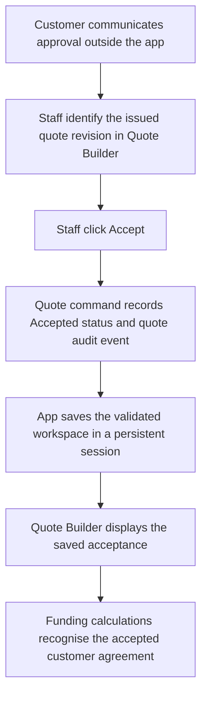

# How customer quote acceptance reaches the app

Verified against this checkout on 5 October 2026. Applies to the NSA and Events Quote Builder.

The app learns that a customer accepted a quote when a staff member clicks **Accept** on the saved, issued quote. This records the staff member's assertion of acceptance. The current app does not receive, authenticate or verify the customer's approval directly.

New quotes inherit the customer's name, address and email from the Project's linked Register record, including contact fields imported with an application. Existing saved quote details remain the quote's own editable or resolved record; they are not overwritten whenever the Register is viewed. Missing contact details do not inherit values from another Project or a cleared workspace.

Quote Builder auto-saves Draft edits. **Save Quote** remains an explicit save action, but clicking it is not a prerequisite for Issue if an auto-saved Draft already exists and passes readiness checks. Issue operates through the workspace mutation queue on the saved Draft. In a deliberately cleared in-memory session, both automatic and explicit updates remain session-only, as described below.

## Staff process

1. Receive the customer's approval outside the app, for example through correspondence. Retain that evidence externally against the particular quote number and revision; the Accept action does not request or store an evidence reference.
2. Open the relevant Register/Project record in **Quote Builder** and identify the issued quote revision the customer approved. Check the revision, scope and customer amount against the approval.
3. Click **Accept**. This action is available on an **Issued** quote, rather than a Draft quote. Issuing a quote is the offer stage and does not itself record customer acceptance.
4. The **Customer Acceptance Recorded** dialog confirms the successful workspace update. Confirm that the quote displays **Accepted**. In a persistent workspace, wait for successful saving before treating the acceptance as recorded. A failed save is not a completed acceptance.

Before issuance, the **Issue Quote** confirmation prominently names the funding source. It warns if **Scope/Description** or **Terms and Conditions** is empty, allowing staff to cancel and complete those sections or proceed subject to the existing readiness checks. Cancelling does not issue the quote.

After successful issuance, the **Quote Issued** dialog explains that the quote awaits customer acceptance and that staff should use **Accept** once the customer agrees. Failed Issue attempts show a **Quote Not Issued** dialog with the validation or saving error. These messages do not collect or authenticate customer approval.

The editor shows status in a pill beside **Live Preview**, with Issue for a Draft and Accept/Decline for an Issued quote. Resolved status pills include their recorded transition date. Saved quote rows start with a slim status pill and include audit dates where available; an editable quote date is not treated as proof of when Issue occurred.

These evidence checks are staff responsibilities, not validations performed by the current Accept button. There is no customer acceptance link or customer approval form in this path.

## Communication and saved data

The Quote Builder click handler calls `ProgramApp.updateWorkspace`, whose mutator calls `ProgramQuotes.setStatus(workspace, quoteId, "Accepted")`. The quote command permits **Issued → Accepted**. A Draft cannot transition directly to Accepted, and repeating the same status request returns without creating another quote transition event.

The command changes the selected quote's `status` to `Accepted`, sets `statusChangedAt`, and appends an entry to `entities.quoteEvents`:

| Field | Recorded value |
| --- | --- |
| `id`, `owner`, `type`, `quoteId` | Event identity, workspace owner, `quoteEvent`, and the specific quote ID |
| `eventType` | `status_changed` |
| `timestamp` | Time the app records the transition, not the customer's approval date |
| `actor` | The quote's `preparedBy`, with `Officer` as the fallback |
| `reason` | `Status changed from Issued to Accepted` |
| `payload` | `oldStatus: "Issued"` and `newStatus: "Accepted"` |

For a normal persistent workspace, `ProgramApp` saves the validated candidate through `ProgramStorage.saveValidated`, activates the saved workspace, and publishes the workspace change. Quote Builder then repopulates from the updated workspace. Acceptance is workspace data; it is not a separate message sent to the customer. The app also supports a cleared session that updates only in-memory state, so that session must not be mistaken for a durable saved record.

Implementation references: [Quote Builder](src/program-planner/js/quote-builder.js), [quote commands and audit events](src/program-planner/js/quote-model.js), [workspace updates](src/program-planner/js/app.js), and [workspace storage](src/program-planner/js/storage.js).

## What acceptance changes elsewhere

- **Customer funding:** the funding calculation recognises confirmed customer funding from the applicable Accepted quote when it has not been superseded. Acceptance indicates agreement; it does not indicate that the customer has paid. See [funding calculations](src/program-planner/js/funding-model.js).
- **Register status:** issuing an eligible linked quote can establish **Quoted**, subject to the existing automation and status protections. Acceptance itself does not trigger that issuance signal or advance the application to Scheduled or In Progress. See [status automation](src/program-planner/js/status.js).
- **Payments:** recording a payment does not accept a quote, and accepting a quote does not record a payment. Customer payments remain separate from the agreement; city-funded quotes do not require customer payment.
- **Quote revisions:** acceptance belongs to the specific quote ID/revision. An Accepted quote cannot be edited back into Draft through a status transition. Replacement revisions follow their own Draft, Issue and acceptance lifecycle; the customer's approval is not automatically carried into the replacement.
- **Scheduling:** acceptance does not create or start a job. Scheduler jobs and their nomination to update application status remain separate controls.

## Current evidence and attribution limits

The audit entry identifies the quote and the recorded transition but does not prove customer approval. The app does not capture a dedicated customer representative, approval date, approval method, signature or supporting correspondence reference in the Accept action. Client details and the quote's commercial snapshot provide context, not authentication of acceptance.

The `actor` is derived from the quote preparer and may differ from the person clicking Accept. A session operator used by application-status commands should not be confused with the actor recorded by this quote command. This path does not enforce an approver role or provide an independently signed approval record.

For the existing control assessment and proposed improvements, see [Quote customer approval controls](quote-customer-approval-assessment.md). Those recommendations are separate from the current process described here.

Quote Builder confirmations allow cancellation before Issue or Accept changes the quote status. Create Revision warns when the Project has an issued quote: creating the Draft preserves the issued quote, while issuing the replacement can supersede it. Cancelling the revision leaves quotes and events unchanged.

The quote Site/location address follows Privacy Mode in the editor and live preview, using the existing masking system. Masking does not replace the persisted address. Review cards show coloured, fixed-width status pills first, followed by bullet-separated quote ID, Revision number and dates.
