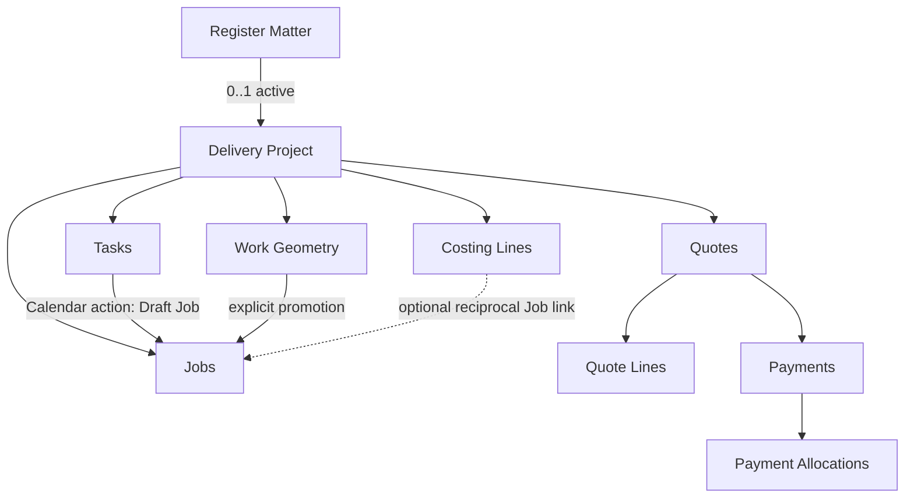
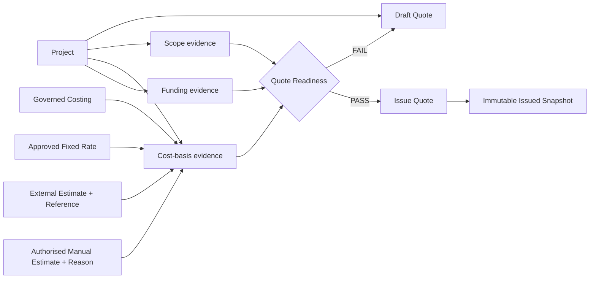
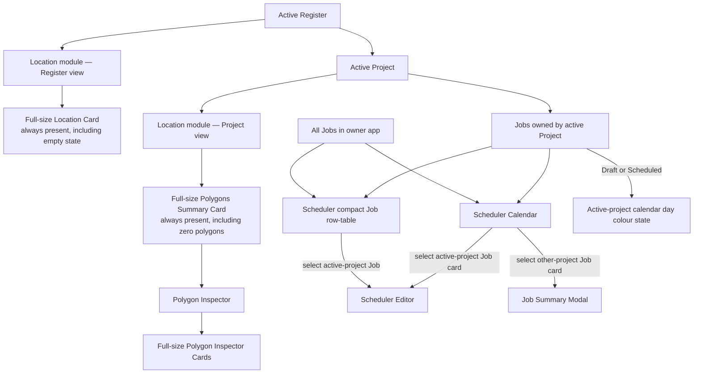

# Canonical Model — v1.5-draft

## Canonical business graph

## Quote Readiness evidence graph

Workflow gates are satisfied by canonical business evidence, never by module visitation or completion. Quote Readiness therefore does not mandate Planner → Space Map → Calculator → Quote Builder. The minimum evidence classes are Scope, Cost basis and Funding, with legitimate evidence permitted through multiple governed pathways.

## Annual authority and delivery lineage

Canonical keys: `financialYearId` identifies an exact July–June period; `(owner, financialYearId)` is unique for Annual Budget. Allocation references its Annual Budget, Register ID and owner, with an optional Project ID that must resolve to that Register. Multiple allocations for one Register in different years remain separate. Approved totals are derived from original approved amounts plus approved signed entries in cents. Draft/rejected entries have no effect. Transfer entries are linked debit/credit peers committed atomically.

Financial states remain distinct: approved annual authority; allocated authority; unallocated capacity; committed amount; actual expenditure; forecast; verified unspent. Actual expenditure retires or reconciles the corresponding commitment so reports do not double count. Availability must be calculated from approved authority and protected obligations. A Register carry-forward answer starts review and never changes authority by itself. A closed year cannot accept financial changes before a recorded reopen.

Job origin is exactly one of `planner` (source Task ID), `calculator` (source Calculator work identity), or `space-map` (source Work Geometry ID). Each Job retains its owner, Project and originating Register lineage. A Planner Draft Job is schedulable and costable later, but its existence alone is neither a schedule nor a Costing Line. Legacy `manual` or ambiguous source values remain review candidates; they are not silently relabeled. Quote inclusion follows Costing and preserves source Job/Costing IDs through Draft and immutable Issue snapshots.

## UI projection and Scheduler interaction graph

### Projection rules

- Calendar visibility is broader than editability.
- The Scheduler Calendar may project all Jobs in the owning application.
- Scheduler Editor is ownership-scoped: it accepts only Jobs whose `projectId` resolves to the active Project under the active Register.
- A non-active-project Job remains inspectable through a summary modal without changing the active Register/Project context.
- Active-project calendar-day colouring is a projection of canonical Job ownership plus Draft/Scheduled status; it is not stored as independent calendar truth.

## Canonical Calculator and Map command ownership — PC-026 / PC-028 amendment

This amendment supersedes rules requiring every Costing Line to have a Job,
requiring all Calculator additions to share an aggregate Job, or requiring
every mapped costing lineage to have a Job. Existing assigned lines,
aggregate Jobs, confirmed schedules and financial history are preserved.

- Rate Items persist schedulerEnabled. Missing values default on for Labour
  and Contractors and off for other categories. Explicit settings win;
  changes affect future additions only and never create Jobs for old lines.
- ProgramCosting owns createWork, recreateWorkJob and deleteWorkJob. Manual
  Calculator additions, mapped costing and explicit polygon Create a Job
  enter this command layer. UI handlers do not construct or repair links.
- Each intentional manual addition carries a stable operationId. Retrying
  returns the same line and Job; another intentional addition gets a new
  identity. Map synchronisation uses stable geometry lineage and updates
  existing work. Explicit Create a Job overrides the Rate Item flag.
- A Costing Line belongs to one Project and owner and may have no Job.
  Command-created Jobs reciprocally identify exactly one source Costing
  Line in that same Project and owner, with matching source identity.
  Commands validate those relationships before committing.
- Creation, deletion and linking persist atomically. A persistence failure
  stores no partial line/Job changes. Identity and links survive reopening.
- New Jobs are unscheduled Drafts with no scheduling dates. Confirmation
  schedules the same Job; finalised here means scheduling confirmed.
- Job-only deletion retains the source line and records
  jobCreationSuspended. Ordinary synchronisation cannot recreate it.
  Its calendar action deliberately recreates one Draft Job; retries reuse
  that Job. Deleting Job and line retains source geometry and records
  deliberate removal, so ordinary updates cannot recreate work. Explicit
  creation may establish a fresh lineage.
- Planner Jobs keep canonical Task ownership. Calculator commands cannot
  appropriate them. Existing historical aggregate/assigned relationships
  are not converted. Issued Quotes, payments and protected financial
  records retain their deletion and immutability protections.
- Calculator shows all selected-Project Costing Lines, including Map and
  Planner work, independently of selected Job. Costing-only and linked
  lines both contribute to totals and Quotes. Optional Job links do not
  weaken Project/owner validation or financial evidence requirements.

## Persistent UI projections — PC-014 / PC-018 / PC-024 amendment

- The Rate Item settings Scheduler checkbox edits schedulerEnabled. The
  compact Rate Library calendar appears only when its effective flag is
  enabled. It is informational, with hover and keyboard-focus help explaining
  that future additions create draft jobs; clicking it never changes data. Icon rails use Register Action dimensions and established
  module SVGs. Source icons distinguish Calculator, Map and Planner.
- Calculator Job calendar immediately precedes Delete, separated by a
  subtle vertical divider. Draft uses Planner calendar-without-tick;
  confirmed scheduling uses calendar-with-tick. Either opens the exact
  Job's Scheduler sidebar and brings its schedule into view. Suspended
  lines offer deliberate recreation; unflagged costing-only lines have
  no Job calendar. Job deletion offers an unchecked Also delete its
  Resource Calculator item option (items for multiple links). Keeping items
  suspends automatic recreation; deleting them records deliberate removal.
  The Unit selector is 88px wide and the action column reserves 88px for two
  28px buttons, their divider, spacing and focus clearance. Narrow tables
  scroll horizontally without wrapping or clipping the action rail.
- Escape closes only the topmost native or shared modal, restores opener
  focus, and preserves Register drawer, active module, selection and
  background scroll. Lower modal and drawer Escape handlers must not
  consume the same event.
- Selected Financial Year's Budget form is always visible: Amount /
  Effective date, Recording officer / Named approver, Reason / Evidence.
  Fields are editable before approval and read-only after approval, using
  recorded approval data. Amendments retain their governed workflow.
- One permanently visible action row directly follows the form: Approve
  budget, Allocate, Reconcile year, Adjust budget, Transfer allocation,
  Close year, Record reopen decision, Apply reopen. Unavailable actions
  are disabled, never hidden; narrow widths allow horizontal overflow.
  Dashboard cards, allocation/request controls, internal scrolling and
  shared drawer hard floor remain intact.
- Release evidence covers both owners; defaults and overrides; command
  retries and distinct additions; geometry synchronisation and explicit
  promotion; scheduling; deletion/recreation; persistence failure and
  round trips; malformed/cross-Project links; costing-only totals and
  Quotes; exact sidebar navigation; icons; modal Escape isolation; and
  Budget form/action states. Screenshot tests are not required.

## Quote funding arrangements and customer agreement — 2026-10-01

NSA and EVT Quotes explicitly select City of Adelaide, Customer, or City of Adelaide and customer. New Quotes default to Customer; existing editable legacy Drafts and legacy revisions require an explicit selection before Issue. Selection never creates or changes a Budget allocation.

The immutable commercial snapshot includes fundingMode (city/customer/mixed), the explicitly proposed mixed customer contribution (ex GST), and the applicable City funding and delivery-cost basis captured at Issue. Estimated work totals remain independent from customer payable amounts. ProgramQuotes.customerAmounts is the canonical customer calculation for Quote UI, funding position, payment balances, reports, preview and PDF. Legacy issued documents retain their original calculations and history.

City mode has zero customer contribution, GST, payable and outstanding balance; no customer payments or deposits are allowed. Customer mode charges the calculated Quote total and excludes all available City allocation from coverage. Mixed mode charges the explicitly proposed contribution plus existing 10% GST. Its initial suggestion is the work subtotal after discount and contingency minus City allocation, floored at zero. Subsequent costs, allowances and allocations never silently change the proposal; Use suggested amount is an explicit action. Show genuine surpluses.

Drafts may be underfunded. Issue requires the applicable City allocation plus proposed customer contribution to cover Calculator delivery cost ex GST, including costing-only Labour independently of Jobs or Scheduler use. Customer acceptance is not an Issue prerequisite. Draft customer funding is Proposed; Issued is Awaiting acceptance; Accepted is Accepted. Declined and superseded Quotes do not count as confirmed customer funding. Payments reduce the customer balance without changing agreement or proposed coverage.

Issued commercial changes require revision. Drafts with active payments or allocations require reversal through existing commands before funding arrangement or contribution changes. Preview and PDF distinguish estimated work cost, applicable City funding, proposed customer contribution, customer GST and customer payable. City documents state: Fully funded by City of Adelaide — no customer payment required. Third-party grants and in-kind funding are outside this model.
