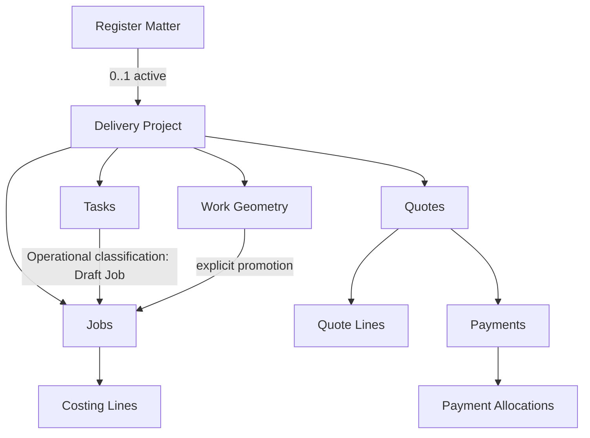
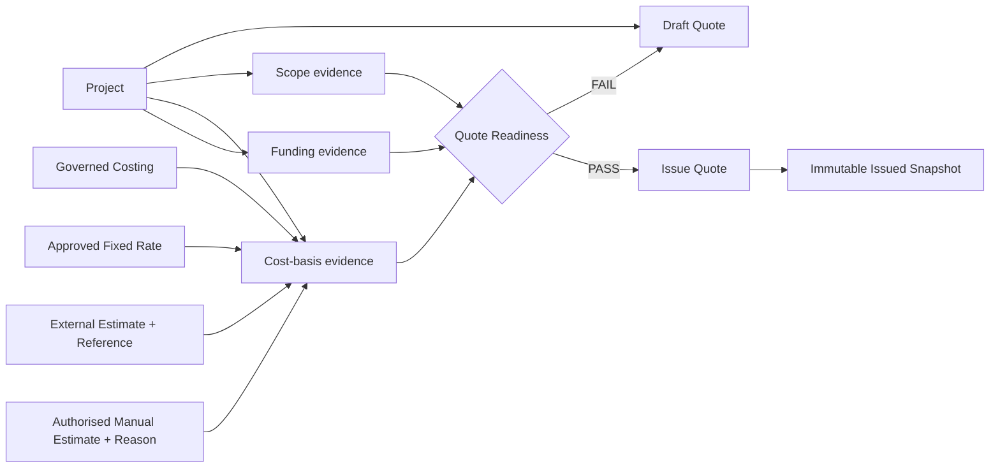
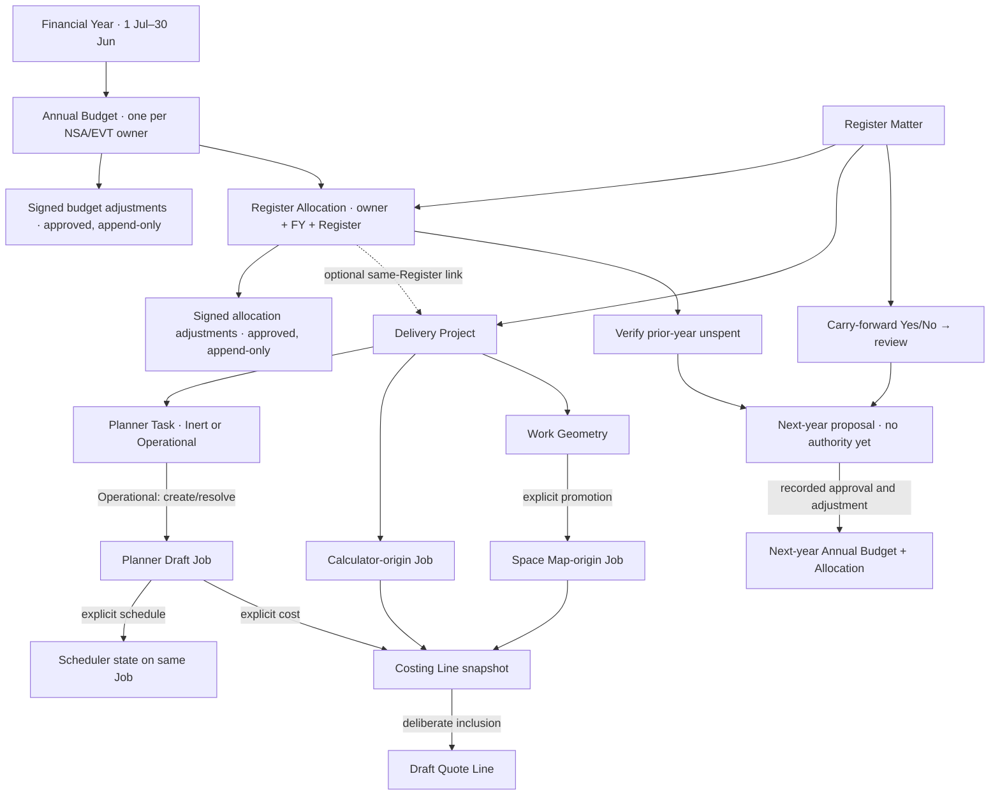
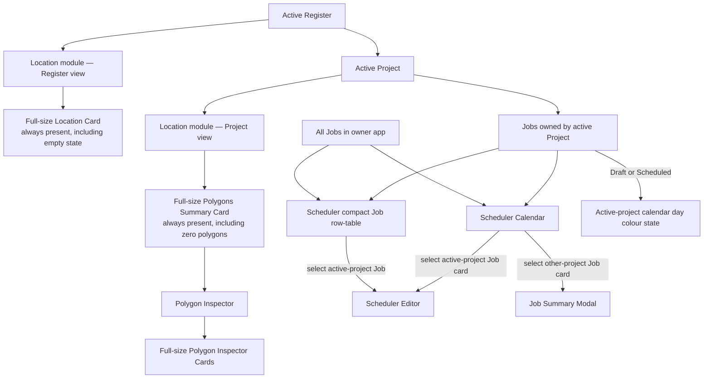

# Canonical Model — v1.5-draft

## Canonical business graph

## Quote Readiness evidence graph

Workflow gates are satisfied by canonical business evidence, never by module visitation or completion. Quote Readiness therefore does not mandate Planner → Space Map → Calculator → Quote Builder. The minimum evidence classes are Scope, Cost basis and Funding, with legitimate evidence permitted through multiple governed pathways.

## Annual authority and delivery lineage

Canonical keys: `financialYearId` identifies an exact July–June period; `(owner, financialYearId)` is unique for Annual Budget. Allocation references its Annual Budget, Register ID and owner, with an optional Project ID that must resolve to that Register. Multiple allocations for one Register in different years remain separate. Approved totals are derived from original approved amounts plus approved signed entries in cents. Draft/rejected entries have no effect. Transfer entries are linked debit/credit peers committed atomically.

Financial states remain distinct: approved annual authority; allocated authority; unallocated capacity; committed amount; actual expenditure; forecast; verified unspent. Actual expenditure retires or reconciles the corresponding commitment so reports do not double count. Availability must be calculated from approved authority and protected obligations. A Register carry-forward answer starts review and never changes authority by itself. A closed year cannot accept financial changes before a recorded reopen.

Job origin is exactly one of `planner` (source Task ID), `calculator` (source Calculator work identity), or `space-map` (source Work Geometry ID). Each Job retains its owner, Project and originating Register lineage. A Planner Draft Job is schedulable and costable later, but its existence alone is neither a schedule nor a Costing Line. Legacy `manual` or ambiguous source values remain review candidates; they are not silently relabeled. Quote inclusion follows Costing and preserves source Job/Costing IDs through Draft and immutable Issue snapshots.

## UI projection and Scheduler interaction graph

### Projection rules

- Calendar visibility is broader than editability.
- The Scheduler Calendar may project all Jobs in the owning application.
- Scheduler Editor is ownership-scoped: it accepts only Jobs whose `projectId` resolves to the active Project under the active Register.
- A non-active-project Job remains inspectable through a summary modal without changing the active Register/Project context.
- Active-project calendar-day colouring is a projection of canonical Job ownership plus Draft/Scheduled status; it is not stored as independent calendar truth.
