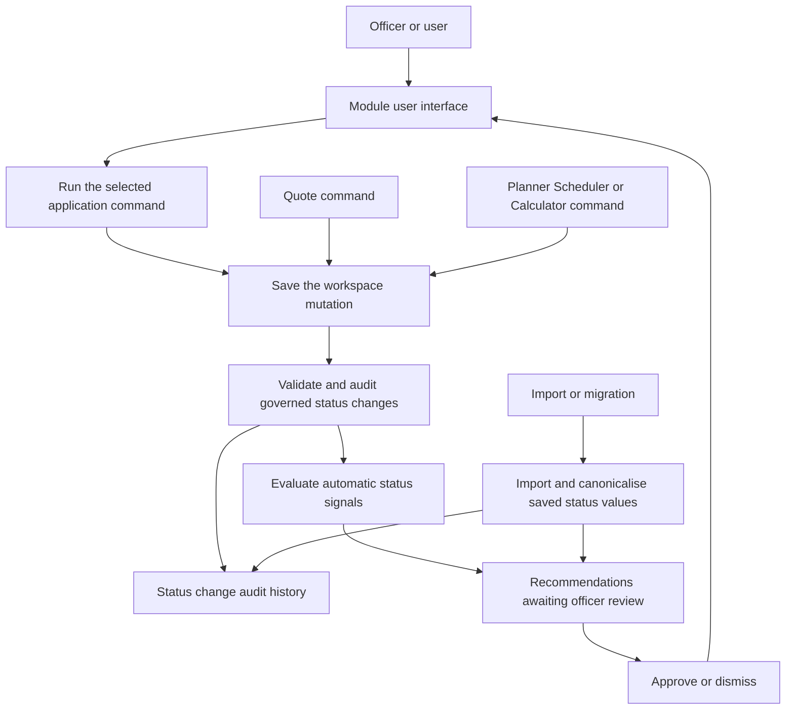
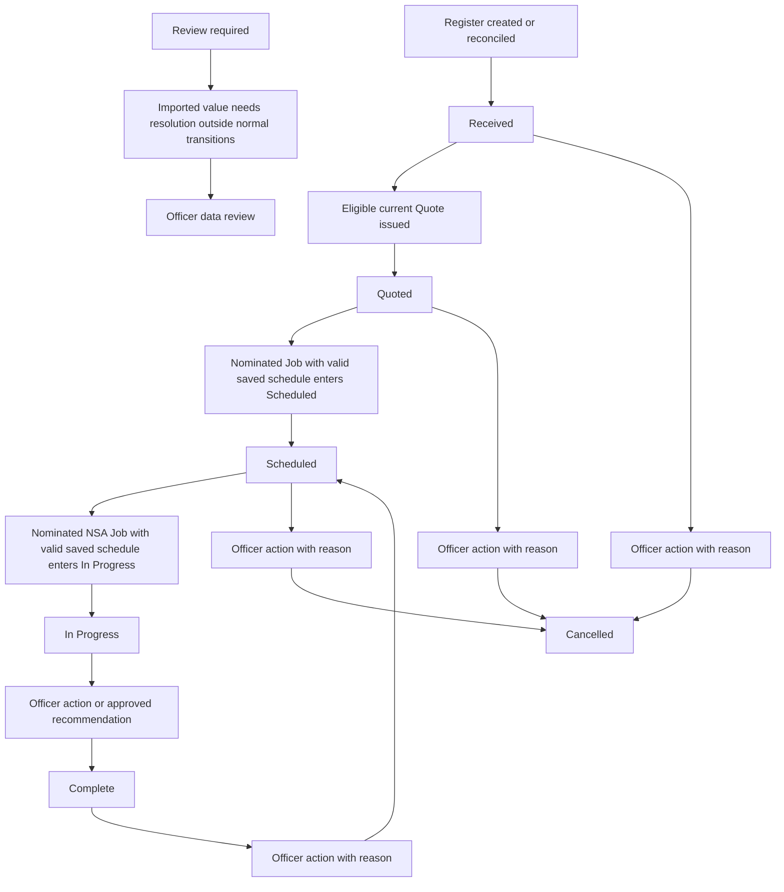
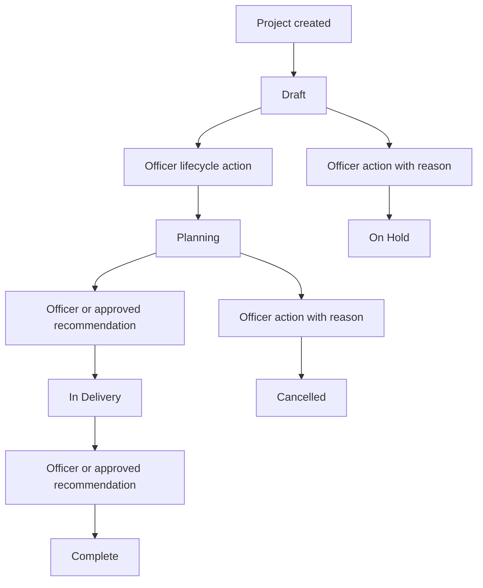
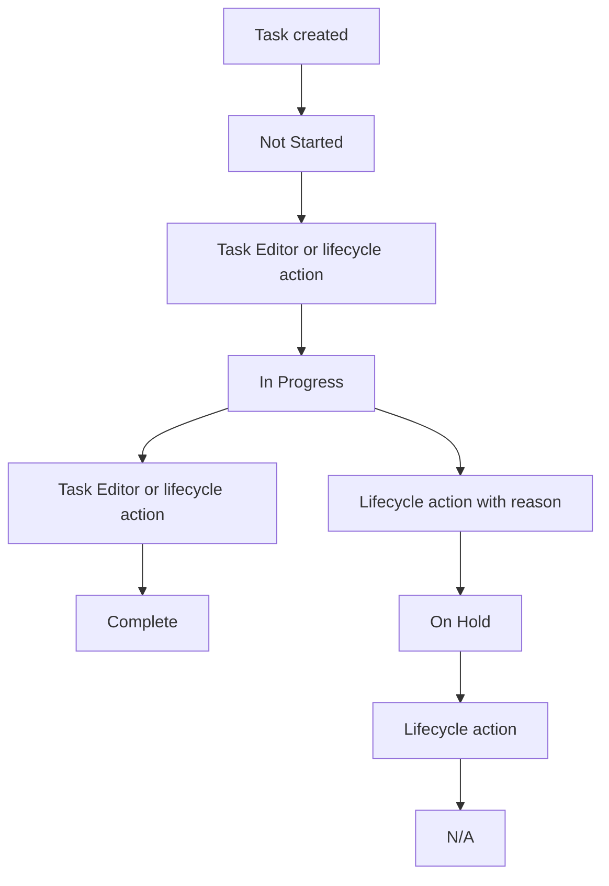
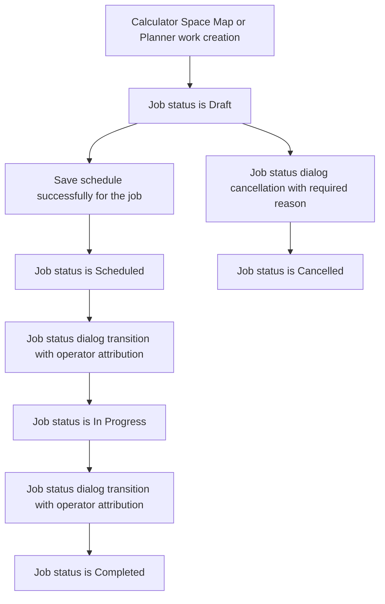
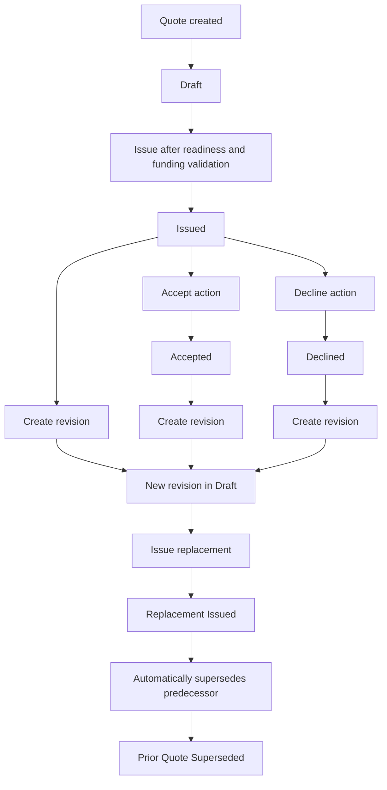
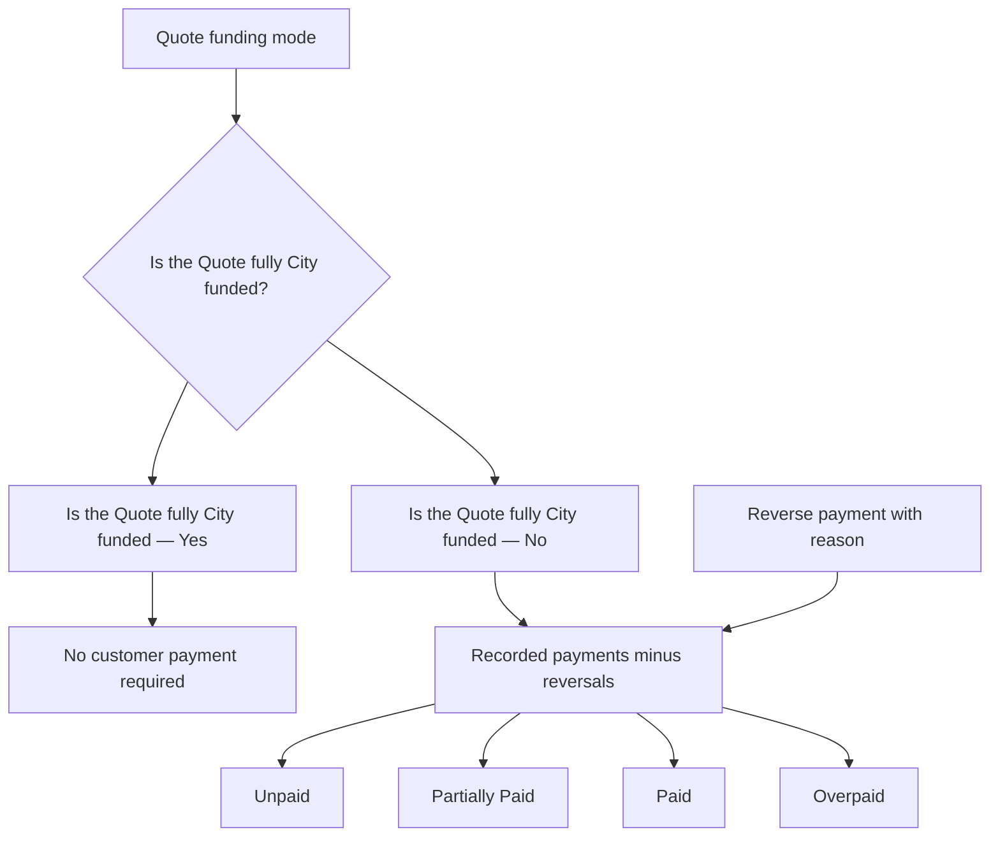
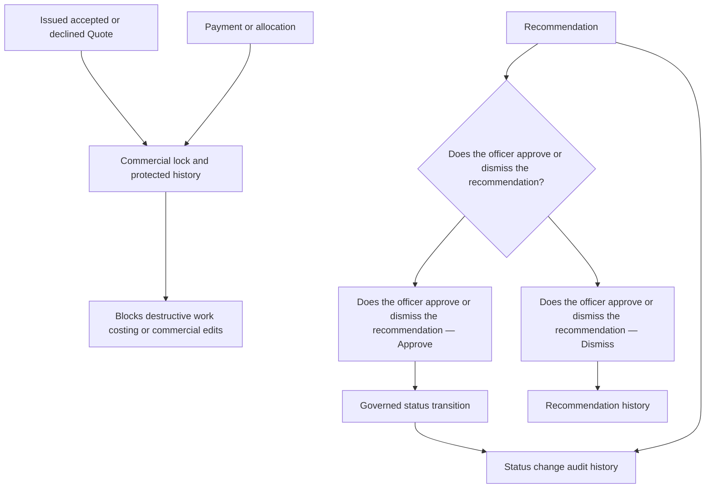
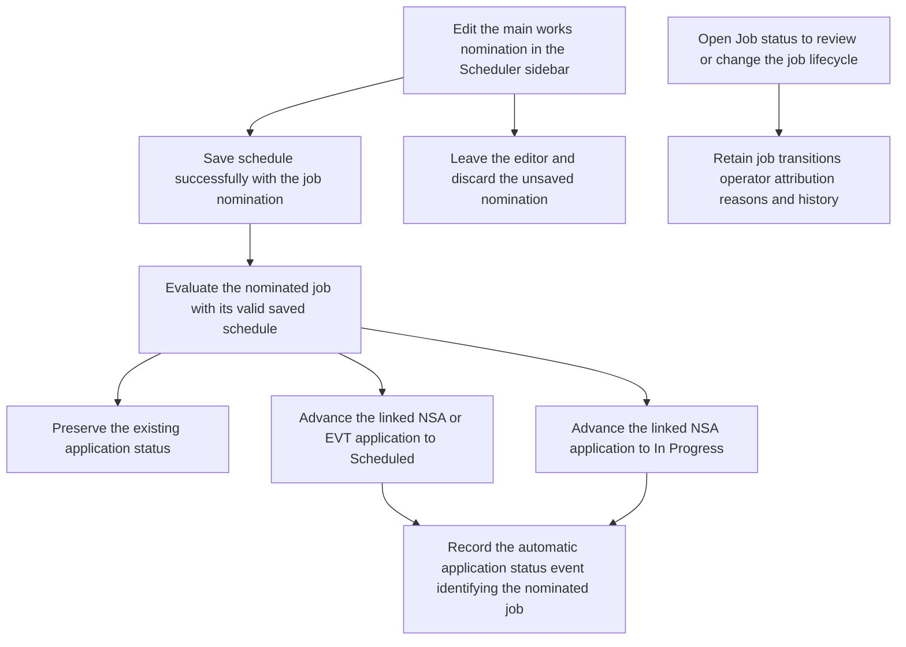

# Status mutation map

This document maps every current place where a user, a command, or the automatic status engine can create, change, approve, dismiss, pause, or calculate a status-like value. It reflects the program planner implementation as at 2 October 2026.

## Reading this map

- **Governed status** is a canonical `ProgramStatus` value. It has transition rules and a `statusEvents` audit record.
- **Commercial status** belongs to a Quote or payment. It is not a `ProgramStatus` domain, but it has its own validation and history.
- **Operational state** changes what a module permits or displays. It is not a lifecycle transition.
- **Derived state** is calculated when displayed and is never saved as a separate status field.

The main application status is the status on an NSA Application or EVT Event register record. Project, Planner task, and Scheduler job statuses are governed sub-systems. Quote, payment, rate, and mapped-work states are separate module sub-systems.

`status-app.js` wraps every `ProgramApp.updateWorkspace` call. A direct mutation to a governed record is therefore normalised, checked as a permitted transition, and audited before it is saved. A module can set a status before this wrapper sees it; the wrapper is the common enforcement and audit point.

## Governed lifecycle domains

| Domain and stored field | Canonical values | User opportunities | Automatic opportunities |
| --- | --- | --- | --- |
| NSA register: `applications[].status` | Received, Quoted, Scheduled, In Progress, Complete, Cancelled, Review required | Lifecycle **Review** dialog; approve or dismiss a recommendation; import values subject to migration | New record becomes Received; latest eligible Quote issued makes it Quoted; a a nominated Job with a valid saved schedule becoming Scheduled makes it Scheduled; a nominated NSA Job with a valid saved schedule becoming In Progress makes it In Progress; Project completion creates a completion recommendation |
| EVT register: `events[].status` | Received, Report Completed and Sent, Quoted, Planning, Scheduled, Completed, Cancelled, Review required | Same lifecycle dialog and recommendation actions | New record becomes Received; latest eligible Quote issued makes it Quoted; a a nominated Job with a valid saved schedule becoming Scheduled makes it Scheduled; moving its Project to Planning also moves the EVT register to Planning when automation is enabled; Project completion creates a completion recommendation |
| Project: `projects[].status` | Draft, Planning, In Delivery, On Hold, Complete, Cancelled, Review required | Lifecycle dialog and recommendation actions | New Project becomes Draft; a Job in progress creates an In Delivery recommendation; all active Jobs complete and required Tasks complete or N/A creates a completion recommendation |
| Planner task: `tasks[].status` | Not Started, In Progress, Complete, On Hold, N/A, Review required | Planner Task Editor **Status** selector; lifecycle dialog; recommendation actions | New task becomes Not Started; all changes are reconciled and audited, but no automatic task forward transition is currently made |
| Scheduler job: `jobs[].status` | Draft, Scheduled, In Progress, Completed, Cancelled, Review required | Scheduler **Job status** button opens the job lifecycle dialog; recommendation actions | Calculator or Space Map work creates a Draft Job; saving a schedule changes a Draft Job to Scheduled; reconciliation can advance the parent register from a Job state |

### Main register status flow

The EVT path uses the EVT vocabulary: `Received → Report Completed and Sent → Quoted → Planning → Scheduled → Completed`. Its Project Planning action may automatically set the linked EVT register to Planning. Register completion is deliberately a recommendation, rather than an automatic terminal transition.

### Project, task, and job flows

## User controls for the governed system

| Control | What it changes | Guardrails and record made |
| --- | --- | --- |
| Governed Lifecycle **Review** button or dialog | Any permitted register, Project, Task, or Job transition | Requires a session operator. Backward, hold, cancellation, and reopening terminal states require a reason. Adds `statusEvents[]`. |
| Planner Task Editor **Status** selector | `tasks[].status` | Collects a reason in the former Order position when required. Saves operator and reason through reconciliation into the status audit. |
| Planner Task Editor **Reset** | Restores original task values and removes eligible linked work on Save | Reset is staged for review. Collects an operator and any required reason, preserves identity and history, and uses existing deletion protections. |
| Scheduler **Job status** | `jobs[].status` | Opens the retained lifecycle dialog with transitions, operator attribution, required reasons, pause control and history. Application status remains a separate lifecycle. |
| Scheduler **Save schedule** | Job schedule fields and saved `updatesApplicationStatus` nomination and, for a Draft Job, `jobs[].status = scheduled` | The schedule command runs through reconciliation. Planner-linked Jobs also update the Task job linkage. |
| Recommendation **Approve** | Moves the recommended governed record to the proposed state | Uses a human transition with the action `Approved status recommendation`, then marks the recommendation approved. |
| Recommendation **Dismiss** | Does not change the target status | Marks the recommendation dismissed with user and timestamp. |
| Per-record **Pause automation** | `record.statusAutomationPaused` | Stops automatic register transitions for that record. It does not replay missed changes when resumed. |
| Workspace **Status automation** switch | `workspace.statusControl.automationEnabled` | Pausing prevents automatic transitions but still evaluates recommendations. Enabling requires an operator and records the enabler and time. |
| Import and migration | Incoming status fields | Recognised names are canonicalised. Unknown values become Review required; migration creates history and events and pauses automation for migrated workspaces. |

## Automatic status decisions and recommendations

```mermaid
flowchart TD
    EveryWorkspaceMutation[Every workspace mutation]
    IsStatusAutomationEnabledAndThisRecordNotPaused{Is status automation enabled and this record not paused?}
    NormaliseAndAuditDirectChanges[Normalise and audit direct changes]
    HasTheLatestLinkedQuoteJustBeenIssued{Has the latest linked Quote just been issued?}
    RegisterMovesToQuoted[Register moves to Quoted]
    IsNominatedJobScheduleValidAndApplicationEligible{Does the nominated Job have a valid saved schedule and an eligible linked application?}
  HasALinkedSchedulerJobChangedStatus{Has a nominated linked Scheduler Job entered Scheduled or NSA In Progress or just been nominated?}
    LinkedRegisterMovesToScheduled[Linked application advances to Scheduled only from an earlier nonterminal status]
    NSARegisterMovesToInProgress[NSA application advances to In Progress only from an earlier nonterminal status]
    EvaluateRecommendations[Evaluate recommendations]
    HasAJobStartedWhileTheProjectIsDraftOrPlanning{Has a Job started while the Project is Draft or Planning?}
    RecommendProjectMovesToInDelivery[Recommend Project moves to In Delivery]
    AreAllActiveJobsCompletedAndRequiredTasksCompleteOrNA{Are all active Jobs completed and required Tasks complete or N/A?}
    RecommendProjectMovesToComplete[Recommend Project moves to Complete]
    WhenProjectIsCompleteRecommendRegisterCompletion[When Project is complete recommend register completion]
    IsStatusAutomationEnabledAndThisRecordNotPausedNo[Is status automation enabled and this record not paused — No]
    IsStatusAutomationEnabledAndThisRecordNotPausedYes[Is status automation enabled and this record not paused — Yes]
    HasTheLatestLinkedQuoteJustBeenIssuedYes[Has the latest linked Quote just been issued — Yes]
    HasTheLatestLinkedQuoteJustBeenIssuedNo[Has the latest linked Quote just been issued — No]
    HasALinkedSchedulerJobChangedStatusScheduled[Nominated linked Job enters Scheduled or receives a saved nomination while Scheduled]
    HasALinkedSchedulerJobChangedStatusNSAInProgress[Nominated linked NSA Job enters In Progress or receives a saved nomination while In Progress]
    HasALinkedSchedulerJobChangedStatusOther[No eligible nominated Job status signal]
    HasAJobStartedWhileTheProjectIsDraftOrPlanningYes[Has a Job started while the Project is Draft or Planning — Yes]
    HasAJobStartedWhileTheProjectIsDraftOrPlanningNo[Has a Job started while the Project is Draft or Planning — No]
    AreAllActiveJobsCompletedAndRequiredTasksCompleteOrNAYes[Are all active Jobs completed and required Tasks complete or N/A — Yes]

    EveryWorkspaceMutation --> IsStatusAutomationEnabledAndThisRecordNotPaused
    IsStatusAutomationEnabledAndThisRecordNotPaused --> IsStatusAutomationEnabledAndThisRecordNotPausedNo
    IsStatusAutomationEnabledAndThisRecordNotPausedNo --> NormaliseAndAuditDirectChanges
    IsStatusAutomationEnabledAndThisRecordNotPaused --> IsStatusAutomationEnabledAndThisRecordNotPausedYes
    IsStatusAutomationEnabledAndThisRecordNotPausedYes --> HasTheLatestLinkedQuoteJustBeenIssued
    HasTheLatestLinkedQuoteJustBeenIssued --> HasTheLatestLinkedQuoteJustBeenIssuedYes
    HasTheLatestLinkedQuoteJustBeenIssuedYes --> RegisterMovesToQuoted
    HasTheLatestLinkedQuoteJustBeenIssued --> HasTheLatestLinkedQuoteJustBeenIssuedNo
    HasTheLatestLinkedQuoteJustBeenIssuedNo --> IsNominatedJobScheduleValidAndApplicationEligible
    RegisterMovesToQuoted --> IsNominatedJobScheduleValidAndApplicationEligible
    IsNominatedJobScheduleValidAndApplicationEligible --> NominatedJobScheduleAndApplicationEligible[Valid schedule and eligible application]
  NominatedJobScheduleAndApplicationEligible --> HasALinkedSchedulerJobChangedStatus
  IsNominatedJobScheduleValidAndApplicationEligible --> NominatedJobScheduleOrApplicationIneligible[Invalid schedule or ineligible application]
  NominatedJobScheduleOrApplicationIneligible --> EvaluateRecommendations
  HasALinkedSchedulerJobChangedStatus --> HasALinkedSchedulerJobChangedStatusScheduled
    HasALinkedSchedulerJobChangedStatusScheduled --> LinkedRegisterMovesToScheduled
    HasALinkedSchedulerJobChangedStatus --> HasALinkedSchedulerJobChangedStatusNSAInProgress
    HasALinkedSchedulerJobChangedStatusNSAInProgress --> NSARegisterMovesToInProgress
    HasALinkedSchedulerJobChangedStatus --> HasALinkedSchedulerJobChangedStatusOther
    HasALinkedSchedulerJobChangedStatusOther --> EvaluateRecommendations
    LinkedRegisterMovesToScheduled --> EvaluateRecommendations
    NSARegisterMovesToInProgress --> EvaluateRecommendations
    EvaluateRecommendations --> HasAJobStartedWhileTheProjectIsDraftOrPlanning
    HasAJobStartedWhileTheProjectIsDraftOrPlanning --> HasAJobStartedWhileTheProjectIsDraftOrPlanningYes
    HasAJobStartedWhileTheProjectIsDraftOrPlanningYes --> RecommendProjectMovesToInDelivery
    HasAJobStartedWhileTheProjectIsDraftOrPlanning --> HasAJobStartedWhileTheProjectIsDraftOrPlanningNo
    HasAJobStartedWhileTheProjectIsDraftOrPlanningNo --> AreAllActiveJobsCompletedAndRequiredTasksCompleteOrNA
    RecommendProjectMovesToInDelivery --> AreAllActiveJobsCompletedAndRequiredTasksCompleteOrNA
    AreAllActiveJobsCompletedAndRequiredTasksCompleteOrNA --> AreAllActiveJobsCompletedAndRequiredTasksCompleteOrNAYes
    AreAllActiveJobsCompletedAndRequiredTasksCompleteOrNAYes --> RecommendProjectMovesToComplete
    RecommendProjectMovesToComplete --> WhenProjectIsCompleteRecommendRegisterCompletion
    NormaliseAndAuditDirectChanges --> EvaluateRecommendations
```

The engine automatically advances only the quoted, scheduled, and in-progress signals shown above. Delivery and completion are recommendations that require officer approval. Automation also does not act on Review required imported statuses.

## Quote and customer-agreement status sub-system

Quote status is stored in `quotes[].status`; events are stored through the Quote model quote-event log, not in `statusEvents[]`.

| Opportunity | Status or state changed | Notes |
| --- | --- | --- |
| Save Quote | Draft commercial details | The Draft can be edited unless commercial protections apply. |
| Issue Quote | Draft → Issued | Requires readiness, coverage, date, lines, and commercial snapshot checks. It may signal the linked main register to Quoted. Customer acceptance is not an issue prerequisite. |
| Customer Accept action | Issued → Accepted | This is the application control that records customer agreement. It adds a Quote status-change event. |
| Customer Decline action | Issued → Declined | Also records a Quote status-change event. |
| Create and issue revision | Prior Issued, Accepted, or Declined → Superseded; successor is a Draft then may be Issued | Copies the commercial snapshot, including funding mode and proposed contribution. |
| Change funding mode or contribution | Commercial values, not Quote status | Drafts may change them unless payment or history protections apply. An Issued Quote requires a revision. |

The agreement signal is the **Accepted** Quote status. Funding display labels are distinct: customer funding is Proposed on Draft, Awaiting acceptance on Issued, and Accepted on Accepted. Declined and Superseded Quotes do not count as confirmed customer funding.

## Payment, funding, and budget display states

`paymentSummary()` calculates **No customer payment required**, **Unpaid**, **Partially Paid**, **Paid**, and **Overpaid** each time it is requested. These are derived display values, not a saved lifecycle. Individual `payments[]` use Recorded or Reversed; individual `paymentAllocations[]` use Active or Reversed. City-funded Quotes reject new customer payment and deposit commands at model level.

Funding arrangement also creates a coverage position—underfunded, exactly covered, or surplus—but it is a financial calculation rather than a stored lifecycle status. City allocation is counted only for City and mixed funding modes. An issued Quote is blocked if applicable City allocation plus proposed customer contribution does not cover delivery cost.

## Other module state sub-systems

| Module state | Where it lives | How it changes | Relationship to the governed lifecycle |
| --- | --- | --- | --- |
| Rate Library Active or Inactive | `rateItems[].active` and mirrored `rateItems[].status` | User edits a rate or imports a library row | Prevents inactive rates being added or remapped in Calculator. It is not a `ProgramStatus` transition and has no status-event log. |
| Planner task purpose | `tasks[].operational`, job links, and task content | Task Editor chooses Reminder Task or Add to Scheduler; calendar icon explicitly creates Scheduler work | Purpose is not the task lifecycle status. Removing an unedited operational job can restore the active-but-unused visual state. |
| Resource Calculator assignment | Costing-line job link, `assignmentState`, and `jobCreationSuspended` | Add or remove rate item; create or delete draft Job | A Calculator or Space Map Job starts as Draft and then participates in the governed Job lifecycle. |
| Space Map work synchronisation | Geometry work state and measurement payload | Map, create, update, and delete-work commands | States such as mapped-work synchronised describe geometry and costing linkage; they are not Project or Job lifecycle status. |
| Register map and filter pills | UI query state and displayed record status | User filters a view | Filter state does not alter an underlying status. |

## Audit, protection, and data-quality implications

The status-model layer validates canonical status codes, event ownership, recommendation ownership, and automation controls during normalisation. It also carries deletion protections that rely on Quote and payment history. Those protections must be preserved independently if the governed lifecycle system is ever removed.

## Implementation index

| Concern | Primary implementation |
| --- | --- |
| Definitions, transition rules, recommendations, automation, and migration | `src/program-planner/js/status.js` |
| Workspace wrapper and public lifecycle commands | `src/program-planner/js/status-app.js` |
| Lifecycle dialog, recommendations, pause controls, and audit display | `src/program-planner/js/status-ui.js` |
| Validation, persistence, and deletion protection integration | `src/program-planner/js/status-model.js` |
| Planner task status and purpose | `src/program-planner/js/planner.js`, `planner-model.js` |
| Scheduler schedule and status update | `src/program-planner/js/scheduler.js`, `scheduler-model.js` |
| Calculator-created Jobs and work deletion | `src/program-planner/js/costing-model.js` |
| Quote, agreement, payment, funding, and revision status | `src/program-planner/js/quote-model.js`, `quote-builder.js` |
| Rate activation | `src/shared/js/rate-library.js`, `src/program-planner/js/costing.js` |

## Planner Task history and reset baselines

The Task Editor suppresses Order while preserving stored ordering. A conditional Reason field occupies its former position. Whenever saved history exists, a Task history disclosure appears below the calendar guide. It starts collapsed on every editor opening; expanding it does not save the workspace or create an audit event. Entries retain operator, timestamp, and reason. History does not count as current Planner work.

New task status events, including initial status establishment, record an optional `taskTitle` snapshot from the saved task. New reset records snapshot the pre-reset `taskTitle` and include `restoredTaskTitle` when the reset changes its title. Later renames do not rewrite these snapshots or create status events. Legacy and imported historical events remain unchanged; entries without snapshots display the current title explicitly labelled **Current task name**. These optional metadata fields do not change the schema version, event identity, deduplication, transition rules, source linkage, or automation gates.

Reset restores built-in template defaults, or the creation baseline for custom and duplicated tasks. Existing custom tasks capture their saved state before the first edit under this feature. Reset populates the editor for review; Save applies it atomically after any required reason and linked-job deletion confirmation. Closing the modal discards the staged reset. Baselines and reset audit entries persist with the task and are not inherited from the source when a task is duplicated.

## Scheduler nomination of main works

The Scheduler editor checkbox **Updates application status for the main works** saves a boolean `jobs[].updatesApplicationStatus` only after **Save schedule** succeeds. Unsaved changes are discarded when leaving the editor. Every creation source defaults to unchecked; legacy jobs without the field are unchecked. Multiple jobs may be nominated for one application.

Only nominated jobs with valid saved schedules may automatically advance an NSA or EVT application to Scheduled. Only nominated NSA jobs may advance an application to In Progress. A new saved nomination evaluates an already Scheduled job, or an already In Progress NSA job, immediately. Draft, Completed, Cancelled and Review Required jobs do not advance applications when nominated. Applications advance only from an earlier nonterminal status. Linkage and ownership must be valid, workspace automation must be enabled, and job and application automation must not be paused. Automatic status events identify the nominated job and retain the initiating operator.

Unticking, cancelling or deleting a nominated job never reverses application status. Loading, migration and automation resumption do not replay historical jobs. Project delivery recommendations, completion recommendations, Planner task status and manual application status controls retain their existing rules.

